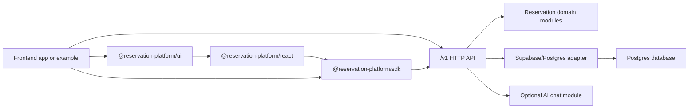

# Reservation Platform

Backend modules, API host, database bundle, contracts, SDK, React hooks, reusable
UI components, and forkable examples for a modular booking platform.

This branch is the frontend-and-backend modular platform direction. Backend
credentials stay in the backend API, while frontends consume the platform through
`/v1`, `@reservation-platform/sdk`, `@reservation-platform/react`, or
`@reservation-platform/ui`.

## Project Intent

The goal of this project is to make booking infrastructure reusable across
different products. The same backend modules should support a racing simulator
booking frontend, a movie ticketing frontend, a room booking frontend, or any
other reservation UI without copying database logic into each app.

The frontend is replaceable, but this monorepo now also includes reusable
frontend modules so a new booking app can start by editing config, theme, copy,
and images instead of rebuilding booking logic.



## What Lives In This Branch

| Path | Purpose |
| --- | --- |
| `apps/api` | Standalone backend HTTP API host for `/v1` routes. |
| `packages/reservation-platform-api` | Framework-neutral route handlers, request validation, auth context, idempotency, and response mapping. |
| `packages/reservations-core` | Headless reservation domain logic for capacity, assigned resources, availability, and validation. |
| `packages/reservations-supabase` | Supabase/Postgres adapter for catalog, availability, reservations, idempotency, and maintenance storage. |
| `packages/database` | Backend-owned migrations, seeds, migration index, and database package metadata. |
| `packages/contract-types` | Public API DTOs, schemas, OpenAPI artifacts, and shared contract types. |
| `packages/sdk` | TypeScript client package for external frontend and server consumers. |
| `packages/reservation-react` | Headless React provider and booking hooks. |
| `packages/reservation-ui` | Tailwind-ready booking components built on the React hooks. |
| `packages/ai-chat` | Optional backend AI chat module scaffold. |
| `apps/examples/starter-next` | Minimal forkable Next.js starter using the frontend packages. |
| `apps/examples/room-booking` | Room booking example using the shared booking UI. |
| `apps/examples/racing-simulator` | Racing simulator example using the shared booking UI. |
| `supabase` | Legacy/reference Supabase SQL assets used for compatibility and migration planning. |
| `scripts` | Backend verification, packaging, database, release, and local-development helpers. |
| `docs` | Architecture plans, extraction manifests, contract notes, and backend packaging documentation. |

## What Stays Out Of Frontends

- No Supabase service-role keys.
- No direct database clients.
- No imports from backend adapters such as `packages/reservations-supabase`.
- No copied booking mutation logic.

Frontend repositories should call the backend API, SDK, React hooks, or UI
package. They should not import backend packages directly and should not receive
Supabase service-role keys.

## Requirements

- Node.js with Corepack enabled.
- pnpm through the repository package manager setting: `pnpm@10.33.2`.
- Supabase/Postgres credentials only when running database-backed or live proof
  flows.

Install dependencies:

```powershell
corepack pnpm install
```

This is safe for local development. It installs workspace dependencies from the
lockfile and does not publish packages or touch production data.

## Start The Backend

Start the local Supabase/Postgres database first:

```powershell
corepack pnpm run local:supabase:start
```

This is safe for local development. It starts the local Supabase Docker stack
only; it does not expose a Cloudflare tunnel unless `scripts/start-local-supabase.ps1`
is run manually with `-StartTunnel`.

Then start the standalone backend API:

```powershell
corepack pnpm run dev
```

This is safe in this branch. It starts only the standalone backend API host from
`apps/api`; it does not start a Next.js frontend. The local dev launcher loads
`.env`, maps existing Supabase env names to backend-only
`RESERVATION_SUPABASE_*` names, and defaults the local Supabase URL to
`http://localhost:8000` unless `RESERVATION_SUPABASE_URL` is explicitly set.

The backend exposes platform routes under `/v1`, including:

- `/v1/metadata`
- `/v1/services`
- `/v1/resources`
- `/v1/availability`
- `/v1/reservations`
- `/v1/resource-maintenance`
- `/v1/chat/*` when the optional chat module is enabled

## Start A Frontend Example

Set the public backend URL and a service id from your local database:

```powershell
$env:NEXT_PUBLIC_RESERVATION_PLATFORM_BASE_URL="http://localhost:4100"
$env:NEXT_PUBLIC_RESERVATION_SERVICE_ID="<service-id>"
corepack pnpm --filter @reservation-platform/example-room-booking run dev
```

This is safe locally. It starts only the room booking frontend on port 4201 and
does not start Docker, Supabase, or production services.

The other examples use the same pattern:

```powershell
corepack pnpm --filter @reservation-platform/example-starter-next run dev
corepack pnpm --filter @reservation-platform/example-racing-simulator run dev
```

These are safe locally. They start frontend-only dev servers on ports 4200 and
4202.

## Use From Another Frontend

An external frontend should install the SDK package once it is packed or
published, then point it at the backend URL.

Local tarball packaging:

```powershell
corepack pnpm run packages:pack
```

This is safe locally. It writes package tarballs under ignored
`dist-packages/`; it does not publish to npm.

Example frontend usage:

```ts
import { createReservationPlatformClient } from "@reservation-platform/sdk";

const reservations = createReservationPlatformClient({
  baseUrl: "http://localhost:4100",
  tenantId: "demo-tenant",
});

const services = await reservations.listServices();
const availability = await reservations.listAvailability({
  service_id: services.data[0].service_id,
  date: "2026-06-28",
});
```

The frontend only needs the backend URL and safe tenant/venue context. Database
credentials stay in this backend service.

## Backend Environment

Common backend environment names:

```powershell
RESERVATION_SUPABASE_URL=
RESERVATION_SUPABASE_ANON_KEY=
RESERVATION_SUPABASE_SERVICE_ROLE_KEY=
RESERVATION_PLATFORM_SERVICE_API_KEY=
RESERVATION_PLATFORM_AUTH_JWKS_URL=
RESERVATION_PLATFORM_AUTH_ISSUER=
RESERVATION_PLATFORM_AUTH_AUDIENCE=
```

Do not expose backend secrets through `NEXT_PUBLIC_*` variables. A frontend can
know the backend URL; it should not know the Supabase service-role key.

## Verification

Build all backend modules:

```powershell
corepack pnpm run build
```

This is safe locally. It compiles backend packages and the standalone API
skeleton.

Run the main backend test suite:

```powershell
corepack pnpm run test
```

This is safe locally. It runs package tests, standalone API skeleton tests, and
database migration bundle checks. It does not run live database mutation proofs
unless you explicitly use the strict live-proof scripts.

Useful focused checks:

```powershell
corepack pnpm run backend-platform:verify-extraction-boundary
corepack pnpm run backend-platform:verify-extraction-manifest
corepack pnpm run packages:verify-boundaries
corepack pnpm run database:verify-migration-bundle
corepack pnpm run sdk:release-artifacts:check
```

These are safe local checks. They validate backend source boundaries, extraction
metadata, package contents, database migration metadata, and generated SDK
release docs.

Live proof scripts such as `database:live-proof:strict`,
`backend-platform:db-backed-live-parity-proof:strict`, and
`sdk:registry-install-proof:strict` are opt-in because they may require Docker,
database access, registry configuration, or external services.

## Branch Strategy

This branch, `platform/backend-modules`, should contain backend platform code
only. Frontend work should happen in a separate consumer branch or repository.

For a final-year-project submission, the clean story is:

1. This repository branch demonstrates the reusable backend platform.
2. Separate frontend consumers demonstrate that different UIs can reuse the same
   backend contract.
3. The SDK and `/v1` API are the integration points between them.

## Current Status

- Backend packages build and test locally.
- Standalone API skeleton is present under `apps/api`.
- Database migration package and migration metadata are present.
- SDK and contract packages are present for external consumers.
- Frontend implementation has been removed from this branch by design.
