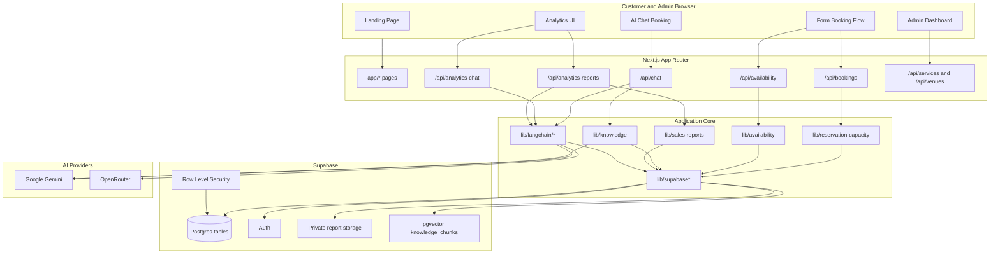
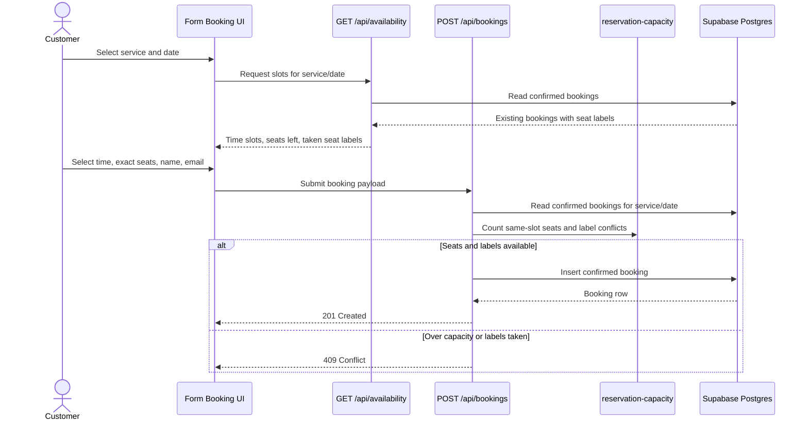
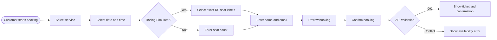
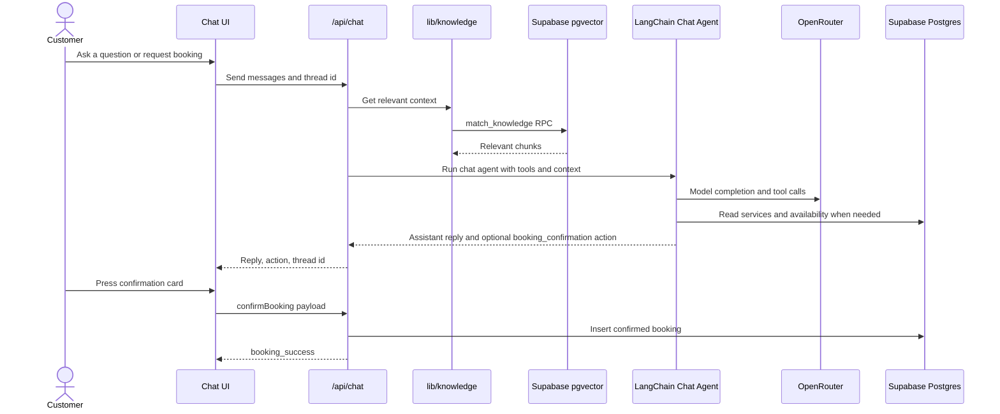
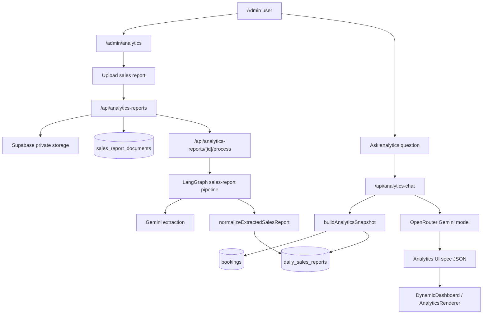
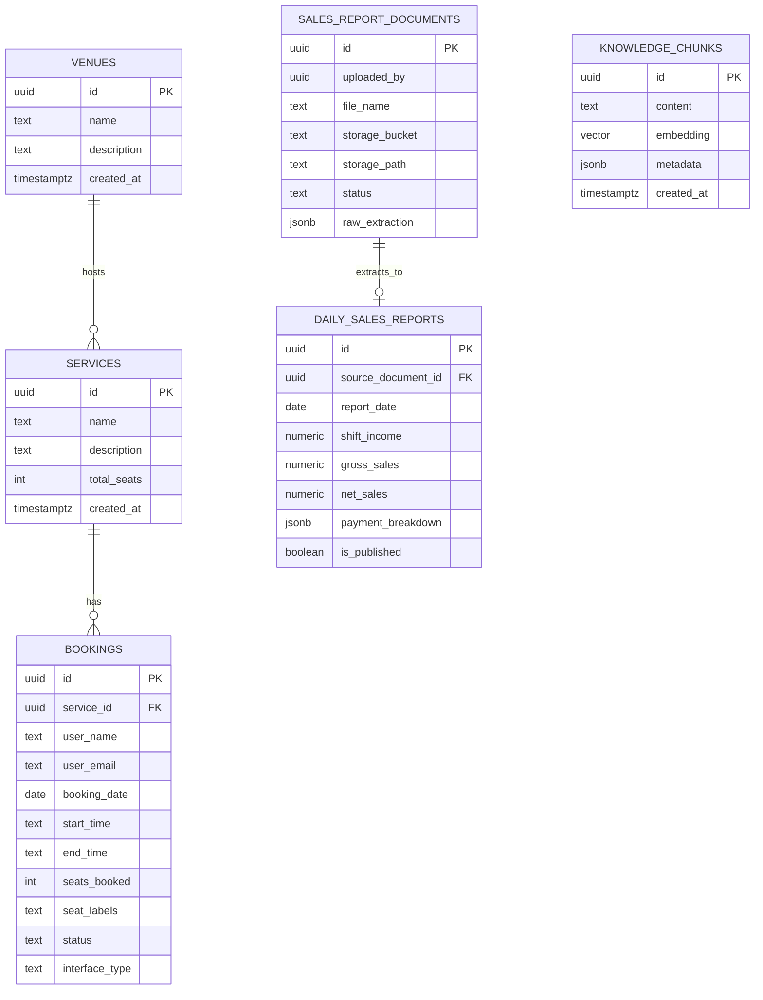
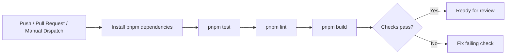

# Project Play Reservation App

Project Play Reservation App is a Next.js 16 App Router application for booking Racing Simulator and Playstation 5 sessions, managing reservations, running AI-assisted booking chat, and producing admin analytics from bookings and uploaded sales reports.

The app uses Supabase for data, authentication, RLS, storage, and pgvector knowledge retrieval. AI features use Gemini, OpenRouter, and LangChain/LangGraph wrappers for chat, retrieval, analytics generation, and sales report processing.

## Quick Start

Install dependencies with pnpm:

```bash
pnpm install
```

Create `.env` with the values listed in [Environment Variables](#environment-variables), then start the local server:

```bash
pnpm dev
```

Open [http://localhost:4000](http://localhost:4000).

## Project Map

```text
app/                         Next.js App Router pages and API routes
  admin/                     Admin dashboard and analytics pages
  api/                       Booking, availability, chat, analytics, services, venues
  chat-booking/              Customer AI chat booking page
  form-booking/              Customer multi-step form booking page
components/                  UI grouped by domain
  analytics/                 Dynamic analytics renderer and reports panel
  chat/                      Chat UI and booking confirmation cards
  form/                      Service/date/time/seat selection booking flow
  landing/                   Home page sections and navbar
  shared/, ui/               Shared layout and visual primitives
lib/                         Business logic, Supabase clients, AI utilities
  langchain/                 Chat agent, analytics generation, vector store, pipelines
supabase/                    SQL setup scripts for RLS, pgvector, reports, checkpoints
scripts/                     Local helper scripts
data/knowledge.md            Business knowledge used by the booking assistant RAG
types/                       Shared TypeScript types
```

## Architecture



## Booking Flow

The customer booking flow supports both a traditional multi-step form and an AI chat assistant. The form path validates service, date, time slot, seat count, exact Racing Simulator seat labels, and customer details before creating a confirmed booking.





## AI Chat and Knowledge Retrieval

The booking assistant combines the customer conversation, business knowledge from `data/knowledge.md`, availability tools, and booking preparation tools. Final booking creation still happens only after explicit confirmation.



## Analytics and Sales Reports

Admin analytics combines booking-derived metrics with uploaded daily sales reports. Sales reports are stored in a private Supabase bucket, extracted with Gemini, normalized, and saved into reporting tables. The analytics chat endpoint generates a renderer spec for the dashboard UI.



## Data Model

The core schema lives in Supabase. The SQL files in `supabase/` configure knowledge retrieval, RLS hardening, LangGraph checkpoint tables, and sales report processing.



## Environment Variables

Local development and production-like builds need:

```env
NEXT_PUBLIC_SUPABASE_URL=
NEXT_PUBLIC_SUPABASE_ANON_KEY=
SUPABASE_SERVICE_ROLE_KEY=
GOOGLE_GENERATIVE_AI_API_KEY=
OPENROUTER_API_KEY=
```

Optional values:

```env
OPENROUTER_CHAT_MODEL=google/gemini-2.5-flash
GOOGLE_EMBEDDING_MODEL=gemini-embedding-001
GOOGLE_GENERATIVE_AI_MODEL=gemini-2.5-flash
```

`SUPABASE_SERVICE_ROLE_KEY` is server-only. Never prefix it with `NEXT_PUBLIC_`, never expose it to client components, and do not commit real credentials.

## Supabase Setup

Run these SQL files in the Supabase SQL editor as needed:

1. `supabase/base-schema.sql` - creates the core reservation tables and default services/venues.
2. `supabase/blogs.sql` - creates public content tables and storage policies.
3. `supabase/knowledge.sql` - creates `knowledge_chunks`, pgvector index, and the `match_knowledge` RPC used by LangChain.
4. `supabase/langchain.sql` - creates LangGraph checkpoint tables if persistent checkpoint storage is later enabled.
5. `supabase/sales-reports.sql` - creates sales report tables and private storage bucket policies.
6. `supabase/reservations-rls.sql` - enables RLS for reservation data and allows server routes to keep booking reads private.
7. `supabase/security-hardening.sql` - reapplies admin-only policies and hardening checks.

After changing SQL functions or policies, refresh the Supabase/PostgREST schema cache if the API still reports missing functions or stale columns.

## Vercel Sandbox Supabase

Vercel Sandbox can run the self-hosted Supabase Docker Compose stack in a temporary remote microVM. This is useful for disposable integration testing, PR checks, and trying schema changes without touching local or production Supabase data.

First-time setup:

1. Link this folder to the existing Vercel project:

```bash
pnpm dlx vercel@latest link
```

2. Pull Preview environment variables into `.env.local`:

```bash
pnpm dlx vercel@latest env pull .env.local --environment=preview
```

3. Verify basic Sandbox access:

```bash
pnpm sandbox:smoke
```

4. Verify Docker can run inside Sandbox:

```bash
pnpm sandbox:docker
```

Run the full Supabase stack:

```bash
pnpm sandbox:supabase
```

The command creates a Sandbox, installs Docker and Docker Compose, starts the official Supabase self-hosted containers, applies the SQL files listed in [Supabase Setup](#supabase-setup), prints temporary Supabase URLs and keys, then keeps the Sandbox alive until you press Enter.

Use the printed values in another terminal while the script is running:

```env
NEXT_PUBLIC_SUPABASE_URL=https://...
NEXT_PUBLIC_SUPABASE_ANON_KEY=...
SUPABASE_SERVICE_ROLE_KEY=...
```

Then start the app:

```bash
pnpm dev
```

The Sandbox database is ephemeral. When the script stops, the Supabase containers and database are destroyed. The script generates temporary Supabase keys, Studio credentials, and a Postgres password for each run; do not reuse those values in any long-lived or public environment.

To run only selected SQL files, set `SANDBOX_SQL_FILES` to a comma-separated list before starting the Sandbox:

```bash
SANDBOX_SQL_FILES=base-schema.sql,knowledge.sql,reservations-rls.sql pnpm sandbox:supabase
```

PowerShell:

```powershell
$env:SANDBOX_SQL_FILES="base-schema.sql,knowledge.sql,reservations-rls.sql"; pnpm sandbox:supabase
```

To skip SQL bootstrap:

```bash
SANDBOX_SQL_FILES=none pnpm sandbox:supabase
```

PowerShell:

```powershell
$env:SANDBOX_SQL_FILES="none"; pnpm sandbox:supabase
```

Optional runtime controls:

```env
SANDBOX_VCPUS=4
SANDBOX_TIMEOUT_MS=2700000
SANDBOX_SUPABASE_REPO=https://github.com/supabase/supabase
SANDBOX_SUPABASE_REF=master
```

## Booking Assistant RAG

The chat assistant retrieves business information from `data/knowledge.md` through Supabase pgvector.

First-time setup:

1. Run `supabase/knowledge.sql` in Supabase.
2. Add the environment values from [Environment Variables](#environment-variables).
3. Seed the knowledge chunks:

```bash
pnpm seed:knowledge
```

Whenever you edit `data/knowledge.md`, re-run:

```bash
pnpm seed:knowledge
```

The script clears old chunks, splits markdown by headings, generates 768-dimension Gemini embeddings, and inserts the chunks into `knowledge_chunks`.

## AI Sales Report Processing

The AI Analytics reports panel needs `supabase/sales-reports.sql` before uploads work.

Setup:

1. Run `supabase/sales-reports.sql` in Supabase.
2. Refresh `/admin/analytics`.
3. Upload a PDF, JPG, PNG, or WebP daily sales report from the Daily Sales Reports panel.

If the panel says sales report storage is not set up, Supabase has not applied `supabase/sales-reports.sql` yet or the PostgREST schema cache has not refreshed.

## Development Commands

Use pnpm. The repository includes `pnpm-lock.yaml`.

```bash
pnpm dev              # Start Next.js on http://localhost:4000
pnpm build            # Create a production build
pnpm start            # Serve the production build
pnpm lint             # Run ESLint
pnpm test             # Run the explicit Node test suite via tsx
pnpm sandbox:smoke    # Verify Vercel Sandbox can run a command
pnpm sandbox:docker   # Verify Docker can run inside Vercel Sandbox
pnpm sandbox:supabase # Start disposable Supabase in Vercel Sandbox and apply SQL
pnpm seed:knowledge   # Rebuild and upload RAG knowledge chunks
pnpm pr               # Push branch and open a PR helper flow
```

## Continuous Integration

GitHub Actions CI is configured in `.github/workflows/ci.yml`.

The workflow runs on pushes, pull requests, and manual dispatches:



Configure these GitHub repository variables or secrets for reliable CI builds:

- `NEXT_PUBLIC_SUPABASE_URL`
- `NEXT_PUBLIC_SUPABASE_ANON_KEY`
- `SUPABASE_SERVICE_ROLE_KEY`
- `GOOGLE_GENERATIVE_AI_API_KEY`
- `OPENROUTER_API_KEY`
- `OPENROUTER_CHAT_MODEL` (optional)

The workflow includes placeholder fallbacks so verification can run before real secrets are configured, but production-like builds should use real values.

## Branch-Based Delivery Flow

```mermaid
gitGraph
    commit id: "master"
    branch staging
    checkout staging
    commit id: "staging baseline"
    branch feature
    checkout feature
    commit id: "feature work"
    commit id: "tests pass"
    checkout staging
    merge feature id: "PR to staging"
    commit id: "staging deploy skeleton"
    checkout master
    merge staging id: "release PR"
    commit id: "production deploy skeleton"
```

Branch rules:

- Feature branches run CI on push and pull request.
- `staging` runs CI plus the staging deploy skeleton in `.github/workflows/deploy.yml`.
- `master` runs CI plus the production deploy skeleton in `.github/workflows/deploy.yml`.

Recommended GitHub setup:

- Create GitHub environments named `staging` and `production`.
- Add environment-specific secrets if your deploy target needs them.
- Optionally require manual approval for the `production` environment.

When you are ready to deploy for real, replace the placeholder deploy step in `.github/workflows/deploy.yml` with your provider-specific command.

## Fast PR Command

Use this command to push your current branch and create a pull request if one does not already exist:

```bash
pnpm pr
```

Default branch flow:

- Feature branches -> `staging`
- `staging` -> `master`

Useful options:

```bash
pnpm pr -- --base staging
pnpm pr -- --base master
pnpm pr -- --dry-run
```

## Operational Notes

- Public booking creation goes through API routes; private booking reads use the service role key on the server.
- Racing Simulator bookings store exact `seat_labels`; availability returns taken labels so the seat map matches real bookings.
- The booking assistant can prepare a booking, but final creation requires the user to confirm the booking card.
- `data/knowledge.md` is the source of truth for customer-facing business knowledge used by RAG.
- Keep SQL files in `supabase/` aligned with deployed Supabase schema before relying on local code changes.
