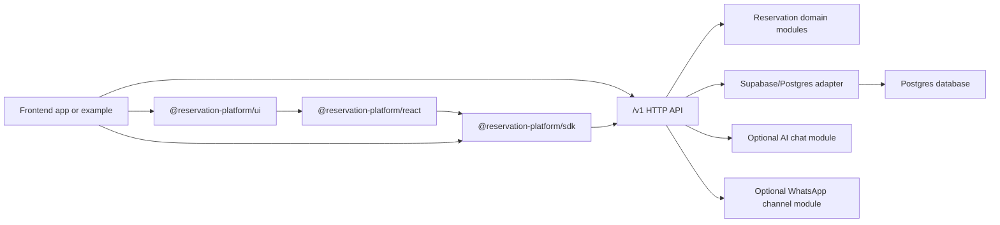

# Reservation Platform

An omnichannel reservation experience platform: owners configure and publish an
industry-specific booking experience, customers reserve through web or an AI
conversation, and staff operate every channel from one command center.

This branch is the frontend-and-backend modular platform direction. Backend
credentials stay in the backend API, while frontends consume the platform through
`/v1`, `@reservation-platform/sdk`, `@reservation-platform/react`, or
`@reservation-platform/ui`.

## Final Demonstration

The deterministic demo tells one complete story across three polished domains:

1. Create, preview, validate, and publish an experience in Experience Studio.
2. Book a racing simulator, capacity-matched room, or specialist appointment.
3. Run the same proposal-and-confirmation workflow through AI chat or the
   credential-free WhatsApp simulation.
4. Pause automation, reply as staff, manage reservations and maintenance, and
   inspect channel conversion and demand analytics.

Eight industry presets share the same platform model. Racing, rooms, and
appointments are the deliberately polished flagship examples; the other five
prove configurability without introducing separate domain subsystems.

For the full system design and presentation path, see
[`docs/architecture/final-platform-architecture.md`](docs/architecture/final-platform-architecture.md)
and [`docs/demo/final-demonstration-runbook.md`](docs/demo/final-demonstration-runbook.md).

## Production Operator Path

The supported product deployment is one appointment business per Docker installation. Operators install a verified release without hand-editing an application `.env`; owners configure the business and optional providers in the console.

- [Production first-run tutorial](docs/tutorials/production-first-run.md)
- [Owner onboarding](docs/how-to/owner-onboarding.md)
- [Staff working day](docs/how-to/staff-working-day.md)
- [AI](docs/how-to/connect-ai.md) and [WhatsApp](docs/how-to/connect-whatsapp.md) connection guides
- [Installation recovery](docs/how-to/recover-installation.md)
- [Production configuration](docs/reference/production-configuration.md) and [release compatibility](docs/reference/release-compatibility.md)
- [Full-day acceptance evidence template](docs/release-evidence/full-day-acceptance-template.md)

## Project Intent

The goal of this project is to make booking infrastructure reusable across
different products. The same backend modules should support a racing simulator
booking frontend, a movie ticketing frontend, a room booking frontend, or any
other reservation UI without copying database logic into each app.

The frontend is replaceable, but this monorepo now also includes reusable
frontend modules so a new booking app can start by editing config, theme, copy,
and images instead of rebuilding booking logic.



## What Lives In This Branch

| Path | Purpose |
| --- | --- |
| `apps/api` | Standalone backend HTTP API host for `/v1` routes. |
| `apps/console` | Server-authenticated owner console and Experience Studio. |
| `packages/reservation-platform-api` | Framework-neutral route handlers, request validation, auth context, idempotency, and response mapping. |
| `packages/reservations-core` | Headless reservation domain logic for capacity, assigned resources, availability, and validation. |
| `packages/reservations-supabase` | Supabase/Postgres adapter for catalog, availability, reservations, idempotency, and maintenance storage. |
| `packages/database` | Backend-owned migrations, seeds, migration index, and database package metadata. |
| `packages/contract-types` | Public API DTOs, schemas, OpenAPI artifacts, and shared contract types. |
| `packages/sdk` | TypeScript client package for external frontend and server consumers. |
| `packages/reservation-react` | Headless React provider and booking hooks. |
| `packages/reservation-ui` | Plug-and-play booking UI, config helper, and Tailwind-ready components built on the React hooks. |
| `packages/ai-chat` | Optional provider-neutral AI workflow and agent runtime package. |
| `packages/reservation-chat-core` | Core reservation chat workflow contracts and helpers. |
| `packages/whatsapp` | Optional backend WhatsApp channel module with QR session mode, knowledge/config storage, and AI booking automation. |
| `apps/examples/starter-next` | Minimal forkable Next.js starter using the frontend packages. |
| `apps/examples/room-booking` | Room booking example using the shared booking UI. |
| `apps/examples/racing-simulator` | Racing simulator example using the shared booking UI. |
| `supabase` | Legacy/reference Supabase SQL assets used for compatibility and migration planning. |
| `scripts` | Backend verification, packaging, database, release, and local-development helpers. |
| `docs` | Architecture plans, extraction manifests, contract notes, and backend packaging documentation. |

## What Stays Out Of Frontends

- No Supabase service-role keys.
- No direct database clients.
- No imports from backend adapters such as `packages/reservations-supabase`.
- No copied booking mutation logic.

Frontend repositories should call the backend API, SDK, React hooks, or UI
package. They should not import backend packages directly and should not receive
Supabase service-role keys.

## Requirements

- Node.js and pnpm `10.33.2` through the repository package manager setting.
- Supabase/Postgres credentials only when running database-backed or live proof
  flows.

Install dependencies:

```powershell
pnpm install
```

This is safe for local development. It installs workspace dependencies from the
lockfile and does not publish packages or touch production data.

## Test The Complete Local Docker Product

Start the database, API, worker, owner console, and public booking application:

```bash
pnpm run stack:up
pnpm run stack:owner
```

The second command asks for your owner name, email, password, and password
confirmation. It hashes the password with the platform's Argon2id
implementation and updates only the guarded `final_demo` installation. No
default password is committed or printed.

Open `http://127.0.0.1:4300/admin/login` and sign in with the credentials you
just created. Use `http://127.0.0.1:4400/apex-racing-demo` for the customer
booking experience. The local stack permits non-`Secure` session cookies only
for its explicit loopback HTTP origins; production keeps `Secure` cookies by
default.

Resetting the deterministic demo removes the chosen owner password and all
sessions:

```bash
pnpm run stack:reset
pnpm run stack:owner
```

Run `stack:owner` again after every reset. Manual acceptance must use the login
form; fixture cookies are reserved for automated browser tests.

## Start The Backend

Start the local Supabase/Postgres database first:

```powershell
pnpm run local:supabase:start
```

This is safe for local development. It starts the local Supabase Docker stack
only; it does not expose a Cloudflare tunnel unless `scripts/start-local-supabase.ps1`
is run manually with `-StartTunnel`.

Then start the standalone backend API:

```powershell
pnpm run dev
```

This is safe in this branch. It starts only the standalone backend API host from
`apps/api`; it does not start a Next.js frontend. The local dev launcher loads
`.env`, maps existing Supabase env names to backend-only
`RESERVATION_SUPABASE_*` names, and defaults the local Supabase URL to
`http://localhost:8000` unless `RESERVATION_SUPABASE_URL` is explicitly set.

The backend exposes platform routes under `/v1`, including:

- `/v1/metadata`
- `/v1/services`
- `/v1/resources`
- `/v1/availability`
- `/v1/reservations`
- `/v1/resource-maintenance`
- `/v1/experience/*` for authenticated Studio operations
- `/v1/public/experiences/{slug}` for published browser-safe configuration
- `/v1/chat/*` when the optional chat module is enabled
- `/v1/channels/whatsapp/*` when the optional WhatsApp module is enabled

## Start A Frontend Example

Set the public backend URL and a service id from your local database:

```powershell
$env:NEXT_PUBLIC_RESERVATION_PLATFORM_BASE_URL="http://localhost:4100"
$env:NEXT_PUBLIC_RESERVATION_SERVICE_ID="<service-id>"
pnpm --filter @reservation-platform/example-room-booking run dev
```

This is safe locally. It starts only the room booking frontend on port 4201 and
does not start Docker, Supabase, or production services.

The other examples use the same pattern:

```powershell
pnpm --filter @reservation-platform/example-starter-next run dev
pnpm --filter @reservation-platform/example-racing-simulator run dev
```

These are safe locally. They start frontend-only dev servers on ports 4200 and
4202.

Each example uses `reservation.config.ts` and `createBookingFlowConfig()` from
`@reservation-platform/ui`. A new frontend can start with:

```tsx
import "@reservation-platform/ui/styles.css";
import { BookingFlow, createBookingFlowConfig } from "@reservation-platform/ui";

const config = createBookingFlowConfig({
  apiBaseUrl: process.env.NEXT_PUBLIC_RESERVATION_PLATFORM_BASE_URL,
  serviceId: process.env.NEXT_PUBLIC_RESERVATION_SERVICE_ID,
});

export default function Page() {
  return <BookingFlow {...config.booking} />;
}
```

## Start The Owner Console

The owner console runs on port `4300` and calls the standalone API from Next.js
server components. Configure these server-only values in the local environment:

```env
RESERVATION_PLATFORM_BASE_URL=http://localhost:4100
RESERVATION_PLATFORM_SERVICE_API_KEY=replace-with-local-service-key
RESERVATION_CONSOLE_TENANT_ID=platform_default
RESERVATION_CONSOLE_VENUE_ID=00000000-0000-0000-0000-000000000001
```

Start it with:

```powershell
pnpm run dev:console
```

`RESERVATION_PLATFORM_SERVICE_API_KEY` is read only by server-guarded console
code. It must never be renamed to a `NEXT_PUBLIC_*` variable or sent to the
browser bundle.

## Use From Another Frontend

An external frontend should install the SDK package once it is packed or
published, then point it at the backend URL.

Local tarball packaging:

```powershell
pnpm run packages:pack
```

This is safe locally. It writes package tarballs under ignored
`dist-packages/`; it does not publish to npm.

Example frontend usage:

```ts
import { createReservationPlatformClient } from "@reservation-platform/sdk";

const reservations = createReservationPlatformClient({
  baseUrl: "http://localhost:4100",
  tenantId: "demo-tenant",
});

const services = await reservations.listServices();
const availability = await reservations.listAvailability({
  service_id: services.data[0].service_id,
  date: "2026-06-28",
});
```

The frontend only needs the backend URL and safe tenant/venue context. Database
credentials stay in this backend service.

## Backend Environment

Common backend environment names:

```powershell
RESERVATION_SUPABASE_URL=
RESERVATION_SUPABASE_ANON_KEY=
RESERVATION_SUPABASE_SERVICE_ROLE_KEY=
RESERVATION_PLATFORM_SERVICE_API_KEY=
RESERVATION_PLATFORM_AUTH_JWKS_URL=
RESERVATION_PLATFORM_AUTH_ISSUER=
RESERVATION_PLATFORM_AUTH_AUDIENCE=
```

Do not expose backend secrets through `NEXT_PUBLIC_*` variables. A frontend can
know the backend URL; it should not know the Supabase service-role key.

Optional provider-neutral AI agent env for backend automation:

```powershell
AI_AGENT_PROVIDER=openai-compatible
AI_AGENT_BASE_URL=
AI_AGENT_API_KEY=
AI_AGENT_MODEL=
```

Optional WhatsApp channel env:

```powershell
RESERVATION_WHATSAPP_ENABLED=false
RESERVATION_WHATSAPP_PROVIDER=session_qr
RESERVATION_WHATSAPP_SESSION_AUTH_DIR=.reservation-whatsapp-sessions
RESERVATION_WHATSAPP_SESSION_ENCRYPTION_KEY=
RESERVATION_WHATSAPP_ALLOW_MEMORY_STORE=false
RESERVATION_WHATSAPP_SIMULATION_ENABLED=false
```

`session_qr` is a self-hosted WhatsApp linked-device mode. Production WhatsApp
automation should use Supabase/Postgres storage and a protected persistent
session auth directory. `RESERVATION_WHATSAPP_ALLOW_MEMORY_STORE=true` and
`RESERVATION_WHATSAPP_SIMULATION_ENABLED=true` are local development/testing
helpers, not production defaults.

## Verification

Build all backend modules:

```powershell
pnpm run build
```

This is safe locally. It compiles backend packages and the standalone API
skeleton.

Run the main backend test suite:

```powershell
pnpm run test
```

This is safe locally. It runs package tests, standalone API skeleton tests, and
database migration bundle checks. It does not run live database mutation proofs
unless you explicitly use the strict live-proof scripts.

Useful focused checks:

```powershell
pnpm run backend-platform:verify-extraction-boundary
pnpm run backend-platform:verify-extraction-manifest
pnpm run packages:verify-boundaries
pnpm run database:verify-migration-bundle
pnpm run sdk:release-artifacts:check
```

These are safe local checks. They validate backend source boundaries, extraction
metadata, package contents, database migration metadata, and generated SDK
release docs.

Smoke and e2e checks now live under `tests/`:

```text
tests/
  smoke/
    backend-health.smoke.ts
    backend-reservation.smoke.ts
    whatsapp-readiness.smoke.ts
  e2e/
    studio-publish-book.e2e.ts
    omnichannel-booking.e2e.ts
    staff-takeover.e2e.ts
    operations-analytics.e2e.ts
```

Run backend smoke checks against a running backend:

```powershell
$env:RESERVATION_SMOKE_BACKEND_BASE_URL="http://localhost:4100"
pnpm run test:smoke
```

Safe when pointed at a local or disposable backend. The current smoke tests are
read-only: health, metadata, services, availability, and WhatsApp readiness.
If the backend requires service-token auth, also set `RESERVATION_SMOKE_API_KEY`.
When no backend URL is explicitly configured and `localhost:4100` is not
running, the smoke tests skip safely. Set `RESERVATION_SMOKE_STRICT=1` when CI
should fail instead of skip.

Run the deterministic presentation-critical e2e journeys:

```powershell
pnpm run test:e2e
```

Safe locally. It validates and resets the checked-in demo seed, then proves the
Studio-to-booking, omnichannel, staff-takeover, and operations/analytics paths.
Optional live page checks run when their documented base URLs are configured.

Live proof scripts such as `database:live-proof:strict`,
`backend-platform:db-backed-live-parity-proof:strict`, and
`sdk:registry-install-proof:strict` are opt-in because they may require Docker,
database access, registry configuration, or external services.

## Branch Strategy

This branch, `platform/backend-modules`, contains the modular platform
monorepo direction: backend modules, frontend packages, SDK, database bundle,
API host, and forkable example apps.

For a final-year-project submission, the clean story is:

1. Backend modules provide the reusable reservation infrastructure.
2. Frontend packages provide a WordPress-like starting point for new booking
   apps without copying booking logic.
3. Forkable examples demonstrate that different UIs can reuse the same backend
   contract and frontend packages.
4. The SDK, React hooks, UI package, and `/v1` API are the integration points.

## Current Status

- Backend packages build and test locally.
- Standalone API skeleton is present under `apps/api`.
- Database migration package and migration metadata are present.
- SDK and contract packages are present for external consumers.
- React hooks and reusable UI packages are present for frontend consumers.
- Forkable frontend examples are present under `apps/examples`.
- Experience Studio, owner operations, unified conversations, channel simulation,
  and analytics are implemented in the owner console.
- Deterministic final-demo reset, readiness, security, smoke, and e2e gates are
  available from root package scripts.
- Optional AI chat and WhatsApp backend modules are present, with production
  WhatsApp requiring database-backed storage and real provider/session config.
