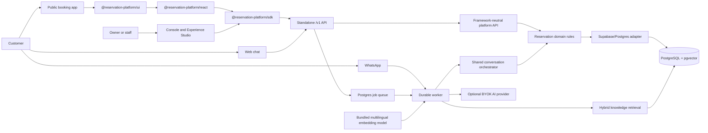
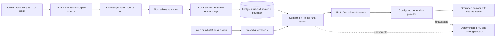

# Reservation Platform

A Docker-first, self-hosted appointment platform built from reusable TypeScript
modules. A business can publish web booking, offer AI-assisted chat and
WhatsApp, manage practitioners and reservations, and operate every channel from
one owner console.

The supported product model is deliberately simple: **one business per Docker
installation**. Internally, tenant and venue boundaries remain enforced so the
backend packages, SDK, and frontend toolkit can be reused safely in other
products.

> **Release status:** `0.2.0` is a release candidate with database migrations
> through `000040`. The product and verification tooling are implemented, but a
> production release remains conditional on deployment-specific recovery,
> integration, and independent acceptance evidence.

## What the platform provides

| Area | Implemented capability |
| --- | --- |
| First run | Blank Docker installation, generated infrastructure secrets, one-time browser owner setup, and guided appointment-business onboarding |
| Public booking | Published business page, live availability, practitioner selection, conflict-safe confirmation, customer management link, rescheduling, and cancellation |
| Owner operations | Appointment calendar, status changes, manual booking, maintenance, staff access, location scope, system status, and operational analytics |
| Experience Studio | Business profile, branding, services, practitioners, opening hours, channels, customer preview, validation, versioned publishing, and public slug |
| Web chat | Shared structured proposal-and-confirmation booking flow, deterministic fallback, staff takeover, and conversation history |
| WhatsApp | Self-hosted Baileys linked-device pairing, encrypted session persistence, the shared booking workflow, staff takeover, and an isolated simulation mode |
| AI | Owner-supplied OpenAI-compatible generation provider, bounded connection testing, structured outputs, and graceful deterministic fallback |
| Knowledge/RAG | FAQs, pasted text, and PDF ingestion; local multilingual embeddings; PostgreSQL lexical and vector retrieval; citations; and retrieval-only testing |
| Email | Owner-configured SMTP, encrypted credentials, durable delivery jobs, and manual staff-invitation fallback when delivery is unavailable |
| Developer surface | Versioned HTTP contracts, OpenAPI and JSON Schema artifacts, TypeScript SDK, headless React hooks, reusable UI, and forkable frontend examples |

Every booking channel reaches the same availability and atomic reservation
path. AI-generated free text cannot create a reservation directly: the platform
stores a structured proposal, requires explicit confirmation, then revalidates
the requested slot and practitioner before inserting the reservation.

## Architecture



The browser receives only public experience data or an authenticated,
server-mediated console session. Database credentials, provider keys,
installation secrets, WhatsApp credentials, and encryption keys remain in the
backend containers.

### Knowledge and AI flow



Embeddings run inside the existing worker using a checksum-verified model
bundled into its image. No embedding API key or separate vector database is
required. The owner’s BYOK provider is used only for final response generation.

## Repository structure

| Path | Responsibility |
| --- | --- |
| `apps/api` | Node HTTP host, runtime composition, authentication, provider wiring, and `/v1` routes |
| `apps/worker` | Durable jobs, email, WhatsApp, knowledge indexing, retrieval, and conversation processing |
| `apps/console` | Authenticated onboarding, Experience Studio, reservations, inbox, analytics, staff, integrations, and system status |
| `apps/booking` | Main published customer experience for booking, chat, and reservation management |
| `apps/examples/starter-next` | Minimal forkable Next.js frontend using the released frontend packages |
| `apps/examples/appointments` | Appointment frontend example |
| `apps/examples/room-booking` | Room-booking frontend example using the same platform boundary |
| `apps/examples/racing-simulator` | Racing-simulator frontend example using the same platform boundary |
| `packages/reservations-core` | Framework-neutral availability, capacity, resource, conflict, and reservation rules |
| `packages/reservation-platform-api` | Framework-neutral handlers, authorization, idempotency, projections, and platform operations |
| `packages/reservations-supabase` | Tenant-scoped persistence and atomic PostgreSQL operations |
| `packages/database` | Ordered migrations, guarded seeds, migration index, and database metadata |
| `packages/contract-types` | Public DTOs, Zod validation, OpenAPI, and generated JSON Schema artifacts |
| `packages/sdk` | Browser-safe TypeScript client for public and authenticated API routes |
| `packages/reservation-react` | Headless React provider and booking hooks |
| `packages/reservation-ui` | Reusable booking components, presets, configuration helpers, and styles |
| `packages/reservation-chat-core` | Provider-neutral structured booking conversation contracts and guards |
| `packages/ai-chat` | AI workflow, checkpoint, audit, and agent runtime abstractions |
| `packages/ai-sdk-adapter` | Backend-only Vercel AI SDK adapter for OpenAI-compatible providers |
| `packages/whatsapp` | Baileys session lifecycle, encrypted credentials, delivery, and staff takeover |
| `scripts` | Local stack, release, database, SDK, deployment, security, and acceptance tooling |
| `tests` | Smoke, E2E, browser, Docker, production, and boundary verification |

Backend packages remain modular and framework-neutral where possible. Frontend
packages are prevented from importing Supabase clients, service-role
credentials, database adapters, or backend runtime code.

## Quick start: blank Docker product

### Prerequisites

- Docker Engine or Docker Desktop with Docker Compose v2.
- Node.js `>=24 <25`.
- pnpm `10.33.2`, pinned by the root `packageManager` field.
- Free loopback ports `4100`, `4300`, and `4400`.

External AI, SMTP, and WhatsApp credentials are optional. They are not required
to complete first-owner onboarding or test web booking.

### 1. Install workspace dependencies

```bash
pnpm install --frozen-lockfile
```

### 2. Start the product installation

```bash
pnpm run stack:up
```

This is equivalent to `docker compose up --build -d`. The default stack:

- generates and retains local infrastructure secrets in protected Docker state;
- applies migrations through `000040`;
- creates one setup-pending installation;
- creates no owner, venue, service, resource, reservation, or demo business;
- starts PostgreSQL/PostgREST, the API, worker, console, and booking app.

Do not create a fixture owner or manually edit an application `.env` for this
flow.

### 3. Create the first owner

```bash
pnpm run stack:setup-url
```

Open the one-time URL printed by the command. Create the owner through the
browser, then complete the guided setup:

1. Business identity and public slug.
2. First location and IANA timezone.
3. Appointment services and durations.
4. Practitioners and service assignments.
5. Weekly opening hours and closures.
6. Channel defaults.
7. Review, validate, preview, and publish.

The setup token becomes permanently unusable after successful owner creation.
Do not put the URL in screenshots, logs, tickets, or committed files.

### 4. Use the installation

| URL | Purpose |
| --- | --- |
| `http://127.0.0.1:4300/admin` | Owner and staff console |
| `http://127.0.0.1:4300/admin/login` | Normal login after setup |
| `http://127.0.0.1:4400/<public-slug>` | Published customer experience |
| `http://127.0.0.1:4100/v1/health` | Local API health |

Make a customer booking in a private window and confirm that it appears in
**Reservations**. Attempting the same practitioner and time again must return a
conflict rather than silently double-booking it.

### 5. Stop or remove the installation

```bash
pnpm run stack:down
```

This stops containers while preserving product data. To delete product data,
use `pnpm run stack:destroy` and accept its explicit confirmation prompt.

## Run the isolated demonstrations

The three completed showcase businesses are not part of the default product
installation. They use a separate Compose project and separate volumes.

```bash
pnpm run stack:down
pnpm run stack:demo:up
pnpm run stack:demo:owner
```

The demo stack contains the Apex racing, Harbour room, and Luma appointment
experiences. Product and demo stacks share the loopback ports, so they cannot
run simultaneously.

```bash
pnpm run stack:demo:verify
pnpm run stack:demo:down
```

Resetting or destroying the demo stack does not modify product volumes.

## Configure optional integrations

Provider configuration belongs in the authenticated console. Secrets are
write-only, encrypted at rest, excluded from public responses, and never meant
for `NEXT_PUBLIC_*` variables.

| Integration | Console location | Notes |
| --- | --- | --- |
| AI generation | `/admin/settings/ai` | Accepts an OpenAI-compatible endpoint, API key, and exact model ID. OpenRouter can be used with its compatible base URL and provider-qualified model ID. |
| Knowledge/RAG | `/admin/studio/knowledge` | Add FAQs, pasted text, or text-based PDFs; inspect indexing state and test retrieval without spending provider credits. |
| WhatsApp | `/admin/settings/whatsapp` | Uses Baileys linked-device QR pairing. QR payloads are displayed only to the authorized owner and must not appear in logs. |
| Email | `/admin/settings/email` | Uses SMTP credentials and a connection test. A provider’s HTTP API key alone is not an SMTP configuration. |

WhatsApp is hosted by the platform worker in the same Docker installation. AI
generation requests are sent from the worker to the owner-configured provider;
knowledge embedding and retrieval remain local.

When integrations fail or are disabled:

- web booking and owner operations continue;
- AI falls back to deterministic FAQ and structured booking behavior;
- retrieval failure prevents unsupported document claims but not booking;
- staff invitations return a manual acceptance link if email cannot be queued;
- WhatsApp simulation remains restricted to the explicit demo/test mode.

See [Connect AI](docs/how-to/connect-ai.md),
[Manage AI knowledge](docs/how-to/manage-ai-knowledge.md), and
[Connect WhatsApp](docs/how-to/connect-whatsapp.md).

## Build a separate frontend

External frontends integrate through `/v1` or the frontend-safe packages. They
do not connect directly to PostgreSQL or Supabase.

Build and pack the release artifacts locally:

```bash
pnpm run packages:pack
```

Tarballs are written to the ignored `dist-packages/` directory. A consumer
typically installs matching versions of:

- `@reservation-platform/contract-types`
- `@reservation-platform/sdk`
- `@reservation-platform/react` for headless React state
- `@reservation-platform/ui` for the complete reusable booking flow

Minimal SDK usage:

```ts
import { createReservationPlatformClient } from "@reservation-platform/sdk";

const client = createReservationPlatformClient({
  baseUrl: "https://appointments.example.com",
  tenantId: "your-tenant-context",
});

const services = await client.listServices();
const date = new Date(Date.now() + 7 * 24 * 60 * 60 * 1_000)
  .toISOString()
  .slice(0, 10);
const availability = await client.listAvailability({
  service_id: services.services[0].service_id,
  date,
});
```

Minimal reusable UI:

```tsx
import "@reservation-platform/ui/styles.css";
import {
  BookingFlow,
  createBookingFlowConfig,
} from "@reservation-platform/ui";

const config = createBookingFlowConfig({
  apiBaseUrl: process.env.NEXT_PUBLIC_RESERVATION_PLATFORM_BASE_URL,
  serviceId: process.env.NEXT_PUBLIC_RESERVATION_SERVICE_ID,
});

export default function Page() {
  return <BookingFlow {...config.booking} />;
}
```

Start from `apps/examples/starter-next` when a complete forkable Next.js shell
is more useful than individual packages.

## Local source development

Start the in-memory backend for fast module development:

```bash
pnpm run dev:memory
```

Start the normal standalone backend after configuring its database connection:

```bash
pnpm run dev
```

Frontend development commands:

```bash
pnpm run dev:console
pnpm run dev:booking
pnpm --filter @reservation-platform/example-starter-next run dev
```

Common backend-only environment names include:

```env
RESERVATION_SUPABASE_URL=
RESERVATION_SUPABASE_ANON_KEY=
RESERVATION_SUPABASE_SERVICE_ROLE_KEY=
RESERVATION_PLATFORM_SERVICE_API_KEY=
RESERVATION_PLATFORM_AUTH_JWKS_URL=
RESERVATION_PLATFORM_AUTH_ISSUER=
RESERVATION_PLATFORM_AUTH_AUDIENCE=
```

These variables are for manual source development. The supported local product
stack and production installer generate infrastructure configuration instead of
asking business owners to maintain it.

## Verification

Fast source checks:

```bash
pnpm run test
pnpm run apps:test
pnpm run packages:verify-boundaries
pnpm run database:verify-migration-bundle
```

Product and browser journeys:

```bash
pnpm run stack:verify
pnpm run stack:verify:live
pnpm run stack:verify:onboarding
pnpm run stack:verify:persistence
pnpm run test:e2e
pnpm run test:browser
```

Release-oriented checks:

```bash
pnpm run sdk:release-gate
pnpm run deploy:verify
pnpm run database:live-proof:strict
pnpm run ci:verify
```

Strict and live commands may start containers, mutate disposable test data, or
require infrastructure. Generated screenshots, recordings, sanitized responses,
and logs belong under ignored `tmp/`; credentials, setup URLs, session cookies,
QR values, and customer identifiers must never be committed.

## Production installation

Production uses the signed release bundle and installer rather than the local
Compose shortcut. The supported target is currently x86-64 Ubuntu 22.04 or
24.04 with Docker Compose v2, public DNS, and HTTPS ports available.

Start with:

- [Production first-run tutorial](docs/tutorials/production-first-run.md)
- [Production configuration reference](docs/reference/production-configuration.md)
- [Release compatibility](docs/reference/release-compatibility.md)
- [Backup and restore](docs/operations/backup-restore.md)
- [Upgrade and rollback operations](docs/operations/upgrades.md)
- [Installation recovery](docs/how-to/recover-installation.md)

## Security model

- The default deployment exposes only the web edge in production; database and
  internal services remain on private Docker networks.
- Public frontends never receive service-role keys or backend provider secrets.
- Owner operations require authenticated tenant and venue context.
- Reservation writes use idempotency and atomic database conflict checks.
- AI and SMTP credentials are encrypted and write-only; installation secrets
  live in protected configuration state, and WhatsApp sessions use their
  dedicated encryption key.
- WhatsApp QR payloads, raw session state, knowledge contents, and customer
  queries are excluded from ordinary logs.
- Knowledge sources and chunks are tenant- and venue-scoped; archived content
  is excluded from retrieval immediately.

## Scope and limitations

- The primary product is an appointment/service business platform. Other
  domains demonstrate package reuse rather than separate production products.
- One business is supported per Docker installation.
- Payments, a public marketplace, native mobile apps, OCR, website crawling,
  DOCX ingestion, and enterprise identity are outside the current scope.
- Baileys is an unofficial WhatsApp Web integration and can be affected by
  upstream protocol changes.
- AI and external delivery quality depend on the owner’s selected provider and
  credentials; deterministic booking and web booking remain the baseline.
- A source checkout is not automatically a production release. Production use
  requires verified release artifacts, backups, restore drills, monitoring, and
  environment-specific acceptance.

## Documentation

- [Documentation index](docs/README.md)
- [Final platform architecture](docs/architecture/final-platform-architecture.md)
- [Owner onboarding](docs/how-to/owner-onboarding.md)
- [Staff working day](docs/how-to/staff-working-day.md)
- [Manual Docker acceptance](docs/how-to/manual-docker-acceptance.md)
- [Release evidence template](docs/release-evidence/full-day-acceptance-template.md)

## License

Release package metadata declares the reusable platform packages as MIT. See
the repository license and release bundle for the exact terms that apply to a
distributed build.
