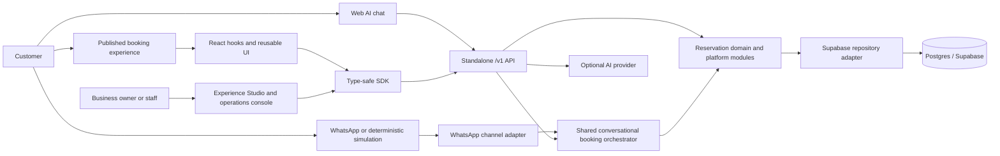
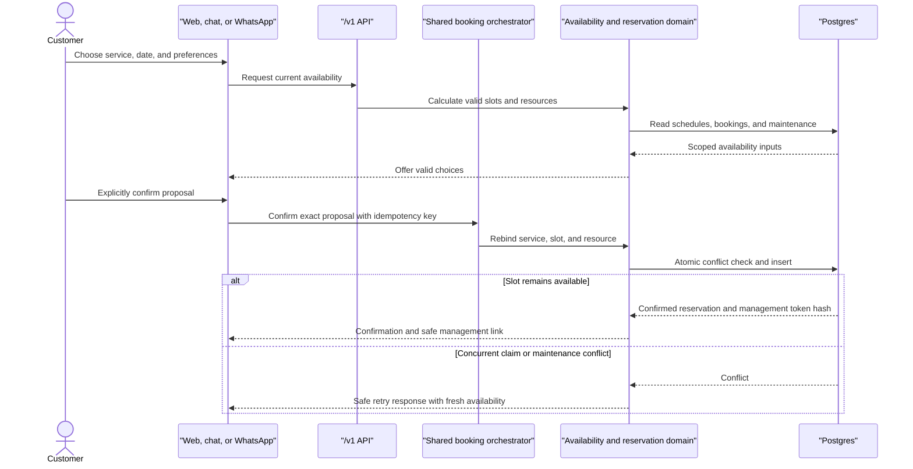
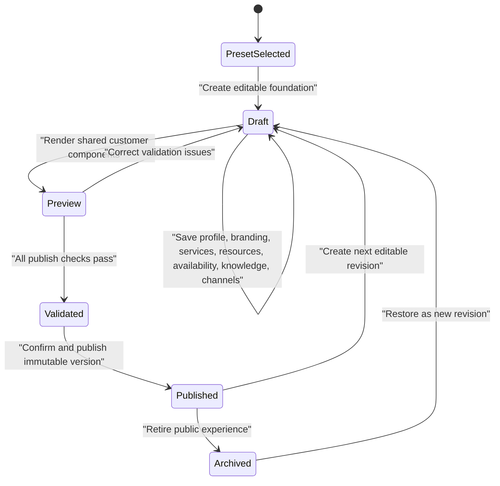
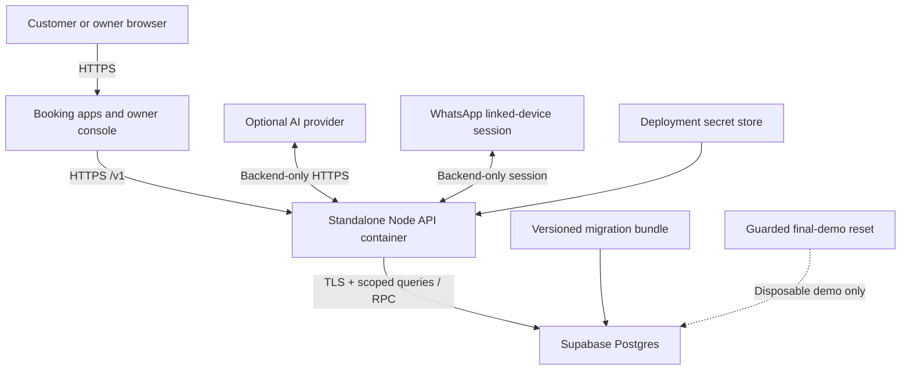

# Final platform architecture

## Purpose

The Reservation Experience Platform separates reusable reservation rules from presentation and channel adapters. A venue can publish one configuration and offer it through visual web booking, AI chat, and WhatsApp while every confirmed booking uses the same availability and atomic reservation path.

## System view

The browser receives only published configuration and public reservation data. Owner operations require authenticated tenant and venue context. Database credentials, AI keys, WhatsApp session material, and service keys remain in backend runtime configuration.

## Package responsibilities

| Layer | Responsibility |
| --- | --- |
| `apps/api` | Runtime composition, environment validation, HTTP server, provider wiring |
| `apps/console` | Server-authenticated Studio, unified inbox, operations, reservations, resources, analytics |
| `apps/booking` and `apps/examples/*` | Public booking shells using browser-safe configuration |
| `packages/reservations-core` | Availability, capacity, resource assignment, overlap, and reservation rules |
| `packages/reservation-platform-api` | Framework-neutral route handling, authorization, idempotency, public/owner mapping |
| `packages/reservations-supabase` | Tenant-scoped persistence and atomic Postgres operations |
| `packages/database` | Ordered migrations, indexes, and deterministic seeds |
| `packages/contract-types` | DTOs, validation schemas, and generated OpenAPI contract |
| `packages/sdk` | Typed client for public and authenticated platform routes |
| `packages/reservation-react` / `reservation-ui` | Headless state and reusable public booking components |
| `packages/ai-chat` / `reservation-chat-core` | Provider-neutral proposal, confirmation, and booking workflow |
| `packages/whatsapp` | Channel session, simulation, staff takeover, encrypted credential persistence |

## Confirmed booking sequence

No conversational channel writes a reservation from free-form model output. The platform stores a structured proposal, requires explicit confirmation, revalidates the exact selection, and uses the same atomic mutation as visual booking.

## Experience Studio lifecycle

The published version is isolated from subsequent draft edits. Public routes resolve only a published slug and expose a browser-safe projection, so an owner can prepare the next revision without changing the live customer experience.

## Deployment view

The API can run in memory for local smoke work, but the final multi-tenant feature set requires migrated Postgres. Deployments must run `pnpm deploy:verify`, apply the indexed migration bundle in order, configure CORS and owner authentication, and keep all secret-bearing values out of frontend environments.

## Live integrations and deterministic simulation

| Capability | Live mode | Deterministic demonstration mode |
| --- | --- | --- |
| Database | Supabase/Postgres with migrations `000001`–`000020` | Same schema with guarded `final_demo` seed; validation-only without a URL |
| AI | OpenAI-compatible provider configured in backend env | Rule-driven structured booking responses |
| WhatsApp | Baileys linked-device session with encrypted credential payload when a key is set | Credential-free channel adapter using the same orchestrator and persistence |
| Realtime | Polling/read refresh against owner API | Same behavior over seeded data |

## Deliberate non-goals and limitations

- This is a broad platform demonstration, not a production marketplace, payment processor, or enterprise workforce scheduler.
- Only racing simulators, rooms, and appointments receive domain-specific visual polish. The other five presets prove the shared model.
- Baileys is an unofficial WhatsApp Web integration and may change upstream; simulation is the guaranteed presentation path.
- Analytics are operational aggregates, not a general business-intelligence warehouse.
- Final production assurance still requires deployed accessibility review, database RLS proof, load testing, monitoring, backups, and incident procedures in the target environment.
