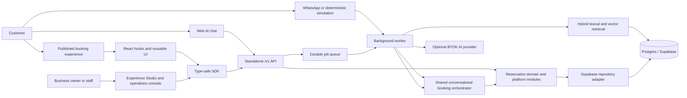
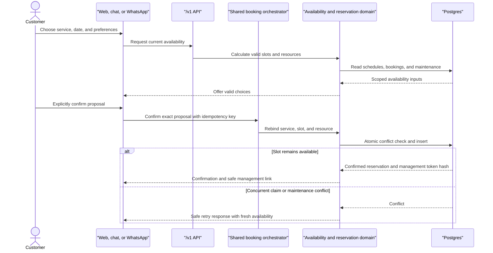
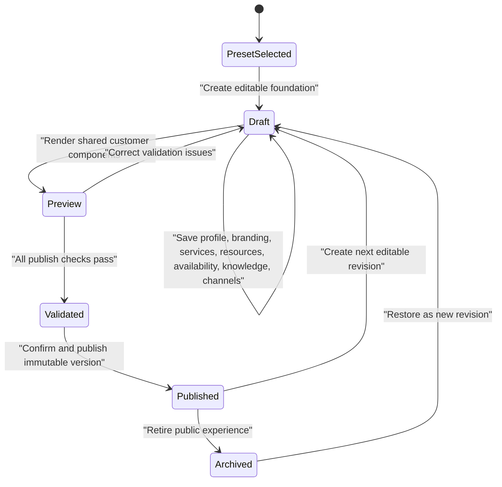
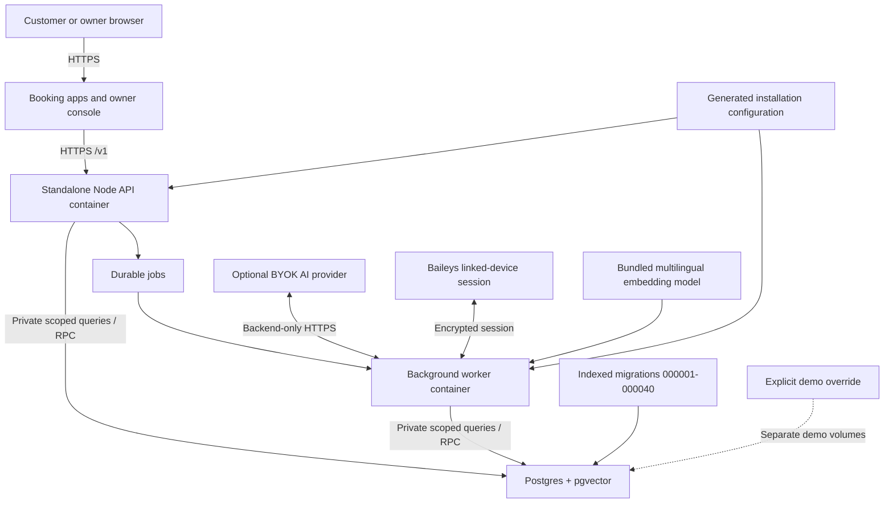

# Final platform architecture

## Purpose

The Reservation Experience Platform is a Docker-first, single-business
appointment product built from reusable reservation modules. One installation
publishes one business through visual web booking, AI-assisted chat, and
WhatsApp while every confirmed booking uses the same availability and atomic
reservation path. Tenant and venue scoping remain enforced internally so the
modules and data model stay safe and reusable.

## System view

The browser receives only published configuration and public reservation data.
Owner operations require authenticated tenant and venue context. Database
credentials and installation secrets remain in generated server configuration;
AI, email, and WhatsApp credentials are entered through owner settings, stored
encrypted, and used only by backend containers.

## Package responsibilities

| Layer | Responsibility |
| --- | --- |
| `apps/api` | Runtime composition, environment validation, HTTP server, provider wiring |
| `apps/worker` | Durable jobs, knowledge indexing, local embeddings, retrieval, notifications, conversation processing, and WhatsApp work |
| `apps/console` | Server-authenticated Studio, unified inbox, operations, reservations, resources, analytics |
| `apps/booking` and `apps/examples/*` | Public booking shells using browser-safe configuration |
| `packages/reservations-core` | Availability, capacity, resource assignment, overlap, and reservation rules |
| `packages/reservation-platform-api` | Framework-neutral route handling, authorization, idempotency, public/owner mapping |
| `packages/reservations-supabase` | Tenant-scoped persistence and atomic Postgres operations |
| `packages/database` | Ordered migrations through `000040`, indexes, and guarded deterministic seeds |
| `packages/contract-types` | DTOs, validation schemas, and generated OpenAPI contract |
| `packages/sdk` | Typed client for public and authenticated platform routes |
| `packages/reservation-react` / `reservation-ui` | Headless state and reusable public booking components |
| `packages/ai-chat` / `reservation-chat-core` | Provider-neutral proposal, confirmation, and booking workflow |
| `packages/whatsapp` | Channel session, simulation, staff takeover, encrypted credential persistence |

## Confirmed booking sequence

No conversational channel writes a reservation from free-form model output. The platform stores a structured proposal, requires explicit confirmation, revalidates the exact selection, and uses the same atomic mutation as visual booking.

## Experience Studio lifecycle

The published version is isolated from subsequent draft edits. Public routes resolve only a published slug and expose a browser-safe projection, so an owner can prepare the next revision without changing the live customer experience.

## Deployment view

The default Compose stack starts a blank product installation and creates its
first owner through browser setup. The explicit demo override uses separate
Compose state and guarded seeds. Production uses the same one-business model,
applies the indexed migration bundle in order, and keeps database and integration
credentials off the browser and ordinary logs. In-memory mode remains a
development-only smoke harness.

## Live integrations and deterministic simulation

| Capability | Live mode | Deterministic demonstration mode |
| --- | --- | --- |
| Database | PostgreSQL/pgvector with migrations `000001`–`000040` | Same schema with explicit, isolated demo seed |
| AI and retrieval | Owner-configured BYOK generation plus local hybrid retrieval over indexed FAQs, text, and PDFs | Deterministic FAQ and structured booking fallback without provider credentials |
| WhatsApp | Baileys linked-device session with encrypted credential payload when a key is set | Credential-free channel adapter using the same orchestrator and persistence |
| Email | Owner-configured SMTP with encrypted credentials and durable delivery jobs | Manual invitation fallback when SMTP is absent |
| Realtime | Polling/read refresh against owner API | Same behavior over isolated demo data |

## Deliberate non-goals and limitations

- This is a self-hosted appointment platform, not a marketplace, payment processor, native mobile application, or enterprise workforce scheduler.
- Industry presets configure booking semantics and terminology. Selectable visual design presets are a separate future extension.
- Baileys is an unofficial WhatsApp Web integration and may change upstream; simulation is the guaranteed presentation path.
- Analytics are operational aggregates, not a general business-intelligence warehouse.
- Final production assurance still requires deployed accessibility review, database RLS proof, load testing, monitoring, backups, and incident procedures in the target environment.
