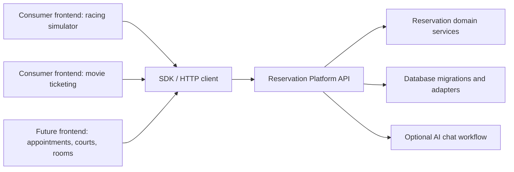

# FYP Modular Booking Platform Strategy

This branch is the backend-modules branch for the final year project modular
booking platform. The product goal is a reusable backend platform that can power
different booking frontends, not a racing-simulator-only application.

## Branch Strategy

Use this branch as the platform development line:

- `platform/backend-modules`: reusable backend platform, SDK, contracts,
  database bundle, backend API host, and backend readiness documentation.
- `main`: remains stable until this branch is ready to become the final FYP
  submission.
- consumer/demo branches or repos: racing simulator, movie ticketing, and other
  frontends that use this backend platform.

When the platform branch is runnable, documented, and proven with demos, merge it
into `main` so the final `main` branch represents the FYP product.

This branch intentionally excludes frontend application source. Consumer demos
should be built separately and connect through the SDK or `/v1` API.

## Product Shape



## What Main Should Eventually Contain

- `apps/api`: standalone backend platform API.
- `packages/sdk`: frontend-facing SDK.
- `packages/contract-types`: public API schemas and TypeScript types.
- `packages/database`: backend-owned migrations, seeds, and migration metadata.
- `packages/reservations-*`: reusable domain and persistence modules.
- docs describing how external frontend demos should use the backend contract
  instead of copying database logic.

## Public Interfaces To Present

The FYP demonstration should focus on these stable integration surfaces:

- Backend API: `/v1/services`, `/v1/availability`, `/v1/reservations`,
  `/v1/resource-maintenance`.
- SDK: installable client package for frontend or server consumers.
- Backend runtime config: Supabase/database credentials stay backend-only.
- Frontend runtime config: frontend only needs the backend URL and optional
  tenant/venue identifiers.
- AI chat: current local LangChain chat is a reference/legacy path; backend
  platform chat is a planned module unless fully wired before submission.

## Consumer Demo Proofs

Use separate consumer branches or repositories to prove the backend is reusable:

- racing simulator: assigned-seat/resource booking proof.
- movie ticketing: second-domain proof using the same backend API/SDK.

Each demo should document:

- how to start the backend platform,
- how to start the frontend example,
- how to make a booking,
- which files prove the frontend has no direct database dependency.

## Readiness Checklist Before Replacing Main

- A fresh consumer frontend can create a booking through the backend without
  Supabase keys.
- The backend runs with backend-only Supabase env.
- The SDK can be imported by an external app.
- Contract/API tests pass.
- Database migration bundle checks pass.
- Current frontend/platform smoke tests pass.
- Docs explain how a new frontend plugs into the platform.

## Recommended Validation Commands

```powershell
node --import tsx --test components/form/SeatMap.test.ts
node --test scripts/dev-platform-config.test.mjs
pnpm run packages:test
pnpm run build
```

These commands are safe for verification. They may write normal build/test cache
artifacts but should not edit tracked source files.
