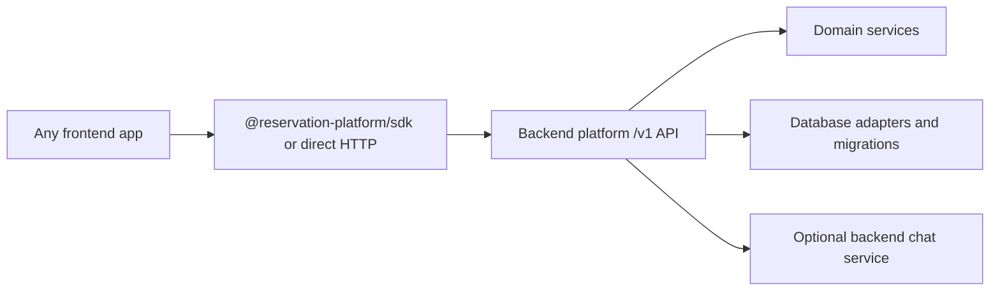

# Modular Backend Platform Refactor

> **Archived programme record:** this tree preserves the decisions and proofs
> used to establish the current backend, SDK, and package boundaries. It is not
> the current installation guide or release checklist. Start from
> [the documentation index](../README.md) for supported workflows.

This directory now tracks the backend-platform architecture direction.

The current product goal is not a frontend plugin and not direct installation of
internal reservation/database packages into another app. The goal is a reusable
backend platform, with an optional TypeScript SDK, that any frontend can call.

## Historical Canonical Plan

- [Backend Platform Extraction Plan](backend-platform-extraction/README.md)
- [SDK Readiness Plan](backend-platform-extraction/sdk-readiness/README.md)
- [Frontend, Backend Modules, and SDK Separation Plan](backend-platform-extraction/frontend-backend-sdk-separation/README.md)
- [API Resource List](backend-platform-extraction/contracts/api-resource-list.md)
- [SDK Method List](backend-platform-extraction/contracts/sdk-method-list.md)
- [Error Conventions](backend-platform-extraction/contracts/error-conventions.md)
- [Idempotency Conventions](backend-platform-extraction/contracts/idempotency-conventions.md)
- [Backend Platform Boundary Inventory](backend-platform-extraction/backend-platform-boundary-inventory.md)
- [Backend Platform Subagent Handoff Template](backend-platform-extraction/subagent-handoff-template.md)

## Retained Source Inventories

These files are kept as source context for the canonical plan:

- [Package Boundary Inventory](package-boundary-inventory.md)
- [AI Chat Boundary Inventory](ai-chat-boundary-inventory.md)
- [AI Chat Workflow Refactor Overview](ai-chat-workflow-refactor.md)

They are not the active implementation roadmap. If they conflict with the
backend-platform extraction plan or SDK readiness plan, the backend-platform
documents win.

## Removed Stale Plans

The older package-first and plugin-host phase docs were removed from this
branch because they described a different direction:

- installing internal `@project-play/*` packages directly in external apps
- exposing Supabase adapters as the consumer integration path
- building plugin host/framework adapter layers before the backend platform
- extracting chat as direct frontend-consumed LangChain packages

Those ideas were superseded by the backend API + SDK model.

## Current Target Shape

Frontend repositories should configure a backend URL, auth/session strategy,
tenant or venue context, and optional SDK client. They should not copy booking
logic, database queries, Supabase RPC details, LangChain workflow internals, or
this app's Next.js route structure.

## Change Propagation Rule

If a canonical phase changes API endpoints, SDK method names, DTO names, package
names, auth/tenant/idempotency behavior, database ownership, or optional chat
contracts, update all later backend-platform and SDK-readiness phase docs before
implementation continues.
