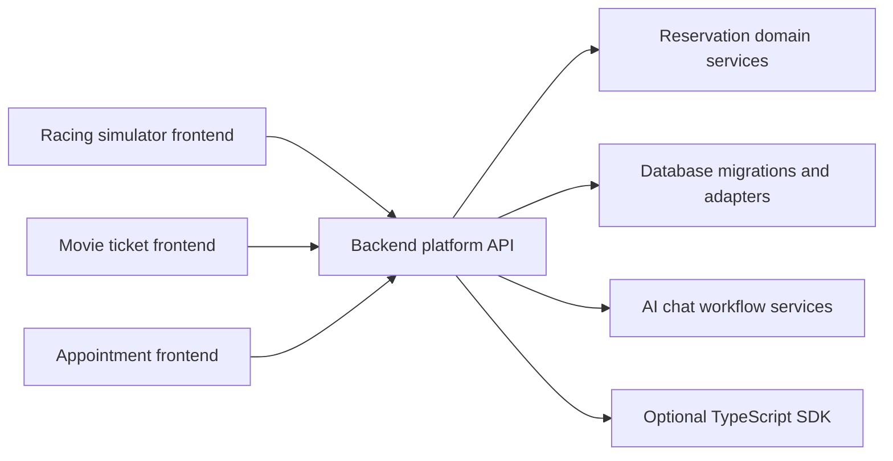

# Backend Platform Extraction Plan

This folder describes the corrected modularity goal: separate the frontend from a reusable backend platform so future products can plug any frontend into the same reservation infrastructure.

The backend platform should become its own repository or deployable service. This app should become the first consumer frontend, not the owner of the reservation backend.

## Target Shape

## FYP Branch Strategy

The final-year-project development branch is `platform/backend-modules`. Keep
`main` stable until this branch is ready to become the final submission branch.
Use in-repository examples for grading-friendly proofs instead of splitting into
multiple repositories before submission. See
[FYP Modular Booking Platform Strategy](../../fyp-modular-booking-platform/README.md).

## What Plug-And-Play Means Here

Plug-and-play means a frontend can be built in another repository and integrated by configuring:

- Backend service URL
- Auth/session strategy
- Tenant or venue configuration
- Resource catalog, such as simulator rigs, seats, rooms, or appointment slots
- Optional SDK package
- Optional AI chat endpoint

The frontend should not need to copy booking logic, database queries, Supabase RPC details, or LangChain workflow internals.

## Phase Files

- [Phase 0: Intent Reset and Boundary Map](phase-0-intent-reset-boundary-map.md)
- [Phase 1: Backend Platform Contract](phase-1-backend-platform-contract.md)
- [Phase 2: Standalone Backend Repo Shape](phase-2-standalone-backend-repo-shape.md)
- [Phase 3: Domain Service Extraction](phase-3-domain-service-extraction.md)
- [Phase 4: API Layer and SDK Contract](phase-4-api-layer-and-sdk-contract.md)
- [Phase 5: Database Ownership and Migration Strategy](phase-5-database-ownership-migration-strategy.md)
- [Phase 6: AI Chat Backend Service Contract](phase-6-ai-chat-backend-service-contract.md)
- [Phase 7: Current Frontend Migration](phase-7-current-frontend-migration.md)
- [Phase 8: External Frontend Proofs](phase-8-external-frontend-proofs.md)
- [Phase 9: Release, Deployment, and Operations](phase-9-release-deployment-operations.md)
- [SDK Readiness Plan](sdk-readiness/README.md)
- [Frontend, Backend Modules, and SDK Separation Plan](frontend-backend-sdk-separation/README.md)
- [Subagent Handoff Template](subagent-handoff-template.md)
- [Standalone Backend Extraction Manifest](standalone-backend-extraction-manifest.json)
- [Backend Repository Bootstrap Guide](backend-repo-bootstrap.md)
- [Backend Package Ownership](backend-package-ownership.md)

## Change Propagation Rule

Every phase must keep later phase docs aligned when it changes shared assumptions.

Shared assumptions include:

- API route names and request/response shapes
- SDK package names and public exports
- Database table names, RPC names, and migration ownership
- Auth, tenant, venue, or user identity requirements
- AI chat endpoint names, tool contracts, and model provider assumptions
- Backend repository structure and deployment target

When one of these changes:

1. Update the current phase file with the decision.
2. Search later phase files for the old assumption.
3. Update downstream dependencies, deliverables, acceptance criteria, and risks.
4. Add a short note in the current phase under `Downstream Updates Required`.

## Current Extraction Guardrails

`apps/api` is now a bounded standalone backend app skeleton proof. It is a
private workspace package, not a final extracted repository, and exposes
framework-neutral/Node HTTP route handling for `GET /v1/metadata`, catalog
`GET /v1/venues`, `/v1/services`, `/v1/resources`,
`/v1/resource-layouts/{id}` reads backed by an injected
`PlatformCatalogRepository`, `GET /v1/availability` backed by an injected
`AvailabilityRepositoryPort`, read-only `GET /v1/reservations` and
`GET /v1/reservations/{id}` backed by an injected
`ReservationReadRepositoryPort`, plus disabled
`/v1/chat/reservation-sessions/**` responses by importing backend-owned
platform packages. It also handles injected idempotent
`POST /v1/reservations` creation through `ReservationCreateRepositoryPort`
and injected idempotent reservation lifecycle mutations (`PATCH
/v1/reservations/{id}`, `POST /v1/reservations/{id}/reschedule`, and `POST
/v1/reservations/{id}/cancel`) through `ReservationMutationRepositoryPort`
and `IdempotencyRepository`, requiring `Idempotency-Key`, validating public
mutation inputs through the platform package, replaying completed matching
requests, and rejecting key reuse with different request fingerprints. It now
also maps `GET /v1/resource-maintenance`, `POST /v1/resource-maintenance`, and
`POST /v1/resource-maintenance/{id}/end` through an injected
`ResourceMaintenanceRepositoryPort`, with list-query validation before
repository configuration/storage work and no standalone idempotency layer beyond
the current SDK route contract. If a host does not inject catalog, availability,
reservation read, reservation create, reservation mutation,
resource-maintenance, or idempotency repositories, those routes return stable
platform errors instead of importing current-app factories. `apps/api` now also
has a backend-only Supabase runtime dependency factory that wires
`@project-play/reservations-supabase` repository adapters from explicit config
or backend env. The expected env names are `RESERVATION_SUPABASE_URL`,
`RESERVATION_SUPABASE_ANON_KEY`, and
`RESERVATION_SUPABASE_SERVICE_ROLE_KEY`; these are backend-only values, not
frontend or SDK config. Complete config creates separate anon/public and
service-role/admin clients and wires tenant/venue context validation through
`createSupabaseTenantVenueRepository(adminClient)`, while absent Supabase
config preserves the safe default repository-not-configured behavior and
partial Supabase config fails closed. `RESERVATION_PLATFORM_SERVICE_API_KEY` is
also supported as optional backend-only standalone service-token config. When
configured, `apps/api` requires `Authorization: Bearer ...` on catalog,
availability, reservation, and resource-maintenance data routes, authorizes an
internal service principal for the requested tenant context, optionally
requires `X-Reservation-Tenant-Id`, and validates tenant/venue existence and
ownership when a tenant/venue repository is available. `GET /v1/metadata` and
disabled chat routes stay unprotected. This is service-token readiness only,
not user bearer-token verification or provider claim/role mapping. The root
verifier
`corepack pnpm run backend-platform:verify-standalone-api-skeleton` builds the
needed package types, type-checks the skeleton, tests route behavior, and scans
the skeleton source for frontend, Next.js, React, browser Supabase,
LangChain/provider, and current-app wrapper imports.

This proves only that a backend-owned host surface can exist outside the current
Next frontend and call backend-owned catalog, availability, and read-only
reservation services plus idempotent reservation creation and lifecycle
mutation services and resource-maintenance list/create/end services through
dependency injection, and that a deployable standalone host can construct those
dependencies from backend-only Supabase runtime config. It does not prove live
reservation parity, SQL migration application, durable database-backed
idempotency behavior against a real database, resource-maintenance idempotency
policy, bearer user auth/provider verification, role claim mapping, RLS/tenant
isolation, enabled provider chat, deployment, or actual separate repository
extraction.

`standalone-backend-extraction-manifest.json` records current move/copy
candidates, compatibility shims, and exclusions for the future
`reservation-platform-backend` repository. The root release gate runs
`corepack pnpm run backend-platform:verify-extraction-manifest` to ensure the
manifest remains well-formed, points current-source entries at existing paths,
keeps backend targets under backend-repository areas, and prevents frontend UI,
admin, analytics, content, browser Supabase, or frontend platform client paths
from being marked as backend move/copy candidates. It also runs
`corepack pnpm run backend-platform:verify-extraction-dry-run`, which
deterministically enumerates move/copy candidate files into target backend
paths, skips generated/install/cache artifacts, treats compatibility shims as
reimplementation references only, verifies exclusions are not planned, and
fails on ambiguous targets, target collisions, invalid paths, frontend targets,
or generated artifact inclusion.

This is an extraction readiness guardrail. It does not create the standalone
repository, copy or move files, publish packages, or prove a live backend
deployment.

## Non-Goals

- Do not make the frontend package the product.
- Do not require future frontends to share this Next.js app structure.
- Do not expose raw Supabase table access as the primary integration contract.
- Do not couple the reusable backend to racing simulator labels.
- Do not move admin UI, analytics UI, or marketing pages into the backend platform.
