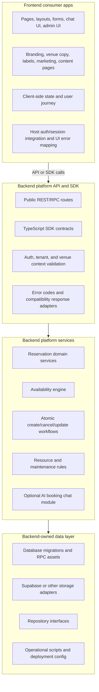

# Backend Platform Boundary Inventory

Phase 0 inventory for extracting the reusable reservation product into a
standalone backend platform. This is documentation-only. It records ownership
boundaries so later phases can move services, APIs, SDKs, database assets, and
chat contracts without treating the current Next.js frontend as the product.

## Boundary Decision

The reusable product is a backend platform that owns reservation infrastructure:
domain rules, persistence contracts, storage adapters, API contracts, optional
SDKs, and optional AI booking orchestration. The current Next.js app is the
first frontend consumer. It owns pages, UI flows, visual design, admin screens,
content presentation, host route glue during migration, and Project Play copy.

Frontend apps should call the future backend platform through an API and/or SDK.
They should not copy Supabase queries, booking validation, availability
generation, atomic booking RPC details, or chat tool orchestration.

## Boundary Diagram

## Backend Platform-Owned Behavior

These behaviors should move to, or remain in, the backend platform repo.

## Core Platform Versus Optional Modules

Core platform scope is reservation infrastructure: resource catalog contracts,
availability, atomic reservation creation, reservation lifecycle, storage
adapters, migrations, API contracts, SDK contracts, tenant isolation, and
domain errors.

Optional backend modules can live beside core only when intentionally scoped:
AI booking chat, structured knowledge retrieval, payment orchestration,
analytics/report APIs, content/CMS APIs, and notification workflows. Optional
modules must depend on core platform contracts instead of making frontend apps
copy backend logic.

Tenant configuration belongs to the platform when it affects backend behavior,
such as timezone, operating windows, resources, capacities, booking rules,
feature flags, and policy identifiers. Tenant/editorial content belongs to the
frontend, CMS, or tenant configuration source when it is display copy, venue
directions, brand wording, help text, or local marketing content.

| Behavior | Current surface | Platform ownership notes |
| --- | --- | --- |
| Reservation contracts | `packages/reservations-core/src/**`, `lib/reservations/types.ts`, `types/index.ts` bridge | Platform owns canonical `ReservationService`, `ReservableResource`, `Reservation`, `ReservationItem`, `ReservationTimeSlot`, policy, repository, and compatibility contracts. Frontends may import generated SDK types but should not define the canonical shapes. |
| Availability generation | `packages/reservations-core/src/availability.ts`, `lib/reservations/availability.ts`, `lib/availability.ts` | Platform owns slot generation, operating-hour rules, unavailable resource calculation, maintenance blocking, and compatibility fields. Host UI can format and render slots. |
| Capacity and conflict rules | `packages/reservations-core/src/capacity.ts`, `packages/reservations-core/src/conflicts.ts`, `lib/reservation-capacity.ts`, `lib/seat-maintenance.ts` | Platform owns generic quantity/resource capacity, resource-label normalization, conflict detection, and validation. Racing-only `RS` normalization remains compatibility behavior until renamed/configured. |
| Reservation validation | `packages/reservations-core/src/create-reservation.ts`, `lib/reservations/create-reservation.ts` | Platform owns errors such as `missing_resource_labels`, `maintenance_conflict`, `resource_conflict`, and `not_enough_capacity`. Frontends map stable errors to copy. |
| Repository contracts | `packages/reservations-core/src/repository.ts` | Platform owns repository interfaces and expected data access semantics. Frontends should not query booking tables directly. |
| Supabase row adapters | `packages/reservations-supabase/src/index.ts`, `lib/reservations/api-adapters.ts` | Platform adapter owns row-to-domain transforms, table constants, RPC result types, and compatibility adapters. |
| Atomic booking storage | `packages/reservations-supabase/sql/create-reservation-atomic.sql`, `packages/reservations-supabase/src/index.ts` | Platform owns the transaction-safe create workflow and SQL/RPC assets. Frontends only submit reservation requests. |
| Reservation API contracts | `app/api/availability/route.ts`, `app/api/bookings/route.ts`, `app/api/bookings/[id]/route.ts`, `app/api/services/**`, `app/api/seat-maintenance/route.ts` | Future platform API should own generic endpoints for services/resources, availability, create reservation, update/cancel reservation, and resource maintenance. Current Next.js files are host route glue during migration, not final platform source. |
| Service and venue catalog data | `app/api/services/**`, `app/api/venues/**`, Supabase `services`, `venues`, `equipment` reads | Platform should own generic resource/service catalog contracts. Project Play-specific venue copy and presentation stay frontend/tenant configuration. |
| AI booking chat contracts | `packages/ai-chat/src/**`, with `packages/reservation-chat-core/src/**`, `lib/langchain/chat-agent.ts`, and `app/api/chat/tool-loop.ts` as migration/reference context | Platform owns provider-neutral serializable chat messages/actions, tool/workflow interfaces, retrieval/checkpoint/audit ports, tenant config, and eventual reservation tool orchestration. `packages/reservation-chat-core` informs compatibility migration but is not the backend-owned optional chat package target. Provider-specific and UI-specific parts stay outside core. |
| Chat-backed reservation flow | `app/api/chat/route.ts`, `lib/langchain/chat-agent.ts`, backend-facing policy/knowledge retrieval currently surfaced through `lib/knowledge.ts` | Platform should provide API/SDK orchestration for booking chat and may own structured policy/knowledge retrieval used by backend AI tools. Host owns model provider credentials, knowledge source configuration, venue copy, editorial knowledge, and final UI confirmation rendering. |
| Database migrations and schemas | `packages/reservations-supabase/sql/**`, root `supabase/*.sql` reservation/schema assets, Supabase table/RPC assumptions | Platform owns migrations for `services`, `bookings`, `reservation_items`, `reservable_resources`, `resource_layouts`, resource maintenance, availability rules, RLS/security policies, and atomic RPCs. Phase 5 must reconcile both root Supabase SQL assets and package SQL assets into one backend-owned migration set. |
| Backend observability and operations | `scripts/start-local-supabase.ps1`, `scripts/stop-local-supabase.ps1`, package READMEs | Platform repo should own backend deployment, SQL bootstrap, smoke tests, and operations docs. Current scripts may be candidates if generalized. |

## Frontend-Owned Behavior

These behaviors should stay in consumer frontend apps.

| Behavior | Current surface | Frontend ownership notes |
| --- | --- | --- |
| Public pages and routing | `app/page.tsx`, `app/form-booking/page.tsx`, `app/chat-booking/page.tsx`, `app/blog/**`, `app/updates/**`, `app/layout.tsx`, `app/globals.css` | Frontend owns route structure, layout, SEO/page metadata, styling, and navigation. Future frontends can use any framework. |
| Booking form journey | `components/form/MultiStepForm.tsx`, `ServiceSelector.tsx`, `DatePicker.tsx`, `TimeSlotSelector.tsx`, `SeatSelector.tsx`, `BookingSummary.tsx` | Frontend owns steps, component state, validation messaging, visual flow, and how users choose service/date/time/resources. It should call backend contracts for availability and booking. |
| Resource picker UI | `components/form/SeatMap.tsx`, `components/form/SeatMap.test.ts`, `components/form/booking-maintenance.ts` | Frontend owns the visual map and selection interactions. Generic helper ideas can inform examples, but React/Tailwind UI must not move into backend platform core. |
| Chat UI | `components/chat/**`, `app/chat-booking/page.tsx` | Frontend owns message rendering, booking cards, location cards, input state, typing indicators, floating chat, and cancellation/pending visuals. |
| Landing and brand UI | `components/landing/**`, `components/shared/**`, `components/ui/**` | Frontend owns Project Play branding, hero/pricing/features copy, headers/footers, visual effects, and ticket/toast/loading components. |
| Admin UI | `app/admin/**`, `components/admin/**` | Frontend owns admin screens and dashboard navigation. Backend platform should expose admin APIs, not ship this app's admin React UI. |
| Analytics UI | `components/analytics/**`, `app/admin/analytics/page.tsx` | Frontend owns dashboard rendering, chart components, drag/sort behavior, and dashboard-to-spec presentation. Platform may expose report data APIs if analytics is in scope, but this UI stays app-owned. |
| Content presentation | `components/content/**`, `app/blog/**`, `app/updates/**`, `lib/blogs.ts`, `lib/content-posts.ts`, `app/api/blogs/**`, `app/api/updates/**`, `app/api/content-posts.ts` | Blog/update editorial behavior is Project Play site functionality, not reservation platform core. If content APIs remain, they belong to the frontend app or a separate CMS concern. |
| Host auth and session UX | `app/admin/login/page.tsx`, `app/api/api-utils.ts`, `lib/supabase-browser.ts`, `lib/supabase-server.ts` | Frontends own how users/admins sign in and how UI reacts to auth. Platform owns auth requirements and token/session validation at API boundaries. |
| Venue-specific knowledge and copy | `data/knowledge.md`, frontend/content-facing usage of `lib/knowledge.ts`, `lib/langchain/prompts.ts`, `app/api/chat/chat-config.ts` | Project Play brand/content copy, editorial knowledge, Malaysia timezone copy, location directions, and local policy text are frontend/content or tenant configuration. Only structured retrieval needed by backend AI tools is a backend platform candidate. |
| Model provider selection | `lib/langchain/models.ts`, `lib/gemini-embeddings.ts`, `lib/langchain/embeddings.ts`, environment variables | The platform may define provider interfaces. This app's OpenRouter/Gemini keys, headers, model names, and embedding setup are host configuration. |

## Current Backend Candidate Files

These current files are candidates for the standalone backend platform repo.
Some are already in `packages/`; others are host glue that should be translated
into platform APIs or adapters rather than moved verbatim.

| Current file or folder | Candidate role | Move stance |
| --- | --- | --- |
| `packages/reservations-core/src/**` | Headless reservation domain package | Move/keep as platform core source. |
| `packages/reservations-core/fixtures/**` | Cross-domain fixtures | Move/keep as platform examples and tests. |
| `packages/reservations-core/examples/**` | External-consumer examples | Move/keep as SDK/API usage guidance. |
| `packages/reservations-supabase/src/**` | Supabase storage adapter | Move/keep as platform adapter source. |
| `packages/reservations-supabase/sql/**` | Database/RPC assets | Move/keep as platform-owned migrations. |
| `packages/reservations-supabase/examples/**` | Supabase row examples | Move/keep as adapter fixtures. |
| `supabase/base-schema.sql` | Root schema asset for reservation-related tables and supporting schema | Reconcile with package SQL in Phase 5 and convert into backend-owned migrations. Exclude frontend-only tables if they remain outside platform scope. |
| `supabase/reservations-rls.sql` | Root reservation RLS policy asset | Reconcile with package SQL in Phase 5 and convert platform-owned auth/tenant policies into backend migrations. |
| `supabase/create-reservation-atomic.sql` | Root atomic reservation RPC asset | Reconcile with `packages/reservations-supabase/sql/**` in Phase 5 so the platform owns one canonical atomic create workflow. |
| `supabase/security-hardening.sql` | Root database security hardening asset | Reconcile in Phase 5 and keep backend-owned security policies with the platform migration set where applicable. |
| `supabase/knowledge.sql`, `supabase/langchain.sql` | Root AI knowledge/vector schema assets | Candidate only for backend-owned structured retrieval used by AI tools; Project Play content remains host/tenant data. Reconcile in Phase 5 if chat knowledge retrieval stays in platform scope. |
| `packages/ai-chat/src/**` | Provider-neutral optional AI chat package | Move/keep as backend-owned optional chat source. |
| `packages/reservation-chat-core/src/**` | Legacy headless chat contract/tool package | Reference-only migration context for translating compatibility DTO/tool behavior into `packages/ai-chat`; do not move as the platform backend chat package. |
| `lib/reservations/**` | Legacy in-app copy of reservation core/adapters | Backend candidate only until fully deduped into packages. Do not keep duplicate ownership long term. |
| `lib/availability.ts` | Compatibility availability wrapper | Adapt into API compatibility layer or retire after host uses platform API/SDK. |
| `lib/reservation-capacity.ts` | Compatibility capacity wrapper | Adapt generic helpers into platform or retire once imports target core package. |
| `lib/seat-maintenance.ts` | Resource maintenance normalization bridge | Split generic resource normalization into platform; keep racing `RS` behavior as compatibility/config. |
| `app/api/availability/route.ts` | Availability HTTP contract | Reimplement as backend platform API route. Current Next.js file stays host glue during migration. |
| `app/api/bookings/route.ts` | Create/list reservations HTTP contract | Reimplement generic create/list contracts in platform. Current admin search behavior is host-specific. |
| `app/api/bookings/[id]/route.ts` | Read/update/cancel reservation HTTP contract | Reimplement platform reservation admin/customer operations with stable auth and tenant rules. |
| `app/api/services/**` | Service catalog HTTP contract | Reimplement as platform service/resource catalog API. |
| `app/api/venues/**` | Venue/catalog HTTP contract | Candidate only if platform owns tenant/venue catalog. Project Play venue copy remains config. |
| `app/api/seat-maintenance/route.ts` | Resource maintenance HTTP contract | Reimplement generically as resource maintenance API. Rename away from seat-only language. |
| `app/api/chat/route.ts` | Booking chat HTTP orchestration | Reimplement as platform chat endpoint or adapter. Keep current route as frontend migration shim. |
| `app/api/chat/tool-loop.ts` | OpenAI-style tool loop helper | Candidate for a chat adapter package if kept provider-neutral enough. |
| `app/api/chat/chat-config.ts` | Prompt/date config | Split: generic prompt/date interface to platform; Project Play copy/time zone to frontend/tenant config. |
| `lib/langchain/chat-agent.ts` | LangChain booking agent | Candidate for optional LangChain adapter. Must inject repository, model, retriever, clock, venue copy, and custom actions. |
| `lib/langchain/prompts.ts` | Prompt builders | Split generic prompt sections into chat platform; host copy stays config. |
| `lib/langchain/vector-store.ts` | Knowledge retrieval adapter | Candidate only as optional Supabase vector-store adapter; table/RPC names must be config. |
| `lib/knowledge.ts` backend-facing retrieval path | Structured policy/knowledge retrieval facade | Split before moving: backend-owned only for tenant-configurable retrieval used by AI tools. Brand copy, editorial content, and venue-specific facts remain frontend/content-owned. |
| `scripts/start-local-supabase.ps1`, `scripts/stop-local-supabase.ps1` | Local Supabase operations | Candidate only if platform repo standardizes local Supabase operations. |

## Current Frontend-Owned Files

These files must stay with this frontend app or another frontend/CMS project.
They are not backend platform source.

| Current file or folder | Why it stays frontend-owned |
| --- | --- |
| `app/page.tsx`, `app/layout.tsx`, `app/globals.css`, `app/favicon.ico` | App shell, styling, and site entry. |
| `app/form-booking/page.tsx`, `components/form/**` | Booking UI flow, visual controls, and client-side resource selection. |
| `app/chat-booking/page.tsx`, `components/chat/**` | Chat rendering, cards, input state, and frontend fetch behavior. |
| `components/landing/**`, `components/shared/**`, `components/ui/**` | Branding, layout, UI primitives, effects, and visual presentation. |
| `app/admin/**`, `components/admin/**` | Current admin experience and page-level workflows. |
| `components/analytics/**`, `app/admin/analytics/page.tsx` | Analytics dashboard UI and renderer behavior. |
| `app/blog/**`, `app/updates/**`, `components/content/**` | Public content pages and presentation. |
| `app/api/blogs/**`, `app/api/updates/**`, `app/api/content-posts.ts`, `lib/blogs.ts`, `lib/content-posts.ts` | Project Play content/CMS support, not reservation platform core. |
| `app/api/analytics-chat/**`, `app/api/analytics-reports/**`, `lib/langchain/analytics-agent.ts`, `lib/langchain/sales-report-pipeline.ts`, `lib/sales-reports.ts`, `lib/sales-report-extraction.ts` | Admin analytics/reporting product area. Keep outside reservation platform unless a separate analytics backend is approved. |
| `data/knowledge.md` | Tenant/venue knowledge content. Platform can accept knowledge input but should not own Project Play content. |
| `supabase/blogs.sql` | Blog/content schema. Keep with frontend/CMS ownership unless a separate content platform is intentionally scoped. |
| `supabase/sales-reports.sql` | Reporting/analytics schema. Keep outside reservation platform core unless backend analytics becomes an explicit platform module. |
| `types/index.ts` | Current frontend type bridge and compatibility aliases. Future frontends consume generated/API SDK types instead. |
| `lib/supabase.ts`, `lib/supabase-admin.ts`, `lib/supabase-browser.ts`, `lib/supabase-server.ts` | Current app's Supabase client construction and auth helpers. Platform repo should have its own environment and client factories. |
| `scripts/seed-knowledge.ts` | Project Play knowledge seeding. Candidate only for host/tenant operations, not generic platform core. |

## Shared Contracts

These are the contracts later phases must make explicit and stable.

| Contract | Platform-owned fields or concepts | Frontend responsibility |
| --- | --- | --- |
| Tenant/venue | Tenant id, venue id, allowed services/resources, timezone, operating windows, feature flags | Provide selected tenant/venue context, display venue branding/copy, handle auth/session UX. |
| Service/resource catalog | Service id/name/description, total capacity, resource kind, selection mode, policy, resources, layouts, availability windows | Render service cards, pickers, labels, icons, and service descriptions. |
| Slot/availability | Date, start/end time, available quantity, unavailable/taken resource labels, maintenance labels, compatibility seat fields | Render calendars/time buttons and disable unavailable choices. |
| Reservation create | Service id, customer details, date/time, quantity, resource items/labels, interface/source, required idempotency key | Collect inputs, validate UI fields, submit request, render success/failure. |
| Reservation lifecycle | Status, update/cancel commands, conflict/error codes, timestamps | Map lifecycle state to admin/customer UI and copy. |
| Customer | Name, email, phone, optional user id or external customer id | Collect and display customer fields; platform validates and persists canonical data. |
| Resource maintenance | Service/resource labels, reason, active state, actor/audit metadata | Admin UI for selecting resources under maintenance. |
| Payment intent | Amount/currency/provider intent ids/status if payments are added | Payment UI and provider handoff. Platform owns reservation/payment consistency rules. |
| Chat session | Serializable messages, thread id, action payloads, tool names/schemas, confirmation payload | Render chat, cards, and custom actions; platform handles tool execution and reservation-grounded responses. |
| API/SDK error contract | Stable error codes and machine-readable validation metadata | User-facing copy, toasts, retry UI, and locale-specific wording. |

## Racing-Specific Concepts Needing Generic Names Or Configuration

These names and assumptions should not leak into the standalone platform as
defaults. Keep compatibility where current Racing Simulator and PS5 behavior
depends on them, but express them as tenant/service/resource configuration.

| Current racing-specific concept | Current surface | Generic direction |
| --- | --- | --- |
| `seat`, `seats`, `seats_booked` | API payloads, types, UI copy, chat payloads | Use `resource`, `quantity`, or `units` in platform contracts. Keep legacy aliases in compatibility API/SDK until migration. |
| `seat_labels`, `taken_seat_labels`, `maintenance_seat_labels` | Availability and booking responses | Use `resource_labels`, `taken_resource_labels`, and `maintenance_resource_labels`; expose seat aliases only in compatibility adapters. |
| `totalSeats`, `total_seats`, `available_seats` | Service and slot responses | Use `total_quantity` and `available_quantity`; preserve legacy fields for current app. |
| `service_seat_maintenance` table | Supabase queries and adapter docs | Rename or abstract as `resource_maintenance` in platform migrations; keep adapter mapping for existing schema. |
| `seat-maintenance` route and admin page | `app/api/seat-maintenance/route.ts`, `app/admin/seat-maintenance/page.tsx` | Platform API should be resource maintenance. Current admin UI can keep user-facing wording if needed. |
| `RACING_SIMULATOR_SEAT_COUNT = 16` | `app/api/seat-maintenance/route.ts` | Make configured service resources/capacity the source of truth. |
| `RS1` through `RS16` labels | `lib/seat-maintenance.ts`, `lib/availability.ts`, `components/form/SeatMap.tsx`, tests, fixtures | Treat as resource labels configured for the Racing Simulator tenant/service. |
| `legacy-rs-*` ids and fallback labels | `lib/availability.ts`, Supabase adapter fallback behavior | Replace with configured resource ids/labels or adapter compatibility callback. |
| Racing Simulator service name | `data/knowledge.md`, package examples, UI copy | Service display name remains tenant data, not platform vocabulary. |
| Island A/B layout language | `components/form/SeatMap.tsx` | Resource layout metadata/configuration, not backend core default. |
| PS5/Playstation 5 as two-seat quantity service | `data/knowledge.md`, package examples, UI copy | Keep as tenant service fixture; platform should model it as quantity/capacity resource configuration. |
| Project Play venue and Malaysia timezone | `data/knowledge.md`, `app/api/chat/chat-config.ts`, `lib/langchain/prompts.ts` | Tenant configuration: venue name, address, timezone, location actions, operating-hours copy. |
| Chat `seats` field | `packages/reservation-chat-core/src/prepared-booking.ts`, `app/api/chat/route.ts` | Consider `quantity` in future API. Keep `seats` as existing chat compatibility until downstream phases approve a breaking change. |

## What Moves Versus What Does Not

Moves to backend platform:

- Headless reservation domain packages and tests.
- Supabase/storage adapter packages and SQL/RPC migrations.
- Reservation-related root `supabase/*.sql` assets after Phase 5 reconciles them
  with package SQL into backend-owned migrations.
- Generic reservation API routes for catalog, availability, create, read,
  update, cancel, and maintenance.
- Stable SDK exports and generated API types.
- Optional AI booking chat contracts, tool factories, and model/tool adapters
  when chat is explicitly scoped as a backend module.
- Backend deployment, migration, and operational smoke assets.

Does not move:

- React/Next.js pages, layouts, CSS, visual components, and route structure.
- Booking form, seat map, chat UI, admin UI, analytics UI, and content UI.
- Project Play marketing copy, knowledge base, venue directions, and local
  branding.
- Current app-specific Supabase client factories and frontend auth UX.
- Blog/update CMS behavior and admin analytics unless separately scoped.

## Downstream Updates Required

No downstream phase assumptions changed in this inventory. Later phases should
continue to treat `reservation`, `resource`, `slot`, `customer`, and `tenant`
as generic backend platform contracts while preserving current Racing Simulator
and PS5 compatibility through adapters/configuration.
