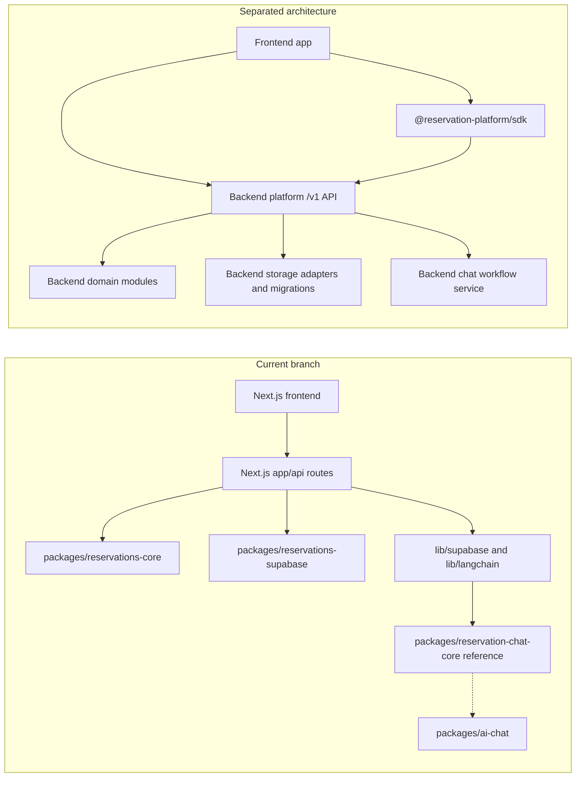

# Frontend, Backend Modules, and SDK Separation Plan

This plan focuses on the gap in the current branch: the code is modularized
into packages, but the frontend and backend are not fully separated yet.

The target is three separate surfaces:

- Current frontend app: UI, routes/pages, forms, admin screens, chat UI, and
  analytics UI.
- Backend platform: `/v1` API, domain services, persistence adapters,
  migrations, auth/tenant enforcement, idempotency, and AI workflow services.
- SDK package: installable TypeScript HTTP client for frontends. It calls the
  backend API and must not contain backend rules, database queries, Supabase
  clients, LangChain workflows, or UI.

## Current Versus Target

## Phase Files

- [Phase 0: Current Coupling Audit](phase-0-current-coupling-audit.md)
- [Phase 0 Audit Results](phase-0-current-coupling-audit-results.md)
- [Phase 1: Backend Module Boundary](phase-1-backend-module-boundary.md)
- [Phase 1 Boundary Results](phase-1-backend-module-boundary-results.md)
- [Phase 2: SDK Boundary and Public Client](phase-2-sdk-boundary-public-client.md)
- [Phase 2 SDK Boundary Results](phase-2-sdk-boundary-public-client-results.md)
- [Phase 3: Frontend API Migration](phase-3-frontend-api-migration.md)
- [Phase 3 Frontend API Migration Results](phase-3-frontend-api-migration-results.md)
- [Phase 4: Auth, Tenant, and Runtime Config Split](phase-4-auth-tenant-runtime-config-split.md)
- [Phase 4 Auth and Config Split Results](phase-4-auth-tenant-runtime-config-split-results.md)
- [Phase 5: AI Chat Workflow Split](phase-5-ai-chat-workflow-split.md)
- [Phase 5 AI Chat Split Results](phase-5-ai-chat-workflow-split-results.md)
- [Phase 6: External Frontend Proof and Removal Gate](phase-6-external-frontend-proof-removal-gate.md)
- [Phase 6 Proof and Removal Gate Results](phase-6-external-frontend-proof-removal-gate-results.md)
- [Remaining Modularity Gaps Index](remaining-modularity-gaps.md)

## Separation Rules

- Frontend must not import backend storage adapters, database clients, route
  handlers, domain services, LangChain workflows, or service-role secrets.
- SDK must import only public contract types and use HTTP/fetch to call `/v1`.
- Backend modules may import domain packages, storage adapters, migrations,
  model providers, and server-only secrets.
- Direct HTTP must remain equivalent to SDK behavior.
- The current Next.js app should become one consumer frontend, not the backend
  owner.

## Subagent Execution Rule

Each phase is designed for one worker subagent. Give the worker the full phase
file, the relevant contract docs, and the current files listed in `Inputs To
Read`. If a phase changes shared assumptions, update later phase docs in this
folder and the SDK readiness docs before moving on.

Every implementation phase after Phase 0 must read
`phase-0-current-coupling-audit-results.md` first and carry forward the target
phase assignments from its migration table.

Every phase after Phase 1 must also read
`phase-1-backend-module-boundary-results.md` before deciding what can be
imported by frontend code, SDK code, backend services, or optional chat modules.
