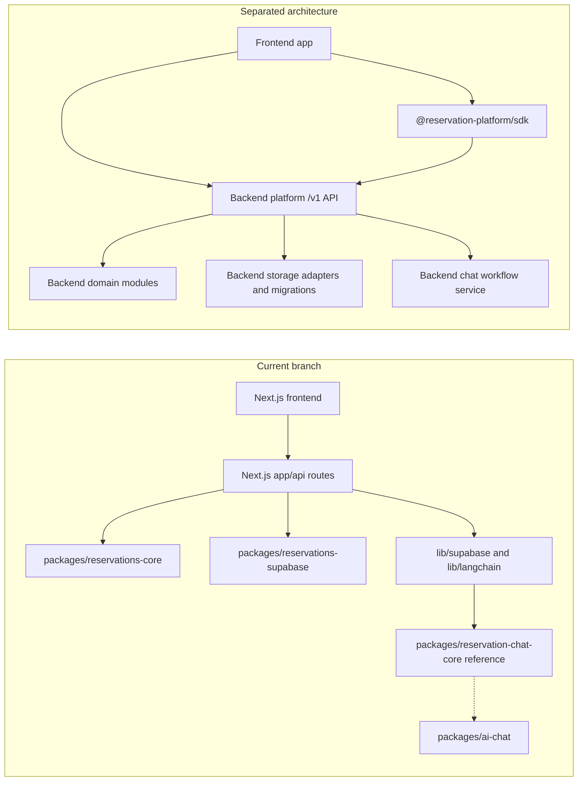

# Frontend, Backend Modules, and SDK Separation Plan

This plan focuses on the gap in the current branch: the code is modularized
into packages, but the frontend and backend are not fully separated yet.

The target is three separate surfaces:

- Current frontend app: UI, routes/pages, forms, admin screens, chat UI, and
  analytics UI.
- Backend platform: `/v1` API, domain services, persistence adapters,
  migrations, auth/tenant enforcement, idempotency, and AI workflow services.
- SDK package: installable TypeScript HTTP client for frontends. It calls the
  backend API and must not contain backend rules, database queries, Supabase
  clients, LangChain workflows, or UI.

## Current Versus Target

## Phase Files

- [Phase 0: Current Coupling Audit](phase-0-current-coupling-audit.md)
- [Phase 0 Audit Results](phase-0-current-coupling-audit-results.md)
- [Phase 1: Backend Module Boundary](phase-1-backend-module-boundary.md)
- [Phase 1 Boundary Results](phase-1-backend-module-boundary-results.md)
- [Phase 2: SDK Boundary and Public Client](phase-2-sdk-boundary-public-client.md)
- [Phase 2 SDK Boundary Results](phase-2-sdk-boundary-public-client-results.md)
- [Phase 3: Frontend API Migration](phase-3-frontend-api-migration.md)
- [Phase 3 Frontend API Migration Results](phase-3-frontend-api-migration-results.md)
- [Phase 4: Auth, Tenant, and Runtime Config Split](phase-4-auth-tenant-runtime-config-split.md)
- [Phase 4 Auth and Config Split Results](phase-4-auth-tenant-runtime-config-split-results.md)
- [Phase 5: AI Chat Workflow Split](phase-5-ai-chat-workflow-split.md)
- [Phase 5 AI Chat Split Results](phase-5-ai-chat-workflow-split-results.md)
- [Phase 6: External Frontend Proof and Removal Gate](phase-6-external-frontend-proof-removal-gate.md)
- [Phase 6 Proof and Removal Gate Results](phase-6-external-frontend-proof-removal-gate-results.md)
- [Phase 7: Standalone Backend Cutover](phase-7-standalone-backend-cutover.md)
- [Phase 8: Current Frontend Consumer Cutover](phase-8-current-frontend-consumer-cutover.md)
- [Phase 9: Compatibility Route Removal](phase-9-compatibility-route-removal.md)
- [Phase 10: Live Platform Proof](phase-10-live-platform-proof.md)
- [Phase 11: Backend Repository Extraction](phase-11-backend-repo-extraction.md)
- [Phase 12: Frontend Repository Consumer Proof](phase-12-frontend-repo-consumer-proof.md)
- [Phase 13: Backend Platform Product Repository](phase-13-backend-platform-product-repo.md)
- [Phase 14: SDK Release and Consumer Contract](phase-14-sdk-release-consumer-contract.md)
- [Phase 15: Operations, Deprecation, and Release Readiness](phase-15-operations-deprecation-release.md)
- [Phase 16: Physical Backend Repository Split](phase-16-physical-backend-repo-split.md)
- [Phase 17: Physical Frontend Repository Split](phase-17-physical-frontend-repo-split.md)
- [Phase 18: SDK Distribution and Contract](phase-18-sdk-distribution-and-contract.md)
- [Phase 19: Cross-Repo Release Proof](phase-19-cross-repo-release-proof.md)
- [Phase 20: Separation Source of Truth](phase-20-separation-source-of-truth.md)
- [Phase 21: Backend Repo Materialization](phase-21-backend-repo-materialization.md)
- [Phase 22: Frontend Repo Materialization](phase-22-frontend-repo-materialization.md)
- [Phase 23: SDK Package Materialization](phase-23-sdk-package-materialization.md)
- [Phase 24: Cross-Repo Adoption Proof](phase-24-cross-repo-adoption-proof.md)
- [Remaining Modularity Gaps Index](remaining-modularity-gaps.md)
- [Focused Backend Platform, SDK, and Frontend Split Execution Plan](plugin-platform-split/README.md)

## Separation Rules

- Frontend must not import backend storage adapters, database clients, route
  handlers, domain services, LangChain workflows, or service-role secrets.
- SDK must import only public contract types and use HTTP/fetch to call `/v1`.
- Backend modules may import domain packages, storage adapters, migrations,
  model providers, and server-only secrets.
- Direct HTTP must remain equivalent to SDK behavior.
- The current Next.js app should become one consumer frontend, not the backend
  owner.

## Subagent Execution Rule

Each phase is designed for one worker subagent. Give the worker the full phase
file, the relevant contract docs, and the current files listed in `Inputs To
Read`. If a phase changes shared assumptions, update later phase docs in this
folder and the SDK readiness docs before moving on.

Every implementation phase after Phase 0 must read
`phase-0-current-coupling-audit-results.md` first and carry forward the target
phase assignments from its migration table.

Every phase after Phase 1 must also read
`phase-1-backend-module-boundary-results.md` before deciding what can be
imported by frontend code, SDK code, backend services, or optional chat modules.

Phases 7 through 11 are the core separation plan. They should be executed in
order: make the standalone backend target real, cut the current frontend over
as a normal consumer, remove compatibility routes, prove the platform against
live disposable infrastructure, then extract or release the backend repository.

Phases 12 through 15 are the productization plan. They prove the frontend can
live as a separate consumer repo, define the backend platform as the product
repo, make the SDK installable by unrelated frontends, and document release,
deprecation, rollback, and support rules.

Phases 16 through 19 are the physical repository split plan. They turn the
monorepo readiness work into separate backend, frontend, and SDK adoption
proofs, then require a cross-repo release chain before the platform is treated
as plug-and-play infrastructure.

Phases 20 through 24 are the separation completion plan. They make the repo
ownership source of truth explicit, materialize backend and frontend repository
candidates, prove the SDK as the installable contract, and finish with a
cross-repo adoption proof for a frontend that starts outside this monorepo.
