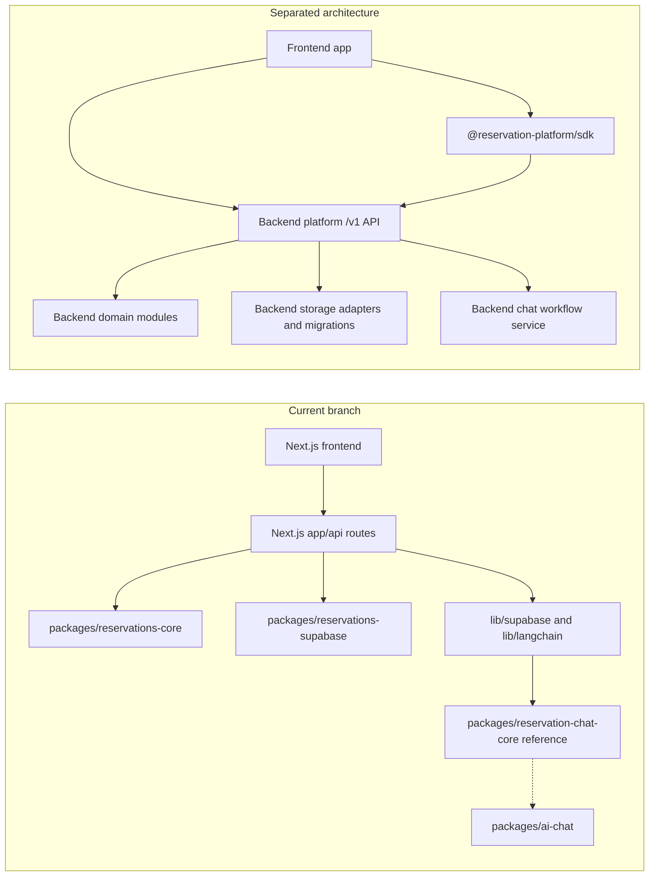

# Frontend, Backend Modules, and SDK Separation Plan

This plan focuses on the gap in the current branch: the code is modularized
into packages, but the frontend and backend are not fully separated yet.

The target is three separate surfaces:

- Current frontend app: UI, routes/pages, forms, admin screens, chat UI, and
  analytics UI.
- Backend platform: `/v1` API, domain services, persistence adapters,
  migrations, auth/tenant enforcement, idempotency, and AI workflow services.
- SDK package: installable TypeScript HTTP client for frontends. It calls the
  backend API and must not contain backend rules, database queries, Supabase
  clients, LangChain workflows, or UI.

## Current Versus Target

## Phase Files

- [Phase 0: Current Coupling Audit](phase-0-current-coupling-audit.md)
- [Phase 0 Audit Results](phase-0-current-coupling-audit-results.md)
- [Phase 1: Backend Module Boundary](phase-1-backend-module-boundary.md)
- [Phase 1 Boundary Results](phase-1-backend-module-boundary-results.md)
- [Phase 2: SDK Boundary and Public Client](phase-2-sdk-boundary-public-client.md)
- [Phase 2 SDK Boundary Results](phase-2-sdk-boundary-public-client-results.md)
- [Phase 3: Frontend API Migration](phase-3-frontend-api-migration.md)
- [Phase 3 Frontend API Migration Results](phase-3-frontend-api-migration-results.md)
- [Phase 4: Auth, Tenant, and Runtime Config Split](phase-4-auth-tenant-runtime-config-split.md)
- [Phase 4 Auth and Config Split Results](phase-4-auth-tenant-runtime-config-split-results.md)
- [Phase 5: AI Chat Workflow Split](phase-5-ai-chat-workflow-split.md)
- [Phase 5 AI Chat Split Results](phase-5-ai-chat-workflow-split-results.md)
- [Phase 6: External Frontend Proof and Removal Gate](phase-6-external-frontend-proof-removal-gate.md)
- [Phase 6 Proof and Removal Gate Results](phase-6-external-frontend-proof-removal-gate-results.md)
- [Phase 7: Standalone Backend Cutover](phase-7-standalone-backend-cutover.md)
- [Phase 8: Current Frontend Consumer Cutover](phase-8-current-frontend-consumer-cutover.md)
- [Phase 9: Compatibility Route Removal](phase-9-compatibility-route-removal.md)
- [Phase 10: Live Platform Proof](phase-10-live-platform-proof.md)
- [Phase 11: Backend Repository Extraction](phase-11-backend-repo-extraction.md)
- [Phase 12: Frontend Repository Consumer Proof](phase-12-frontend-repo-consumer-proof.md)
- [Phase 13: Backend Platform Product Repository](phase-13-backend-platform-product-repo.md)
- [Phase 14: SDK Release and Consumer Contract](phase-14-sdk-release-consumer-contract.md)
- [Phase 15: Operations, Deprecation, and Release Readiness](phase-15-operations-deprecation-release.md)
- [Phase 16: Physical Backend Repository Split](phase-16-physical-backend-repo-split.md)
- [Phase 17: Physical Frontend Repository Split](phase-17-physical-frontend-repo-split.md)
- [Phase 18: SDK Distribution and Contract](phase-18-sdk-distribution-and-contract.md)
- [Phase 19: Cross-Repo Release Proof](phase-19-cross-repo-release-proof.md)
- [Phase 20: Separation Source of Truth](phase-20-separation-source-of-truth.md)
- [Phase 21: Backend Repo Materialization](phase-21-backend-repo-materialization.md)
- [Phase 22: Frontend Repo Materialization](phase-22-frontend-repo-materialization.md)
- [Phase 23: SDK Package Materialization](phase-23-sdk-package-materialization.md)
- [Phase 24: Cross-Repo Adoption Proof](phase-24-cross-repo-adoption-proof.md)
- [Phase 25: Backend Product Repository Contract](phase-25-backend-product-repo-contract.md)
- [Phase 26: Frontend Consumer Detachment](phase-26-frontend-consumer-detachment.md)
- [Phase 27: SDK Public Release Surface](phase-27-sdk-public-release-surface.md)
- [Phase 28: Live Backend and External Consumer Proof](phase-28-live-backend-and-external-consumer-proof.md)
- [Phase 29: Subagent Execution Matrix](phase-29-subagent-execution-matrix.md)
- [Remaining Modularity Gaps Index](remaining-modularity-gaps.md)
- [Focused Backend Platform, SDK, and Frontend Split Execution Plan](plugin-platform-split/README.md)
- [Repo Product Split Plan](repo-product-split-plan/README.md)
- [Frontend and Backend Hard Separation Plan](frontend-backend-hard-separation-plan/README.md)
- [Frontend and Backend Module Separation Plan](frontend-backend-module-separation-plan/README.md)
- [Backend SDK Frontend Product Split Plan](backend-sdk-frontend-product-split-plan/README.md)
- [Backend Product Repo Handoff Plan](backend-product-repo-handoff-plan/README.md)
- [Frontend, Backend, and SDK Final Separation Plan](frontend-backend-sdk-final-separation-plan/README.md)
- [Frontend and Backend Physical Separation Plan](frontend-backend-physical-separation-plan/README.md)
- [Backend Product, SDK, and Frontend Separation Plan](backend-product-sdk-frontend-separation-plan/README.md)
- [Current Refactor Separation Gap Plan](current-refactor-separation-gap-plan/README.md)
- [Current Separation Answer Plan](current-separation-answer-plan/README.md)
- [Backend Product and Frontend Consumer Plan](backend-product-frontend-consumer-plan/README.md)

## Separation Rules

- Frontend must not import backend storage adapters, database clients, route
  handlers, domain services, LangChain workflows, or service-role secrets.
- SDK must import only public contract types and use HTTP/fetch to call `/v1`.
- Backend modules may import domain packages, storage adapters, migrations,
  model providers, and server-only secrets.
- Direct HTTP must remain equivalent to SDK behavior.
- The current Next.js app should become one consumer frontend, not the backend
  owner.

## Subagent Execution Rule

Each phase is designed for one worker subagent. Give the worker the full phase
file, the relevant contract docs, and the current files listed in `Inputs To
Read`. If a phase changes shared assumptions, update later phase docs in this
folder and the SDK readiness docs before moving on.

Every implementation phase after Phase 0 must read
`phase-0-current-coupling-audit-results.md` first and carry forward the target
phase assignments from its migration table.

Every phase after Phase 1 must also read
`phase-1-backend-module-boundary-results.md` before deciding what can be
imported by frontend code, SDK code, backend services, or optional chat modules.

Phases 7 through 11 are the core separation plan. They should be executed in
order: make the standalone backend target real, cut the current frontend over
as a normal consumer, remove compatibility routes, prove the platform against
live disposable infrastructure, then extract or release the backend repository.

Phases 12 through 15 are the productization plan. They prove the frontend can
live as a separate consumer repo, define the backend platform as the product
repo, make the SDK installable by unrelated frontends, and document release,
deprecation, rollback, and support rules.

Phases 16 through 19 are the physical repository split plan. They turn the
monorepo readiness work into separate backend, frontend, and SDK adoption
proofs, then require a cross-repo release chain before the platform is treated
as plug-and-play infrastructure.

Phases 20 through 24 are the separation completion plan. They make the repo
ownership source of truth explicit, materialize backend and frontend repository
candidates, prove the SDK as the installable contract, and finish with a
cross-repo adoption proof for a frontend that starts outside this monorepo.

Phases 25 through 29 are the repo-first plug-and-play product plan. They restate
the intended ownership model in execution-ready terms: the backend GitHub
repository is the product, the SDK is the only package a new frontend installs,
the current frontend becomes a replaceable consumer, live proof must use a real
standalone backend target, and subagents must update downstream phases whenever
shared assumptions change.

The frontend/backend hard separation plan is the focused continuation for the
practical proof question: whether the current refactor has crossed from
monorepo modularity into real product separation. It adds audit, boundary,
backend runtime, frontend detachment, SDK install, cross-repo proof, and
compatibility cleanup phases that subagents can execute without relying on chat
history.

The frontend/backend module separation plan is the narrower current-state
cleanup plan for keeping backend modules, the SDK, and the frontend consumer
honest while the repo split work continues. Use it when assigning subagents to
close boundary leaks before treating the backend as the product infrastructure
repo and the frontend as a replaceable SDK consumer.

The backend SDK frontend product split plan is the clearest plan for the final
intended plug-and-play model: backend repository as the infrastructure product,
SDK as the installable integration surface, and any frontend repository as a
replaceable consumer. Use it when assigning subagents who need phase-by-phase
instructions without relying on earlier chat history.

The backend product repo handoff plan is the focused subagent execution pack for
turning that intent into a reviewed handoff sequence. Use it when workers need
explicit inputs, proof commands, reviewer checklists, and downstream update
rules for the backend-as-product, SDK-as-install-surface, frontend-as-consumer
model.

The backend product, SDK, and frontend separation plan is the concise
repo-first execution pack for the final intended architecture: backend product
repository, installable SDK, and replaceable frontend consumer. Use it when a
subagent needs a bounded phase file that explains both the work and which later
phase docs must be updated if assumptions change.

The frontend/backend physical separation plan is the most direct answer to the
current-state question: the branch is modular, but it is not fully product-split
until a backend repo candidate, SDK artifact, frontend repo candidate, live
backend proof, external frontend adoption proof, and compatibility cleanup all
pass without relying on monorepo workspace links.

The current refactor separation gap plan is the most direct handoff pack for
answering whether this branch is separated right now. It starts from the
current modular state, names what remains coupled, and gives subagents a
phase-by-phase route to backend product boundary closure, SDK install surface
closure, frontend consumer detachment, cross-repo proof, and compatibility
operations cleanup.

The current separation answer plan is the shortest phase pack for the latest
status question. It states that this branch is currently modular-monorepo
readiness, not full product separation, then assigns the remaining work to
backend product boundary enforcement, SDK install contract enforcement,
frontend consumer detachment proof, live cross-repo proof, and compatibility
cleanup/release decision phases.

The backend product and frontend consumer plan is the direct execution pack for
the intended product model: backend repository as infrastructure product, SDK
as the installable contract, and any frontend as a replaceable consumer. Use it
when subagents need one focused folder with downstream update rules, AI chat
ownership, external adoption proof, and compatibility cleanup gates.
