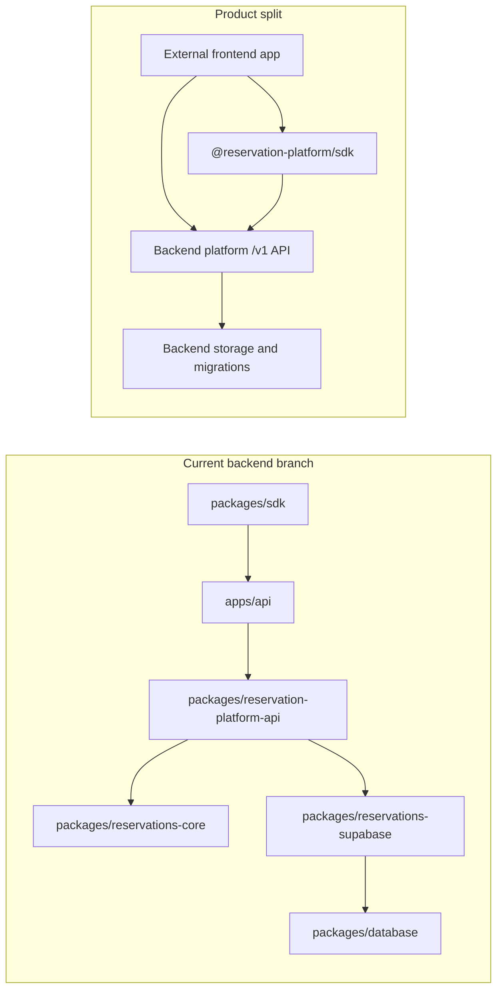

# Frontend, Backend Modules, and SDK Separation Plan

This folder is the canonical planning area for separating the modular booking
platform into three surfaces:

- Backend platform: standalone `/v1` API, domain services, persistence
  adapters, migrations, auth/tenant enforcement, idempotency, and backend-owned
  AI workflow services.
- SDK package: installable TypeScript HTTP client for frontend and server
  consumers. It must stay HTTP-only and frontend-safe.
- Frontend consumers: replaceable apps that use `/v1` or the SDK without
  importing backend modules or receiving Supabase service-role credentials.

## Current Versus Target

## Canonical Phase Files

- [Phase 0: Current Coupling Audit](phase-0-current-coupling-audit.md)
- [Phase 0 Audit Results](phase-0-current-coupling-audit-results.md)
- [Phase 1: Backend Module Boundary](phase-1-backend-module-boundary.md)
- [Phase 1 Boundary Results](phase-1-backend-module-boundary-results.md)
- [Phase 2: SDK Boundary and Public Client](phase-2-sdk-boundary-public-client.md)
- [Phase 2 SDK Boundary Results](phase-2-sdk-boundary-public-client-results.md)
- [Phase 3: Frontend API Migration](phase-3-frontend-api-migration.md)
- [Phase 3 Frontend API Migration Results](phase-3-frontend-api-migration-results.md)
- [Phase 4: Auth, Tenant, and Runtime Config Split](phase-4-auth-tenant-runtime-config-split.md)
- [Phase 4 Auth and Config Split Results](phase-4-auth-tenant-runtime-config-split-results.md)
- [Phase 5: AI Chat Workflow Split](phase-5-ai-chat-workflow-split.md)
- [Phase 5 AI Chat Split Results](phase-5-ai-chat-workflow-split-results.md)
- [Phase 6: External Frontend Proof and Removal Gate](phase-6-external-frontend-proof-removal-gate.md)
- [Phase 6 Proof and Removal Gate Results](phase-6-external-frontend-proof-removal-gate-results.md)
- [Phase 7: Standalone Backend Cutover](phase-7-standalone-backend-cutover.md)
- [Phase 8: Current Frontend Consumer Cutover](phase-8-current-frontend-consumer-cutover.md)
- [Phase 9: Compatibility Route Removal](phase-9-compatibility-route-removal.md)
- [Phase 10: Live Platform Proof](phase-10-live-platform-proof.md)
- [Phase 11: Backend Repository Extraction](phase-11-backend-repo-extraction.md)
- [Phase 12: Frontend Repository Consumer Proof](phase-12-frontend-repo-consumer-proof.md)
- [Phase 13: Backend Platform Product Repository](phase-13-backend-platform-product-repo.md)
- [Phase 14: SDK Release and Consumer Contract](phase-14-sdk-release-consumer-contract.md)
- [Phase 15: Operations, Deprecation, and Release Readiness](phase-15-operations-deprecation-release.md)
- [Phase 16: Physical Backend Repository Split](phase-16-physical-backend-repo-split.md)
- [Phase 17: Physical Frontend Repository Split](phase-17-physical-frontend-repo-split.md)
- [Phase 18: SDK Distribution and Contract](phase-18-sdk-distribution-and-contract.md)
- [Phase 19: Cross-Repo Release Proof](phase-19-cross-repo-release-proof.md)
- [Phase 20: Separation Source of Truth](phase-20-separation-source-of-truth.md)
- [Phase 21: Backend Repo Materialization](phase-21-backend-repo-materialization.md)
- [Phase 22: Frontend Repo Materialization](phase-22-frontend-repo-materialization.md)
- [Phase 23: SDK Package Materialization](phase-23-sdk-package-materialization.md)
- [Phase 24: Cross-Repo Adoption Proof](phase-24-cross-repo-adoption-proof.md)
- [Phase 25: Backend Product Repository Contract](phase-25-backend-product-repo-contract.md)
- [Phase 26: Frontend Consumer Detachment](phase-26-frontend-consumer-detachment.md)
- [Phase 27: SDK Public Release Surface](phase-27-sdk-public-release-surface.md)
- [Phase 28: Live Backend and External Consumer Proof](phase-28-live-backend-and-external-consumer-proof.md)
- [Phase 29: Subagent Execution Matrix](phase-29-subagent-execution-matrix.md)
- [Phase 30: Package Source and Frontend Proof](phase-30-package-source-and-frontend-proof.md)
- [Phase 31: Disposable Database Proof](phase-31-disposable-database-proof.md)
- [Phase 32: Standalone Backend Live Proof](phase-32-standalone-backend-live-proof.md)
- [Phase 33: SDK and Direct HTTP Parity Proof](phase-33-sdk-direct-parity-proof.md)
- [Phase 34: Registry Release Proof](phase-34-registry-release-proof.md)
- [Phase 35: Compatibility Cleanup and Release Decision](phase-35-compatibility-cleanup-release-decision.md)

## Supporting Files

- [Remaining Modularity Gaps](remaining-modularity-gaps.md)
- [External Separation Proof Results](external-separation-proof-results.md)
- [Frontend Consumer Repo Inventory](frontend-consumer-repo-inventory.json)
- [Compatibility Route Inventory](compatibility-route-inventory.json)
- [Compatibility Route Removal Decision Log](compatibility-route-removal-decision-log.md)
- [Frontend Backend Separation Completion Plan](frontend-backend-separation-completion-plan/README.md)

The completion-plan folder is retained because extraction tests use it as a
known frontend-planning document that must not be materialized into the backend
repository candidate. Other duplicate plan-pack folders were removed so this
directory has one obvious source of truth.

## Separation Rules

- Frontends must not import backend storage adapters, database clients, route
  handlers, domain services, LangChain workflows, or service-role secrets.
- The SDK must import only public contract types and call `/v1` through HTTP.
- Backend modules may import domain packages, storage adapters, migrations,
  model providers, and server-only secrets.
- Direct HTTP behavior must remain equivalent to SDK behavior.
- Current or demo frontends should be consumers, not backend owners.

## Subagent Execution Rule

Give a worker subagent the relevant phase file, this README, and the supporting
contract docs. If a phase changes ownership, API, env, proof, or compatibility
assumptions, update later phase docs and [Remaining Modularity Gaps](remaining-modularity-gaps.md)
before treating the phase as complete.
