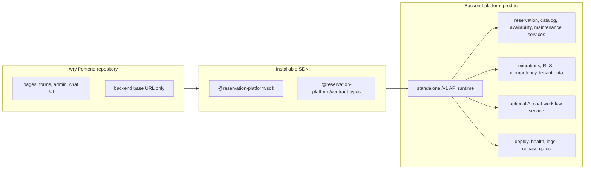

# Backend Platform Product Completion Plan

This folder is the current execution plan for the intended product shape:

- the backend repository is the product and owns infrastructure, database,
  runtime services, auth, tenant enforcement, idempotency, and optional AI chat;
- the SDK is the installable integration contract for any frontend;
- the current Next.js frontend is only one consumer and must be replaceable.

The current branch is modular, but it is not finished until separated backend,
SDK, and frontend proofs pass outside the monorepo assumptions.

## Target Architecture

## Phase Files

- [Phase 0: Current Product Boundary Baseline](phase-0-current-product-boundary-baseline.md)
- [Phase 1: Backend Product Repository Contract](phase-1-backend-product-repository-contract.md)
- [Phase 2: Deployable Backend Runtime and Database Ownership](phase-2-deployable-backend-runtime-and-database-ownership.md)
- [Phase 3: SDK Public Install and Contract Surface](phase-3-sdk-public-install-and-contract-surface.md)
- [Phase 4: Frontend Consumer Detachment](phase-4-frontend-consumer-detachment.md)
- [Phase 5: External Adoption Proof Chain](phase-5-external-adoption-proof-chain.md)
- [Phase 6: Compatibility Cleanup, Release, and Operations Gate](phase-6-compatibility-cleanup-release-operations-gate.md)
- [Subagent Execution Matrix](subagent-execution-matrix.md)

## Execution Rule

Run phases in order. If a phase changes ownership, API shape, auth behavior,
database behavior, package names, env names, proof commands, or compatibility
route decisions, update every later phase file in this folder before handing off.

| Changed assumption | Later docs to update |
| --- | --- |
| Backend ownership, deploy target, database adapter, auth, tenant, idempotency, or AI chat runtime | Phases 1, 2, 4, 5, and 6 |
| SDK package name, exports, dependency rules, install source, auth/header behavior, or error shape | Phases 3, 4, 5, and 6 |
| Frontend inventory, public env names, chat/admin/form ownership, or `/api` compatibility use | Phases 4, 5, and 6 |
| Proof root, disposable database, registry source, live backend URL, or smoke flow | Phases 5 and 6 |
| Compatibility route removal, deprecation, support window, or rollback rule | Phase 6 and `../remaining-modularity-gaps.md` |

## Definition Of Done

The refactor counts as plug-and-play only when all answers are yes:

1. Can the backend product install, build, test, deploy, and serve `/v1` without
   the current frontend repo?
2. Does the backend own database migrations, RLS, tenant enforcement,
   idempotency, auth, deployment config, and optional AI chat workflows?
3. Can a clean external frontend install the SDK and contract package without
   workspace links?
4. Can the current frontend build and smoke against an external backend base
   URL with no backend source imports?
5. Does SDK behavior match direct HTTP behavior against the same standalone
   backend?
6. Are compatibility routes removed or governed by explicit deprecation,
   support, and rollback rules?

Skipped checks, monorepo links, local-only route shims, and readiness-only
commands do not count as final product proof.
