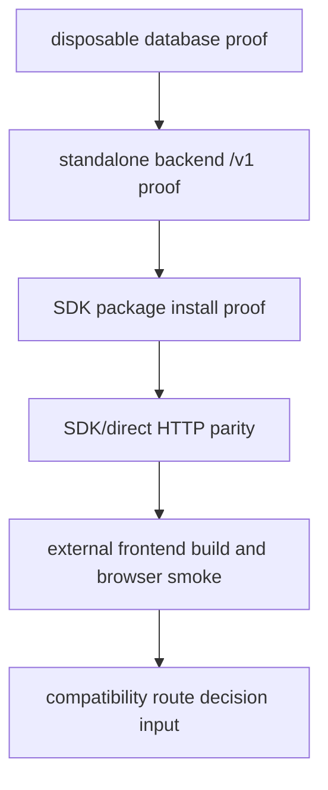

# Phase 5: External Adoption Proof Chain

## Purpose

Run the end-to-end proof that a frontend outside this repo can adopt the backend
platform through the SDK and public `/v1` API. This phase answers: does the
architecture work when the backend, SDK, database, and frontend are treated as
separate products?

## Inputs To Read

- Phase 0 through Phase 4 files in this folder
- `../external-separation-proof-results.md`
- `../phase-28-live-backend-and-external-consumer-proof.md`
- `../phase-31-disposable-database-proof.md`
- `../phase-32-standalone-backend-live-proof.md`
- `../phase-33-sdk-direct-parity-proof.md`
- `../phase-34-registry-release-proof.md`
- external proof, registry proof, parity proof, database proof, and frontend
  smoke scripts

## Write Scope

- external proof command transcript summary;
- redacted backend/database/package source evidence;
- SDK/direct parity evidence;
- external frontend smoke evidence;
- blocker list for Phase 6.

## Non-Goals

- Do not use the current monorepo workspace as the consumer proof.
- Do not rely on unpublished local path packages unless the phase is explicitly
  testing tarballs.
- Do not count skipped readiness checks as proof.
- Do not mutate production infrastructure.

## Proof Chain

## Steps

1. Prepare clean external roots for backend candidate, SDK consumer, and
   frontend consumer.
2. Start a disposable database and apply backend-owned migrations.
3. Start or deploy the standalone backend against that database.
4. Install SDK and contract packages from the selected package source.
5. Run SDK/direct HTTP parity against the standalone backend.
6. Build and smoke an external frontend against the same backend base URL.
7. Record commands, paths, env shape, and pass/fail results with secrets
   redacted.
8. Send any failing contract back to the owning earlier phase and update later
   docs before re-running.

## Acceptance Criteria

- Backend proof uses a standalone `/v1` service, not compatibility `/api`
  routes.
- SDK install proof uses clean external consumer state.
- Frontend smoke runs outside backend source ownership.
- SDK and direct HTTP results match against the same backend.
- Failed or skipped checks are named blockers, not hidden as partial success.

## Subagent Handoff Notes

This worker coordinates outputs from earlier phases. It should not patch around
failures in the external fixture; it should identify the owning phase, update
the phase docs, and then rerun the proof after the owner fixes the contract.
