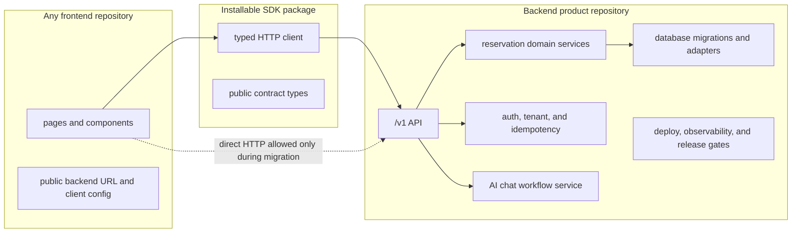

# Backend Product and Frontend Consumer Plan

This plan is for the intended plug-and-play model:

- the backend repository is the product infrastructure;
- the SDK is the installable integration surface;
- any frontend is only a consumer of the backend through the SDK or stable
  `/v1` HTTP contract.

The current branch is modular, but it should not be described as fully product
separated until these phases pass against repositories or prepared roots that
do not rely on monorepo workspace links.

## Target Shape

## Phase Files

- [Phase 0: Current Separation Baseline](phase-0-current-separation-baseline.md)
- [Phase 1: Backend Product Repository Boundary](phase-1-backend-product-repository-boundary.md)
- [Phase 2: SDK Installable Contract](phase-2-sdk-installable-contract.md)
- [Phase 3: Frontend Consumer Detachment](phase-3-frontend-consumer-detachment.md)
- [Phase 4: AI Chat Backend Workflow Separation](phase-4-ai-chat-backend-workflow-separation.md)
- [Phase 5: External Repository Adoption Proof](phase-5-external-repository-adoption-proof.md)
- [Phase 6: Compatibility Route Cleanup and Release Gate](phase-6-compatibility-route-cleanup-release-gate.md)
- [Subagent Handoff Matrix](subagent-handoff-matrix.md)

## Downstream Update Rule

Every phase must update later phases when it changes a shared assumption.

| If this changes | Update these phase files |
| --- | --- |
| Backend ownership, package graph, persistence, migrations, auth, tenant isolation, idempotency, deployment, or route ownership | Phases 1, 3, 5, and 6 |
| SDK package name, exports, install source, dependency policy, auth/header handling, error shape, or versioning | Phases 2, 3, 5, and 6 |
| Frontend env names, app-owned auth UX, direct HTTP usage, compatibility route usage, or included source inventory | Phases 3, 5, and 6 |
| AI chat workflow ownership, provider secrets, LangChain graph shape, or chat API contract | Phases 1, 3, 4, 5, and 6 |
| Proof command, prepared-root requirement, package registry method, live backend target, or disposable database requirement | Phases 5 and 6 |
| Compatibility route status, deprecation policy, rollback rule, or removal blocker | Phase 6 and the compatibility route inventory |

## Definition Of Done

This plan is complete only when:

- a backend candidate installs, builds, tests, and runs without frontend source;
- the SDK installs into an unrelated frontend without `workspace:`, `file:`,
  `link:`, or `portal:` dependencies;
- the current frontend builds as a replaceable consumer using only public SDK
  or `/v1` contract access;
- AI chat provider secrets and workflow orchestration stay backend-owned;
- an external frontend repository proves the plug-and-play flow against a live
  backend target;
- compatibility routes are removed or retained with explicit deprecation and
  rollback policy.

