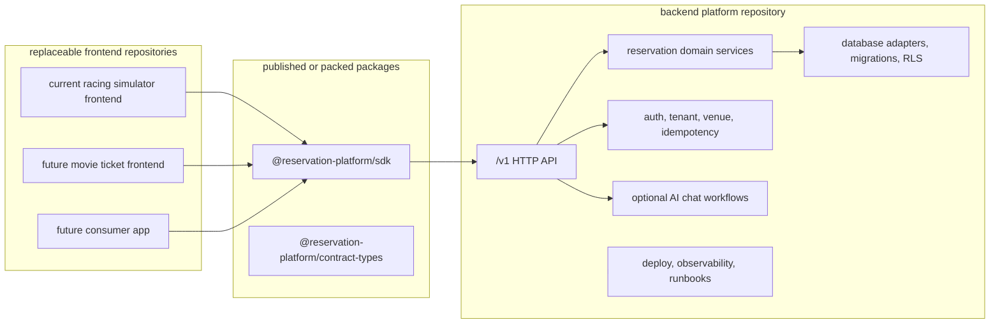

# Backend Product Repo Handoff Plan

This folder is the phase-by-phase plan for the intended plug-and-play product
shape:

- the backend platform is the product repository and deployable service;
- the SDK is the installable frontend integration surface;
- the current frontend is only one consumer and can be replaced by another
  frontend, such as movie ticketing.

Use this folder when sending subagents to finish the separation. Each phase is
written so a worker, spec reviewer, and quality reviewer can run without chat
history.

## Target Shape

## Phase Files

- [Phase 0: Ownership Source of Truth](phase-0-ownership-source-of-truth.md)
- [Phase 1: Backend Repository Product Boundary](phase-1-backend-repository-product-boundary.md)
- [Phase 2: SDK Distribution Surface](phase-2-sdk-distribution-surface.md)
- [Phase 3: Current Frontend Consumer Split](phase-3-current-frontend-consumer-split.md)
- [Phase 4: External App Adoption Proof](phase-4-external-app-adoption-proof.md)
- [Phase 5: Live Backend Platform Proof](phase-5-live-backend-platform-proof.md)
- [Phase 6: Release and Compatibility Cleanup](phase-6-release-and-compatibility-cleanup.md)
- [Subagent Handoff Matrix](subagent-handoff-matrix.md)

## Non-Negotiable Rules

- Do not make a frontend build pass by copying backend source into the frontend.
- Do not make SDK install proof pass through workspace links only.
- Do not treat the current Next.js `app/api/**` routes as the final product
  API.
- Do not put database clients, migrations, server secrets, provider SDKs,
  LangChain workflows, or React UI into the SDK.
- Do not claim plug-and-play readiness from skipped readiness checks. Strict
  proof must run against configured disposable infrastructure.

## Downstream Update Rule

Every phase owns its own doc, but no phase is allowed to silently change the
outcome for later phases. When a worker changes a shared assumption, it must
update all downstream files in the same change.

| Changed assumption | Must update |
| --- | --- |
| Backend-owned packages, API routes, auth, tenant, venue, idempotency, database, or chat ownership | Phases 1, 2, 3, 4, 5, and 6 |
| SDK exports, package dependencies, package name, install method, or version policy | Phases 2, 3, 4, and 6 |
| Frontend inventory, app-owned routes, admin/chat/form ownership, or remaining `/api` dependencies | Phases 3, 4, and 6 |
| Live proof env, disposable data, migration/RLS proof, provider proof, or deploy target | Phases 4, 5, and 6 |
| Compatibility route removal criteria | Phases 3, 4, 5, and 6 |

## Subagent Flow

For each phase, assign three roles:

1. Worker: implements only the assigned phase scope and updates downstream docs
   when assumptions change.
2. Spec reviewer: checks whether acceptance criteria are actually satisfied and
   rejects overclaims.
3. Quality reviewer: checks maintainability, boundary hygiene, safety, and test
   coverage.

The coordinator should not mark a phase complete until both reviewers pass and
the phase doc has updated status, proof commands, and remaining blockers.
