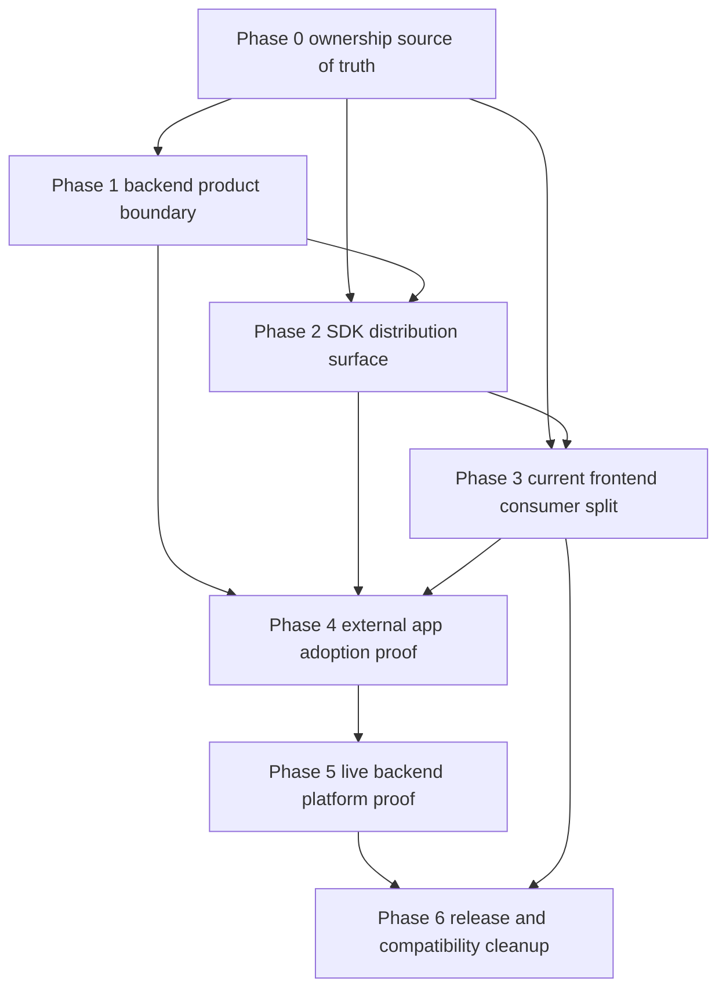

# Subagent Handoff Matrix

Use this matrix when assigning the backend product repo handoff plan. Each phase
requires a worker, spec reviewer, and quality reviewer.

## Dependency Graph

## Assignment Table

| Phase | Worker focus | Spec reviewer focus | Quality reviewer focus |
| --- | --- | --- | --- |
| Phase 0 | Own the source classification and import rules | Every source area has one owner | Rules are automatable and understandable |
| Phase 1 | Backend repo candidate, runtime, extraction, and `/v1` boundary | Backend stands without frontend source | Backend proof is reproducible and fail-closed |
| Phase 2 | SDK exports, package artifact, install proof, docs | SDK maps to `/v1` and is frontend-safe | Package metadata/artifacts avoid backend leakage |
| Phase 3 | Current frontend inventory and platform-mode cutover | Frontend behaves as a consumer | No hidden backend imports or `/api` fallback in platform mode |
| Phase 4 | Clean external app install/use proof | External app is outside this repo and uses SDK | Fixture is reproducible and not workspace-linked |
| Phase 5 | Disposable live backend/database/parity proof | Strict proof covers required behavior | Live proof is safe, throwaway, and has rollback |
| Phase 6 | Release checklist and compatibility cleanup | Claims match evidence | Ops docs and deprecation decisions are usable |

## Required Handoff Format

Each worker must return:

- files changed;
- proof commands run and exact pass/fail/skipped status;
- assumptions changed;
- downstream phase files updated;
- blockers left;
- rollback or safety notes when live infrastructure is involved.

Each reviewer must return:

- pass/fail;
- blocking issues;
- non-blocking follow-ups;
- whether downstream docs were updated when assumptions changed.

## Rejection Triggers

Reject the phase if it:

- imports backend implementation into frontend source;
- puts backend implementation, migrations, provider workflows, or UI into the
  SDK;
- treats current Next.js `app/api/**` compatibility routes as the final backend
  API;
- claims external adoption through workspace links only;
- claims live proof from skipped readiness checks;
- changes backend, SDK, frontend, or compatibility assumptions without updating
  downstream phase docs.
