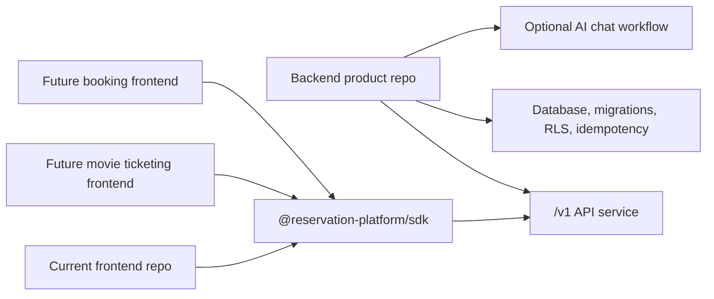

# Backend Product, SDK, and Frontend Separation Plan

This folder is the focused phase plan for the intended plug-and-play model:

- The backend repository is the product and infrastructure boundary.
- The SDK is the installable contract used by frontends.
- The current frontend is only one replaceable consumer.

Use these files when assigning subagents. Each phase is written so a worker can
read one phase file plus the listed inputs, implement the bounded task, update
downstream docs if assumptions change, and hand off to spec and quality
reviewers.

## Target Shape

## Phase Files

- [Phase 0: Product Boundary Source of Truth](phase-0-product-boundary-source-of-truth.md)
- [Phase 1: Backend Product Repository Contract](phase-1-backend-product-repository-contract.md)
- [Phase 2: SDK Installable Contract](phase-2-sdk-installable-contract.md)
- [Phase 3: Current Frontend Consumer Detachment](phase-3-current-frontend-consumer-detachment.md)
- [Phase 4: Clean External Frontend Proof](phase-4-clean-external-frontend-proof.md)
- [Phase 5: Live Backend Platform Proof](phase-5-live-backend-platform-proof.md)
- [Phase 6: Release, Compatibility, and Operations Gate](phase-6-release-compatibility-operations-gate.md)
- [Subagent Handoff Matrix](subagent-handoff-matrix.md)

## Execution Rule

Run phases in order. If a phase changes ownership, public API shape, SDK method
shape, required env, package metadata, deployment assumptions, or compatibility
route decisions, update every later phase that depends on that assumption before
the worker reports done.

Spec reviewers should fail a phase if later docs are left stale.

## What Counts As Done

This plan is done only when a clean frontend outside this repository can install
the SDK package, point at a standalone backend `/v1` base URL, perform the
reserved workflows without importing backend code, and the backend can run as
its own product boundary with database, auth, idempotency, optional chat, and
operations proof.

Readiness scripts and dry runs are useful, but skipped network, registry,
database, or deployment checks are not final release proof.
