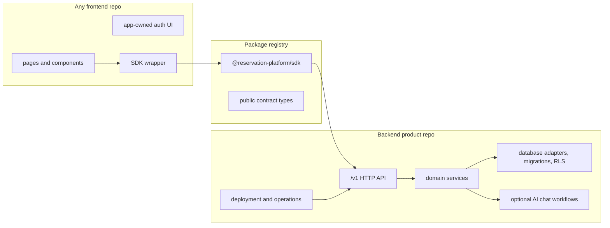

# Backend SDK Frontend Product Split Plan

This folder is the execution plan for the intended product shape:

- the backend platform repository is the product infrastructure;
- the SDK is the installable frontend integration contract;
- the current frontend is only one consumer app and can be replaced by another
  frontend without copying backend source.

Use this plan when the target is stricter than "the repo has packages." The
target is "a different frontend repository can install the SDK, point it at the
backend platform, and use reservations, resources, database-backed behavior,
and optional AI chat without owning backend modules."

## Target Shape

## Phase Files

- [Phase 0: Product Boundary Source of Truth](phase-0-product-boundary-source-of-truth.md)
- [Phase 1: Backend Product Repository Contract](phase-1-backend-product-repository-contract.md)
- [Phase 2: SDK Install Surface Contract](phase-2-sdk-install-surface-contract.md)
- [Phase 3: Frontend Consumer Contract](phase-3-frontend-consumer-contract.md)
- [Phase 4: Backend Runtime and Database Proof](phase-4-backend-runtime-database-proof.md)
- [Phase 5: External Frontend Adoption Proof](phase-5-external-frontend-adoption-proof.md)
- [Phase 6: Release, Deprecation, and Operations Gate](phase-6-release-deprecation-operations-gate.md)
- [Subagent Handoff Matrix](subagent-handoff-matrix.md)

## Non-Negotiable Rules

- Frontend repos install the SDK. They do not copy backend services, database
  adapters, migrations, route handlers, LangChain/provider workflows, or
  service-role configuration.
- The SDK is HTTP-only. It may export public DTOs, errors, request helpers, and
  frontend-safe client methods, but no backend implementation.
- The backend product repo owns `/v1`, domain rules, persistence, migrations,
  RLS, idempotency, tenant/auth enforcement, optional AI chat execution,
  deployment, and operations docs.
- Compatibility `app/api/**` routes in this monorepo are migration adapters,
  not the product API.
- Skipped local readiness checks do not count as release proof. Final proof
  requires actual install/build/test/smoke evidence against a standalone
  backend target.

## Downstream Update Rule

Every worker must update later phase docs when a shared assumption changes.

| Changed assumption | Also update |
| --- | --- |
| Product ownership, package visibility, repository layout, or source inclusion/exclusion | Phases 1, 2, 3, 5, and 6 |
| `/v1` route contract, auth/tenant headers, idempotency behavior, or database ownership | Phases 2, 3, 4, 5, and 6 |
| SDK package name, exports, install flow, public DTOs, error shape, or version policy | Phases 2, 3, 5, and 6 |
| Frontend env names, auth UI responsibilities, current-app `/api` dependency, or consumer inventory | Phases 3, 5, and 6 |
| Live proof command, disposable database requirement, registry requirement, or deployment requirement | Phases 4, 5, and 6 |
| Compatibility route deprecation/removal decision | Phase 6 and `../remaining-modularity-gaps.md` |

## Subagent Execution Rule

Each phase is one worker task. Give a worker:

1. this README;
2. the assigned phase file;
3. `subagent-handoff-matrix.md`;
4. `../remaining-modularity-gaps.md`;
5. any phase files listed in the assigned phase's `Inputs To Read`.

The worker must report:

- files changed;
- proof commands run;
- downstream phase docs updated;
- remaining blockers that are explicitly outside the assigned phase.

Spec reviewers should reject overclaims, especially claims that local readiness
is the same as live proof or that an SDK is installable without pack/install
evidence. Quality reviewers should check boundary hygiene, maintainability,
and whether docs still match the commands in `package.json`.
