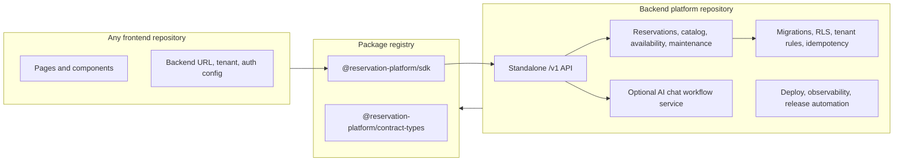

# Backend SDK Productization Final Plan

This folder is the phase plan for turning the current modular refactor into the
intended product shape:

- the backend platform is its own deployable product;
- the SDK is the supported integration package;
- the current frontend is only one consumer of that backend;
- future frontends can plug in without copying backend source.

This is stricter than "the code is organized into packages." The final proof is
an unrelated frontend repository installing the SDK and talking to a separately
running backend platform.

## Target Architecture

## Phase Files

- [Phase 0: Current Truth And Ownership](phase-0-current-truth-and-ownership.md)
- [Phase 1: Backend Product Repository Boundary](phase-1-backend-product-repository-boundary.md)
- [Phase 2: SDK Package Contract](phase-2-sdk-package-contract.md)
- [Phase 3: Frontend Consumer Detachment](phase-3-frontend-consumer-detachment.md)
- [Phase 4: Standalone Runtime And Database Proof](phase-4-standalone-runtime-and-database-proof.md)
- [Phase 5: External Frontend Adoption Proof](phase-5-external-frontend-adoption-proof.md)
- [Phase 6: Compatibility Cleanup And Release Gate](phase-6-compatibility-cleanup-and-release-gate.md)
- [Subagent Handoff Matrix](subagent-handoff-matrix.md)

## Update Rule

Run phases in order. When an earlier phase changes an assumption, update every
later phase before reporting completion.

| If this changes | Update these files |
| --- | --- |
| Backend ownership, API routes, persistence, tenant/auth model, idempotency, or deployment model | Phases 1, 2, 3, 4, 5, and 6 |
| SDK package names, exported methods, DTOs, errors, auth headers, or install path | Phases 2, 3, 4, 5, and 6 |
| Frontend route inventory, direct `/api` calls, env names, or app smoke coverage | Phases 3, 5, and 6 |
| Database proof, standalone server command, live backend URL, or registry proof | Phases 4, 5, and 6 |
| Compatibility route decision, deprecation support, or rollback strategy | Phase 6 and `../compatibility-route-removal-decision-log.md` |

## Final Definition Of Done

The refactor counts as modular plug-and-play only when:

- a backend-only checkout can install, build, test, migrate, and run without the
  frontend app;
- the backend owns persistence, migrations, RLS, tenant enforcement,
  idempotency, and service-level AI workflows;
- the SDK installs from package artifacts or registry into a clean external app;
- a frontend uses only SDK/HTTP contracts and public configuration;
- SDK calls match direct `/v1` HTTP behavior against the same live backend;
- compatibility routes are removed or formally deprecated with a release gate.

