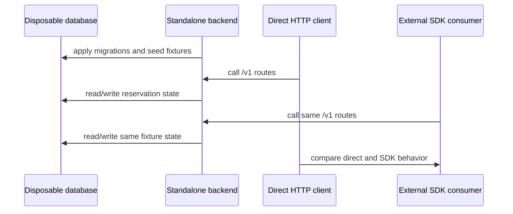

# Phase 4: Standalone Runtime And Database Proof

## Goal

Prove the backend platform runs as a real service against a real disposable
database, then prove the SDK talks to that same backend.

## Required Proof Chain

## Work

1. Start disposable database infrastructure.
2. Apply backend-owned migrations from outside frontend app assumptions.
3. Seed neutral reservation fixtures.
4. Start standalone backend with database-backed repositories.
5. Run direct `/v1` HTTP checks against the backend.
6. Run SDK live parity checks against the same backend URL.
7. Record redacted evidence in `../external-separation-proof-results.md`.

## Proof Commands

- `corepack pnpm run database:live-proof:strict`
- `corepack pnpm run backend-platform:standalone-live-proof:strict`
- `corepack pnpm run sdk:live-parity-proof:strict`
- `corepack pnpm run backend-platform:live-proof-readiness:strict`

These commands can create containers, bind local ports, install packages, or
connect to live local services. They are safe only with disposable env values
and should be reviewed before running on a shared machine.

## Subagent Instructions

- Use disposable database names and ports.
- Do not use hosted production Supabase credentials.
- If the standalone backend can only pass health checks, keep this phase open.
- If SDK parity cannot hit database-backed routes, send the gap back to Phases 1
  and 2.

## Done When

- Standalone backend serves real reservation/catalog/availability routes against
  a disposable database.
- SDK/direct parity passes against that backend.
- Readiness checks have no strict blockers for backend database or SDK parity.

