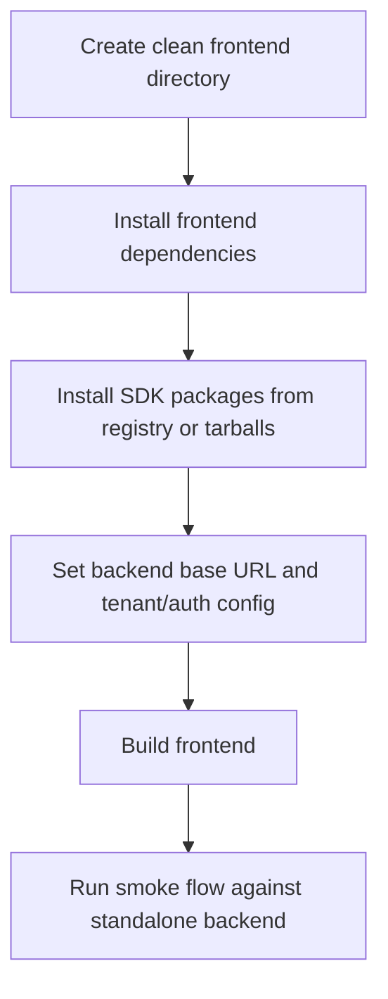

# Phase 5: External Frontend Adoption Proof

## Goal

Prove a frontend that has none of this repository installed can adopt the
backend platform by installing the SDK and configuring the backend URL.

## External Consumer Flow

## Work

1. Create a clean proof workspace outside this repository.
2. Install the frontend app without workspace links.
3. Install `@reservation-platform/sdk` and contract types from the approved
   package source.
4. Configure backend base URL, tenant, and auth values.
5. Run build/typecheck.
6. Run smoke checks for reservation booking, availability read, admin read, and
   optional chat workflow if enabled.

## Proof Commands

- `corepack pnpm run current-frontend:consumer-install-proof:strict`
- `corepack pnpm run current-frontend:external-backend-smoke:strict`
- `corepack pnpm run sdk:registry-install-proof:strict`

The proof is safe when it uses a temp workspace and disposable backend. It
should not modify the source frontend repository except to update documented
consumer setup or package references.

## Subagent Instructions

- Work in an external temp directory for proof runs.
- Do not rely on `workspace:*`, `file:`, or symlinked package dependencies.
- Record package source, backend URL shape, and any smoke failures.
- If a frontend must import backend source to pass, reopen Phase 3.

## Done When

- A clean frontend consumer installs and builds with SDK packages only.
- Smoke tests reach the standalone backend, not local compatibility routes.
- Adoption instructions are clear enough for another app team to follow.

