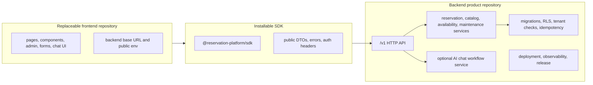

# Current Frontend and Backend Separation Plan

This folder is the current, execution-ready answer to the separation question:

Are the frontend and backend modules separated?

Answer: partially. The branch has useful modular boundaries, backend packages,
SDK client work, extraction manifests, and external proof harnesses. It is not
fully separated as a product architecture until the backend can run as its own
product repository, the SDK can be installed by an unrelated frontend, and the
current frontend can build and smoke as a normal consumer without backend source
or compatibility routes.

## Target Shape

## Phase Files

- [Phase 0: Current Separation Baseline](phase-0-current-separation-baseline.md)
- [Phase 1: Backend Product Boundary](phase-1-backend-product-boundary.md)
- [Phase 2: SDK Install Contract](phase-2-sdk-install-contract.md)
- [Phase 3: Frontend Consumer Detachment](phase-3-frontend-consumer-detachment.md)
- [Phase 4: Live External Proof Chain](phase-4-live-external-proof-chain.md)
- [Phase 5: Compatibility Cleanup and Release Gate](phase-5-compatibility-cleanup-release-gate.md)
- [Subagent Handoff Matrix](subagent-handoff-matrix.md)

## Execution Rule

Run phases in order. If one phase changes a shared assumption, update every
later phase file before reporting done.

| Changed assumption | Must update |
| --- | --- |
| Backend ownership, route contract, database ownership, auth, tenant, idempotency, AI chat, or deployment model | Phases 1, 2, 3, 4, and 5 |
| SDK package name, exports, dependency rules, auth/header behavior, error shape, or install method | Phases 2, 3, 4, and 5 |
| Frontend inventory, public env names, remaining `/api` usage, admin/form/chat ownership, or smoke route coverage | Phases 3, 4, and 5 |
| Proof command, live backend URL, disposable database, registry source, prepared workspace, or clean fixture workflow | Phases 4 and 5 |
| Compatibility route removal, deprecation, rollback, release checklist, or support policy | Phase 5 and `../remaining-modularity-gaps.md` |

## Definition Of Done

The frontend and backend count as separated only when all of these are true:

- backend installs, builds, tests, and runs outside the current Next.js app;
- backend owns database migrations, RLS, tenant enforcement, idempotency, and
  optional AI chat workflow runtime;
- SDK installs in a clean external app without workspace links and exposes only
  public HTTP client contracts;
- current frontend builds and smokes against an external backend base URL with
  no backend source imports;
- SDK behavior matches direct `/v1` HTTP behavior against the same live backend;
- compatibility routes are removed or explicitly deprecated with rollback and
  support rules.

Skipped readiness checks, local monorepo package links, and temporary dry-runs
do not count as final separation proof.
