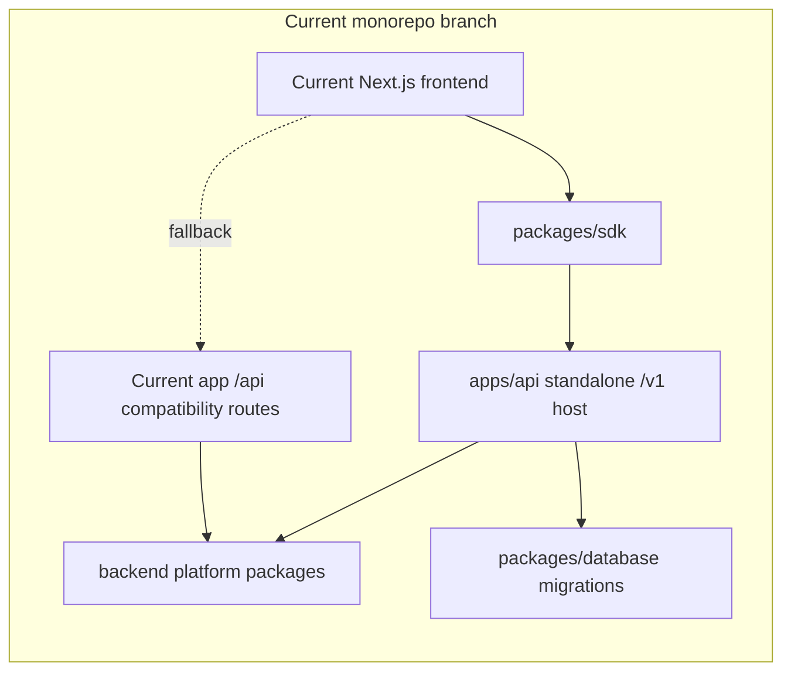
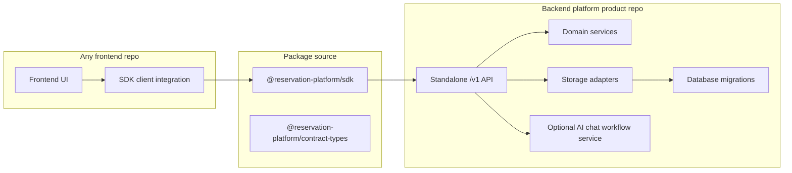

# Current Hard Separation Completion Plan

This folder is the current phase plan for finishing the separation between the
frontend app and the backend platform modules.

The current branch is modular, but it is not yet fully hard-separated as a
product architecture. The backend platform has dedicated packages, a standalone
`apps/api` host, database migration proofs, SDK packaging proofs, and frontend
platform-mode smoke tests. The remaining work is to turn those proofs into a
clean ownership boundary where:

- the backend platform is the product infrastructure;
- the SDK is the installable frontend contract;
- the current frontend is one replaceable consumer;
- current-app `/api` compatibility routes are removed, deprecated, or retained
  only by evidence.

## Current State

## Target State

## Phase Files

- [Phase 0: Separation Baseline Lock](phase-0-separation-baseline-lock.md)
- [Phase 1: Backend Product Boundary Closure](phase-1-backend-product-boundary-closure.md)
- [Phase 2: SDK Install Contract Closure](phase-2-sdk-install-contract-closure.md)
- [Phase 3: Current Frontend Consumer Detachment](phase-3-current-frontend-consumer-detachment.md)
- [Phase 4: External Consumer and Live Backend Proof](phase-4-external-consumer-live-backend-proof.md)
- [Phase 5: Compatibility Cleanup and Release Decision](phase-5-compatibility-cleanup-release-decision.md)
- [Subagent Matrix](subagent-matrix.md)

## Execution Rules

Run phases in order. A subagent may work on one phase at a time, but it must
read this README, its assigned phase file, and the upstream phase result notes
listed in that phase before editing code.

If a worker changes any shared assumption, it must update later phase files in
this folder before it reports completion. Shared assumptions include:

- API paths, payloads, error shapes, headers, auth, tenant, and venue rules;
- SDK package names, exports, install source, and version policy;
- backend repository source ownership;
- frontend environment variables and fallback behavior;
- database migration, RLS, idempotency, or adapter ownership;
- AI chat route ownership and provider workflow placement;
- compatibility route removal, deprecation, or retention criteria.

## Definition of Done

This plan is done only when all of these are true:

- `apps/api` can be treated as the backend product host or has a clear extracted
  backend repository candidate.
- The SDK and contract packages install from an approved package source without
  workspace links.
- The current frontend runs against a standalone `/v1` backend without falling
  back to current-app `/api` routes in the covered public, admin, and chat
  flows.
- A clean external frontend proof runs from outside this repo using only the
  backend URL and SDK package.
- Compatibility routes have an evidence-backed remove, deprecate, or retain
  decision.
- Release docs explain how a new frontend integrates without copying backend
  logic, database queries, Supabase clients, or AI workflow internals.
