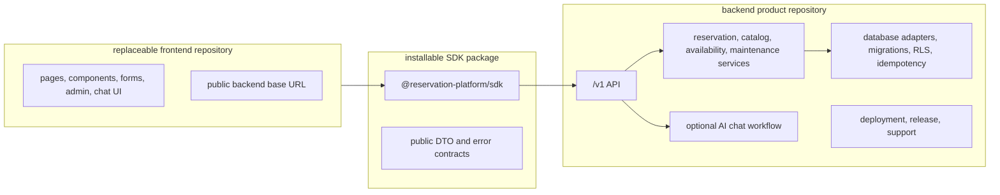

# Current Refactor Separation Gap Plan

This folder answers the current-state question directly:

Is the frontend separated from the backend modules yet?

Answer: partially. The branch has meaningful modular boundaries, SDK client
work, backend package ownership rules, extraction dry-runs, and frontend
consumer readiness checks. It is not fully separated in the product sense until
the backend can stand alone as the product repository, the SDK can be installed
by another app, and the current frontend can run as a replaceable consumer with
no backend source copied into it.

Use this plan when a subagent needs a focused path from the current refactor to
real separation.

## Target Shape

## Phase Files

- [Phase 0: Current Separation Status Audit](phase-0-current-separation-status-audit.md)
- [Phase 1: Backend Product Boundary Closure](phase-1-backend-product-boundary-closure.md)
- [Phase 2: SDK Install Surface Closure](phase-2-sdk-install-surface-closure.md)
- [Phase 3: Frontend Consumer Detachment Closure](phase-3-frontend-consumer-detachment-closure.md)
- [Phase 4: Cross-Repo Proof Closure](phase-4-cross-repo-proof-closure.md)
- [Phase 5: Compatibility and Operations Closure](phase-5-compatibility-operations-closure.md)
- [Subagent Handoff Matrix](subagent-handoff-matrix.md)

## Execution Rule

Run phases in order. If any phase changes a shared assumption, the worker must
update every later phase file in this folder before reporting done.

| Changed assumption | Must update |
| --- | --- |
| Backend package ownership, API contract, database ownership, auth, tenant, idempotency, chat, or deploy model | Phases 1, 2, 3, 4, and 5 |
| SDK package name, exports, dependency rules, auth/header behavior, error shape, or install method | Phases 2, 3, 4, and 5 |
| Frontend source inventory, public env names, remaining `/api` dependencies, chat UI ownership, or admin/form route ownership | Phases 3, 4, and 5 |
| Proof command, live backend URL, disposable database requirement, package registry method, or clean fixture workflow | Phases 4 and 5 |
| Compatibility route removal, rollback, release checklist, or support rule | Phase 5 and `../remaining-modularity-gaps.md` |

## Definition Of Done

This plan is complete only when all of these are true:

- backend candidate installs, builds, tests, and runs without frontend app
  source, current-app route shims, browser helpers, or UI dependencies;
- SDK artifact installs in a clean app without workspace links and exposes only
  public HTTP client contracts;
- current frontend candidate builds and smokes against an external backend base
  URL with no backend source imports;
- SDK and direct HTTP parity pass against the same backend target;
- live disposable database proof covers migrations, RLS, tenant isolation,
  auth, idempotency, and optional chat behavior;
- compatibility routes are removed or explicitly deprecated with rollback and
  release rules.

Skipped readiness checks do not count as final separation proof.
