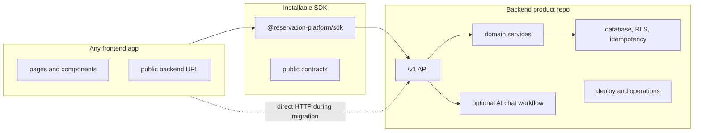

# Current Separation Answer Plan

This folder answers the practical question:

Are the frontend and backend modules separated in the current refactor?

Answer: not fully yet. The branch has strong modular groundwork: backend-owned
packages, SDK/client wrappers, extraction dry-runs, frontend consumer readiness
checks, and strict proof harnesses. It is still not fully separated in the
product sense until a backend repository can stand alone, the SDK can be
installed by an unrelated frontend, and the current frontend can build and run
as only one replaceable consumer.

Use this plan when a subagent needs to turn that answer into implementation
work without relying on chat history.

## Target Architecture

## Phase Files

- [Phase 0: Separation Truth Baseline](phase-0-separation-truth-baseline.md)
- [Phase 1: Backend Product Boundary Enforcement](phase-1-backend-product-boundary-enforcement.md)
- [Phase 2: SDK Install Contract Enforcement](phase-2-sdk-install-contract-enforcement.md)
- [Phase 3: Frontend Consumer Detachment Proof](phase-3-frontend-consumer-detachment-proof.md)
- [Phase 4: Live Cross-Repo Platform Proof](phase-4-live-cross-repo-platform-proof.md)
- [Phase 5: Compatibility Cleanup and Release Decision](phase-5-compatibility-cleanup-release-decision.md)
- [Subagent Handoff Matrix](subagent-handoff-matrix.md)

## Downstream Update Rule

Every phase must update later phases if it changes a shared assumption.

| If this changes | Update these docs |
| --- | --- |
| Backend package ownership, route ownership, database ownership, auth, tenant, idempotency, chat, or deploy model | Phases 1, 2, 3, 4, 5, and `../remaining-modularity-gaps.md` |
| SDK package name, exports, dependency rules, auth headers, error shape, versioning, or install source | Phases 2, 3, 4, 5, and SDK readiness release artifacts |
| Frontend included source inventory, public env names, app-owned auth UX, remaining `/api` usage, or chat UI ownership | Phases 3, 4, 5, and `../frontend-consumer-repo-inventory.json` |
| Proof command, prepared-root requirement, registry method, disposable database requirement, or backend deployment target | Phases 4, 5, release gates, and `../remaining-modularity-gaps.md` |
| Compatibility route status, removal blocker, rollback rule, or deprecation timeline | Phase 5, `../compatibility-route-inventory.json`, and `../compatibility-route-removal-decision-log.md` |

## Definition Of Done

This plan is complete only when all of these pass as real proofs, not skipped
readiness checks:

- backend candidate installs, builds, tests, and runs without frontend source;
- SDK installs from a package artifact or registry source into an unrelated app
  without workspace links;
- current frontend or a clean frontend candidate builds against only the SDK
  and an external `/v1` backend URL;
- live disposable database proof covers migrations, tenant isolation, RLS,
  idempotency, and required reservation flows;
- SDK and direct HTTP parity pass against the same live backend target;
- compatibility routes are removed or explicitly retained with documented
  rollback and deprecation policy.

