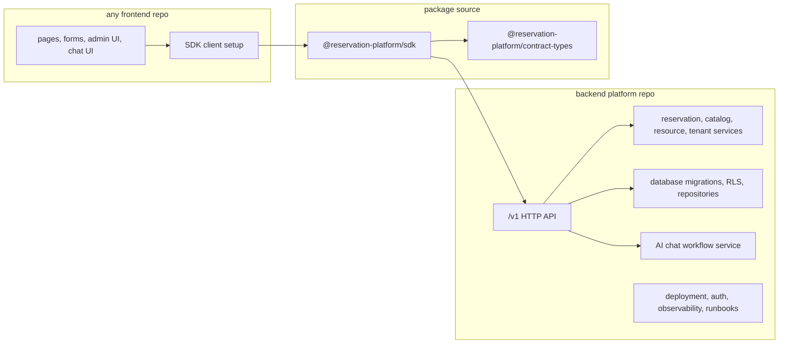
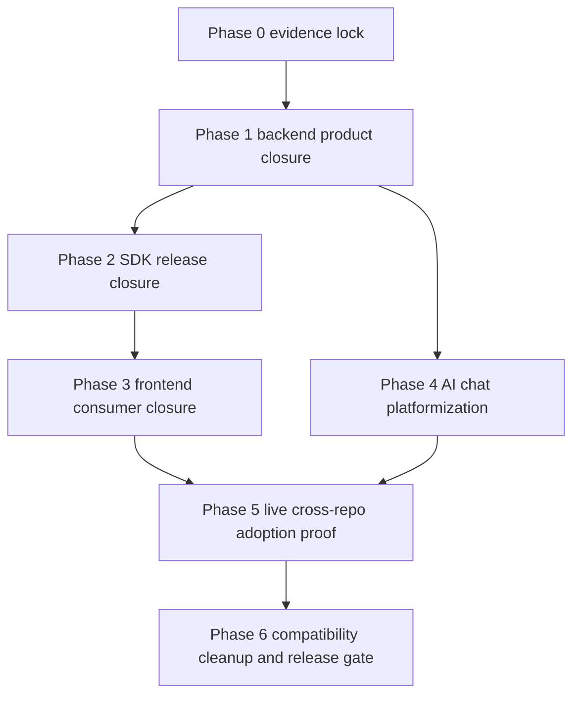

# Final Product Separation Plan

This folder is the current phase plan for turning the modular monorepo work into
the intended product model:

- Backend platform repository is the product.
- SDK is the installable frontend contract.
- Frontend apps are replaceable consumers.
- AI chat and LangChain workflows live behind backend-owned service contracts,
  not inside frontend UI code.

The current branch is modular, but it is not fully product-separated until the
backend can be deployed and operated without the current frontend, the SDK can
be installed from an approved package source, a frontend can run from a separate
repo against that backend, and compatibility routes have an evidence-based
remove/deprecate/retain decision.

## Target Shape

## Phase Order

1. [Phase 0: Evidence Lock and Ownership Baseline](phase-0-evidence-lock-and-ownership-baseline.md)
2. [Phase 1: Backend Product Repository Closure](phase-1-backend-product-repository-closure.md)
3. [Phase 2: SDK Package and Contract Release Closure](phase-2-sdk-package-and-contract-release-closure.md)
4. [Phase 3: Frontend Consumer Repository Closure](phase-3-frontend-consumer-repository-closure.md)
5. [Phase 4: AI Chat Workflow Platformization](phase-4-ai-chat-workflow-platformization.md)
6. [Phase 5: Cross-Repo Live Adoption Proof](phase-5-cross-repo-live-adoption-proof.md)
7. [Phase 6: Compatibility Cleanup and Release Gate](phase-6-compatibility-cleanup-and-release-gate.md)
8. [Subagent Handoff Matrix](subagent-handoff-matrix.md)

## Local Development

Use [Local Modular Platform Dev Runbook](local-modular-platform-dev-runbook.md)
for the current branch's local commands:

- `corepack pnpm run dev:frontend`
- `corepack pnpm run dev:backend`
- `corepack pnpm run dev:platform`

These commands make the modular split easier to work on locally. They do not
replace the strict cross-repo proof chain required for final plug-and-play
release.

## Downstream Update Rule

Every phase must update later phase docs when it changes one of these shared
facts:

- owned source paths;
- package names, versions, or install source;
- public `/v1` API contracts;
- required frontend environment variables;
- backend runtime environment variables;
- database migrations, RLS rules, or adapter ownership;
- chat workflow ownership or provider assumptions;
- proof commands or release gates;
- compatibility route status.

When a phase changes a shared fact, update this folder before marking that phase
complete. This keeps subagents from finishing local work while quietly breaking
the final product-separation outcome.

## Required Proof Chain

Skipped checks do not count as release proof. Safe default commands are useful
for CI, but final separation requires strict proofs with real configured
targets or documented release exceptions.
