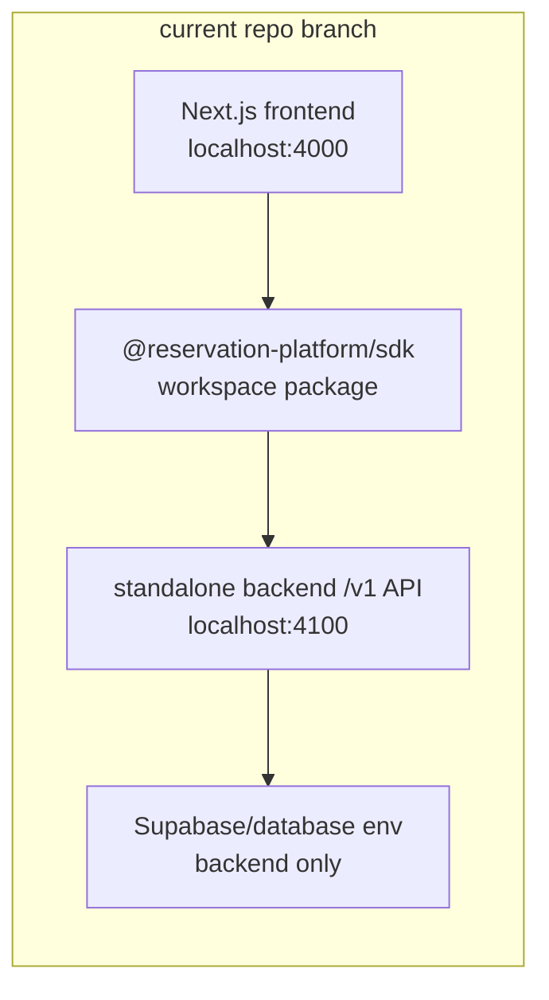

# Local Modular Platform Dev Runbook

This runbook explains how to start the current repository as separate frontend
and backend pieces while the final backend-product repository split is still in
progress.

## Current Local Shape



This is modular local development, not final release proof. Final plug-and-play
proof still requires a backend-owned root, package-source install, and an
external frontend root.

## Commands

Run these from the repository root.

```powershell
corepack pnpm run dev:frontend
```

Starts only the current Next.js frontend on `http://localhost:4000`. This is
safe for local development: it does not deploy, publish packages, or start the
standalone backend. By default the frontend still uses the local compatibility
routes unless `NEXT_PUBLIC_RESERVATION_API_MODE=platform` and
`NEXT_PUBLIC_RESERVATION_PLATFORM_BASE_URL` are set. Chat stays local unless
`NEXT_PUBLIC_RESERVATION_CHAT_MODE=platform` is set.

```powershell
corepack pnpm run dev:backend
```

Starts only the standalone backend API on `http://127.0.0.1:4100` unless `PORT`
or `RESERVATION_BACKEND_PORT` changes the backend port. This is safe for local
development in health-only mode: with no Supabase env, `GET /v1/health` works
and data routes return repository-not-configured errors. If any Supabase env is
present, the command requires the complete backend-only Supabase trio before
starting.

```powershell
corepack pnpm run dev:platform
```

Starts the standalone backend and the current frontend together. The frontend is
started in platform mode with:

- `NEXT_PUBLIC_RESERVATION_API_MODE=platform`
- `NEXT_PUBLIC_RESERVATION_CHAT_MODE=platform`
- `NEXT_PUBLIC_RESERVATION_PLATFORM_BASE_URL=http://127.0.0.1:4100`

The backend is started with local CORS allowing the frontend origin. This is
safe for local development, but any configured Supabase project is real
infrastructure: booking and maintenance mutations can write to that backend
database.

## Ports And Env

| Piece | Default | Override | Notes |
| --- | --- | --- | --- |
| Frontend | `http://localhost:4000` | not currently supported by `dev:platform` | Browser UI and current app routes. |
| Backend | `http://127.0.0.1:4100` | `PORT` or `RESERVATION_BACKEND_PORT` | Standalone `/v1` API. |
| Backend CORS | `http://localhost:4000,http://127.0.0.1:4000` | `RESERVATION_PLATFORM_CORS_ALLOWED_ORIGINS` | Exact origins, comma-separated. |

Backend-only database env:

- `RESERVATION_SUPABASE_URL`
- `RESERVATION_SUPABASE_ANON_KEY`
- `RESERVATION_SUPABASE_SERVICE_ROLE_KEY`

Optional backend auth:

- `RESERVATION_PLATFORM_SERVICE_API_KEY`
- or complete JWT/JWKS env:
  `RESERVATION_PLATFORM_AUTH_JWKS_URL`,
  `RESERVATION_PLATFORM_AUTH_ISSUER`,
  `RESERVATION_PLATFORM_AUTH_AUDIENCE`

Optional JWT/JWKS settings may be added only after the required JWT/JWKS trio is
present:

- `RESERVATION_PLATFORM_AUTH_ALGORITHMS`
- `RESERVATION_PLATFORM_AUTH_CLOCK_TOLERANCE_SECONDS`
- `RESERVATION_PLATFORM_AUTH_JWKS_CACHE_TTL_SECONDS`
- `RESERVATION_PLATFORM_AUTH_SUBJECT_CLAIM`
- `RESERVATION_PLATFORM_AUTH_TENANT_IDS_CLAIM`
- `RESERVATION_PLATFORM_AUTH_VENUE_IDS_CLAIM`
- `RESERVATION_PLATFORM_AUTH_ROLES_CLAIM`
- `RESERVATION_PLATFORM_AUTH_SCOPES_CLAIM`

Frontend-public platform env:

- `NEXT_PUBLIC_RESERVATION_API_MODE=platform`
- `NEXT_PUBLIC_RESERVATION_CHAT_MODE=platform`
- `NEXT_PUBLIC_RESERVATION_PLATFORM_BASE_URL=http://127.0.0.1:4100`
- optional `NEXT_PUBLIC_RESERVATION_TENANT_ID`
- optional `NEXT_PUBLIC_RESERVATION_VENUE_ID`

Do not expose backend secrets through `NEXT_PUBLIC_*`.

## What Each Mode Proves

| Mode | Proves | Does not prove |
| --- | --- | --- |
| `dev:frontend` | Current frontend can run by itself. | Backend-product separation or SDK installability. |
| `dev:backend` without Supabase env | Standalone backend process and health endpoint work. | Real reservation data, migrations, auth, RLS, idempotency, or parity. |
| `dev:backend` with Supabase env | Backend can start with database-backed repositories. | Hosted deployment, seeded data parity, external frontend adoption, or registry install. |
| `dev:platform` | Current frontend can target the standalone local backend URL. | Cross-repo plug-and-play proof. |

## Subagent Handoff Notes

- Treat these commands as ergonomics and local confidence, not release proof.
- If env names, ports, CORS behavior, auth behavior, package names, or proof
  commands change, update Phases 1, 3, 5, and 6 in this folder.
- Do not replace strict external proofs with local dev commands.
- Do not add service-role keys to frontend docs, SDK examples, or browser env.
