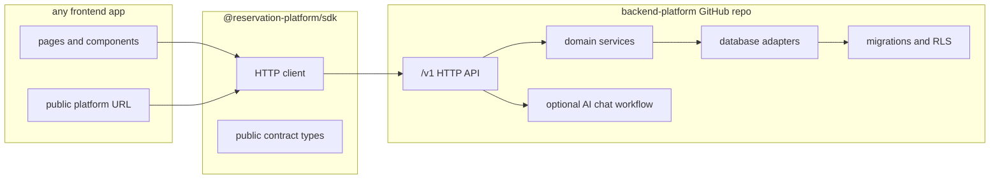

# Frontend and Backend Hard Separation Plan

This plan is for the remaining work needed to make the current refactor truly
separated, not just modular inside one repository.

The target product shape is:

- backend platform repository: owns deployable `/v1` API, domain services,
  persistence adapters, migrations, auth, idempotency, AI workflow services,
  operations, and release gates
- SDK package: owns the installable frontend contract and talks to the backend
  over HTTP only
- frontend consumer repository: owns UI and app-specific pages, and consumes the
  platform through the SDK plus public backend URL configuration

The backend is the product. The frontend is a replaceable consumer. The SDK is
the plug-and-play integration surface.

## Architecture Target

## Phase Files

- [Phase 0: Current Separation Audit](phase-0-current-separation-audit.md)
- [Phase 1: Boundary Enforcement](phase-1-boundary-enforcement.md)
- [Phase 2: Backend Repo Runtime Proof](phase-2-backend-repo-runtime-proof.md)
- [Phase 3: Frontend Consumer Detachment Proof](phase-3-frontend-consumer-detachment-proof.md)
- [Phase 4: SDK Install and Contract Proof](phase-4-sdk-install-and-contract-proof.md)
- [Phase 5: Cross-Repo Plug-and-Play Proof](phase-5-cross-repo-plug-and-play-proof.md)
- [Phase 6: Compatibility Cleanup and Release Gate](phase-6-compatibility-cleanup-release-gate.md)
- [Subagent Handoff Matrix](subagent-handoff-matrix.md)

## Synchronization Rule

Every phase must update later phase files when it changes a shared assumption.
Examples:

- If backend API contracts change, update SDK and frontend proof phases.
- If frontend still needs a missing endpoint, update backend runtime proof.
- If SDK exports change, update frontend consumer setup and cross-repo proof.
- If compatibility routes remain necessary, update cleanup blockers and the
  remaining modularity gaps index.

## Definition Of Done

The separation is done only when all of these are true:

- a backend-only repository candidate can install, build, test, run, and expose
  `/v1` without current frontend files
- a frontend-only repository candidate can install, build, and smoke test
  against a backend URL without importing backend internals
- the SDK can be packed or installed as an artifact in a clean external app
  without workspace links
- SDK and direct HTTP parity pass against the same backend target
- compatibility routes are removed or explicitly deprecated after proven parity
- live database, RLS, tenant isolation, auth, idempotency, and optional chat
  behavior are proven against disposable infrastructure

