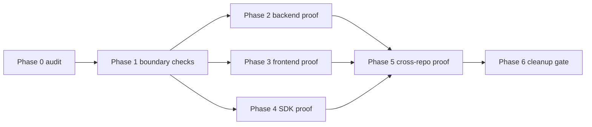

# Subagent Handoff Matrix

Use one worker subagent per phase. After each worker reports done, run a spec
reviewer first, then a code-quality reviewer. If either reviewer finds issues,
send the work back for fixes and re-review before starting the next phase.

## Execution Order

## Task Matrix

| Phase | Worker focus | Must update downstream docs when | Spec reviewer rejects if | Quality reviewer rejects if |
| --- | --- | --- | --- | --- |
| Phase 0 | Current separation audit | ownership or blockers change | audit claims separation without evidence | audit is too vague for a worker to act on |
| Phase 1 | Boundary enforcement | verifier scope changes | checks miss frontend/backend/SDK leakage classes | checks are brittle or scan too narrow a path |
| Phase 2 | Backend repo runtime proof | backend API/env/package shape changes | backend candidate includes frontend files | proof depends on monorepo-only scripts |
| Phase 3 | Frontend detachment proof | frontend needs new SDK/backend behavior | frontend imports backend internals | candidate materialization can leak backend code |
| Phase 4 | SDK install proof | SDK exports/setup change | SDK bundles backend implementation or workspace links | artifact inspection is incomplete |
| Phase 5 | Cross-repo proof | live proof constraints change | proof uses compatibility routes as backend product | skipped checks are reported as passing |
| Phase 6 | Cleanup gate | route decisions change | routes are removed without evidence | cleanup leaves callers or docs inconsistent |

## Shared Instructions For Workers

- Read the assigned phase file completely.
- Read only the listed inputs unless blocked.
- Keep changes inside the phase write scope.
- Update later phases in this folder whenever assumptions change.
- Update the parent remaining gaps index when a gap status changes.
- Do not claim live proof from readiness-only commands.

## Shared Instructions For Reviewers

Spec reviewers check whether the work satisfies the phase exactly and does not
add unrequested shortcuts. Quality reviewers check whether the implementation is
maintainable, safe, and honest about what was actually proven.

Reviewer findings must include the file and line when possible, and must be
fixed before the phase is considered complete.

