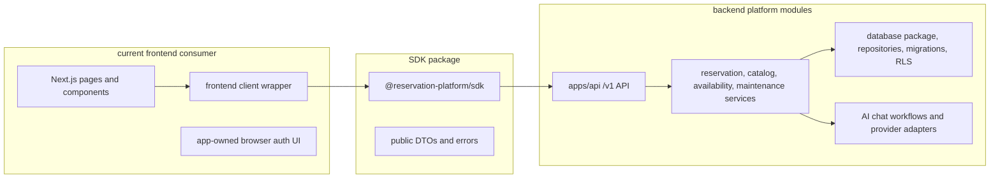

# Frontend and Backend Module Separation Plan

This folder is the execution plan for making the current repository prove a
clean product split:

- backend platform modules own API behavior, services, database access,
  migrations, idempotency, tenant/auth enforcement, and AI workflow execution;
- the SDK is a frontend-safe HTTP client and public contract surface only;
- the current frontend becomes one replaceable consumer that can be moved to a
  different repository without bringing backend code with it.

Use this plan when the goal is not just "packages exist", but "a frontend app
can plug into the backend product through the SDK without sharing source code."

## Target Shape

## Phase Files

- [Phase 0: Separation Source of Truth](phase-0-separation-source-of-truth.md)
- [Phase 1: Backend Module Ownership Lock](phase-1-backend-module-ownership-lock.md)
- [Phase 2: SDK Public Boundary Lock](phase-2-sdk-public-boundary-lock.md)
- [Phase 3: Frontend Consumer Detachment](phase-3-frontend-consumer-detachment.md)
- [Phase 4: Cross-Boundary Proofs](phase-4-cross-boundary-proofs.md)
- [Phase 5: Repo Split and Release Gate](phase-5-repo-split-and-release-gate.md)
- [Subagent Handoff Matrix](subagent-handoff-matrix.md)

## Non-Negotiable Rules

- Frontend source must not import backend platform packages, database
  repositories, migrations, Supabase service-role helpers, route handlers,
  LangChain/provider implementations, or backend runtime config.
- SDK source must not import frontend UI, backend services, database code,
  migrations, provider workflows, server-only auth helpers, or service-role
  secrets.
- Backend platform modules must not import frontend pages, components,
  browser-only helpers, or current-app compatibility wrappers.
- Compatibility `app/api/**` routes are temporary migration adapters. They are
  never the final product API.
- Readiness checks are useful guardrails, but skipped readiness is not release
  proof. Final proof must include a standalone backend target and a clean
  frontend consumer.

## Downstream Update Rule

Whenever a phase changes a shared boundary, the worker must update every later
phase that depends on it before reporting done.

| Changed assumption | Also update |
| --- | --- |
| Backend-owned package list, API ownership, database ownership, auth/tenant rule, idempotency behavior, or AI workflow boundary | Phases 1, 3, 4, and 5 |
| SDK exports, dependency rules, package name, install path, error contract, or header/auth behavior | Phases 2, 3, 4, and 5 |
| Frontend included source inventory, browser env names, current `/api` dependencies, or auth UI responsibilities | Phases 3, 4, and 5 |
| External proof command, live infrastructure requirement, package registry assumption, or repository split artifact | Phases 4 and 5 |
| Compatibility route removal or deprecation decision | Phase 5 and `../remaining-modularity-gaps.md` |

## Subagent Rule

Each phase is designed to be handed to a worker subagent with the same review
loop:

1. Worker receives this README, the assigned phase file,
   `subagent-handoff-matrix.md`, and `../remaining-modularity-gaps.md`.
2. Worker changes only the assigned phase scope.
3. Spec reviewer checks the phase acceptance criteria and rejects overclaims.
4. Quality reviewer checks maintainability, safety, tests, and boundary
   hygiene.
5. Worker fixes reviewer findings, then the same review gate runs again.

