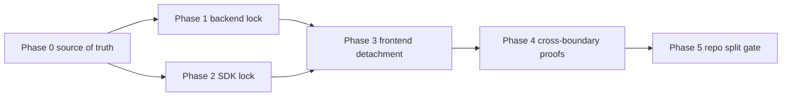

# Subagent Handoff Matrix

## Purpose

This matrix tells a coordinator how to assign the frontend/backend module
separation plan to subagents while preserving the product outcome.

## Execution Order



## Task Matrix

| Phase | Worker focus | Spec review focus | Quality review focus |
| --- | --- | --- | --- |
| Phase 0 | Create/update ownership source of truth | Every path has one owner and later phases use it | Inventory is maintainable, searchable, and hard to misread |
| Phase 1 | Lock backend module ownership | Backend does not depend on frontend or compatibility route ownership | Checks are actionable and package graph rules are narrow |
| Phase 2 | Lock SDK public boundary | SDK is HTTP-only, frontend-safe, installable, and free of backend internals | Exports, artifacts, and install proof are easy to inspect |
| Phase 3 | Detach current frontend | Frontend uses SDK/wrapper and external backend URL in platform mode | Env handling, fallbacks, and smoke tests are explicit |
| Phase 4 | Prove boundaries externally | Backend, SDK, and frontend proofs avoid shared-source shortcuts | Fixtures are clean, safe, deterministic, and useful in CI |
| Phase 5 | Define repo split/release gate | Release claims require live proof and compatibility decisions | Runbooks, rollback notes, and blockers are practical |

## Shared Rejection Rules

Reviewers should reject work that:

- treats `app/api/**` compatibility routes as the backend product API;
- lets frontend source import backend packages, database code, migrations,
  route handlers, provider workflows, or service-role helpers;
- lets SDK source or artifacts include backend implementation code, UI code,
  migrations, provider workflows, or workspace-only assumptions;
- claims release readiness from skipped readiness checks;
- uses workspace links as the only package install proof;
- changes a shared boundary without updating later phase files.

## Worker Prompt Skeleton

```text
You are implementing Phase N from
frontend-backend-module-separation-plan.

Read:
- README.md
- phase-N-*.md
- subagent-handoff-matrix.md
- ../remaining-modularity-gaps.md

Stay within the phase write scope. If you change a shared assumption, update
all later phases required by the README Downstream Update Rule before reporting
done.

Report:
- files changed
- commands run and what they prove
- readiness-only checks versus live proof
- downstream docs updated
- remaining blockers
```

## Reviewer Prompt Skeleton

```text
Review Phase N against the assigned phase file and
frontend-backend-module-separation-plan/README.md.
Do not rely on chat history.

Spec review:
- verify the implementation satisfies purpose, write scope, required checks,
  non-goals, and acceptance criteria;
- reject missing downstream updates.

Quality review:
- verify maintainability, safety, boundary hygiene, deterministic tests,
  useful failure messages, and lack of overbroad scans.

Return APPROVED only when there are no required fixes.
```

