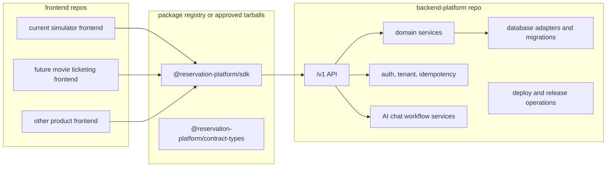

# Frontend and Backend Physical Separation Plan

This folder is the execution plan for the remaining gap between the current
modular monorepo and the intended product shape:

- backend platform repository: the product/infrastructure repo;
- SDK package: the installable frontend integration surface;
- frontend repository: a replaceable consumer app.

The current branch has meaningful modularity already: backend-oriented packages,
SDK client code, extraction/readiness verifiers, frontend consumer inventory,
and compatibility route removal gates. It is not yet fully separated in the
product sense because the frontend, backend modules, SDK, and compatibility
routes still live in this repository and several proofs are dry-run or local
readiness checks.

## Target Shape

## Phase Files

- [Phase 0: Separation Truth Baseline](phase-0-separation-truth-baseline.md)
- [Phase 1: Backend Product Repository Candidate](phase-1-backend-product-repository-candidate.md)
- [Phase 2: SDK Artifact and Contract Boundary](phase-2-sdk-artifact-and-contract-boundary.md)
- [Phase 3: Frontend Consumer Repository Candidate](phase-3-frontend-consumer-repository-candidate.md)
- [Phase 4: Live Backend Platform Proof](phase-4-live-backend-platform-proof.md)
- [Phase 5: External Frontend Adoption Proof](phase-5-external-frontend-adoption-proof.md)
- [Phase 6: Compatibility Cleanup and Release Governance](phase-6-compatibility-cleanup-and-release-governance.md)
- [Subagent Handoff Matrix](subagent-handoff-matrix.md)

## What Counts As Done

This plan is done only when all three statements are true:

1. A backend repo candidate can install, build, test, run, and deploy without
   importing current frontend app files or compatibility route files.
2. A frontend repo candidate can install the SDK artifact, configure a backend
   base URL, build, and complete smoke flows without any backend source copied
   into the frontend repo.
3. A clean external fixture can use only the SDK plus backend URL to exercise
   the reservation platform through `/v1`, with compatibility routes removed or
   explicitly documented as temporary adapters.

## Downstream Update Rule

Every phase is subagent-friendly but not isolated from future consequences. If a
worker changes a shared assumption, the same change must update all later phase
docs in this folder.

| Changed assumption | Must update |
| --- | --- |
| Backend repo contents, package ownership, route shape, database ownership, auth, tenant, idempotency, chat, or deployment model | Phases 1, 2, 3, 4, 5, and 6 |
| SDK package name, exports, install method, dependency graph, error model, auth headers, or version policy | Phases 2, 3, 5, and 6 |
| Current frontend route inventory, admin/form/chat ownership, platform base URL behavior, or remaining `/api` usage | Phases 3, 5, and 6 |
| Live database/deploy proof method, registry/tarball workflow, or external fixture workflow | Phases 4, 5, and 6 |
| Compatibility route removal policy or rollback rule | Phase 6 and `../remaining-modularity-gaps.md` |

## Subagent Rule

Use one worker subagent per phase. Give the worker the full phase file, this
README, `../remaining-modularity-gaps.md`, and only the source files listed in
the phase's inputs. After each worker finishes, run a spec review subagent first
and a code quality review subagent second.

Workers must not claim "separated" from a package graph alone. The proof must be
about installable repositories and package artifacts that can be used from
outside this monorepo.
