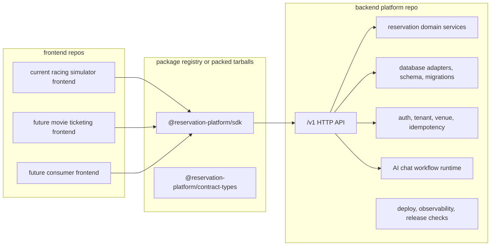

# Frontend, Backend, and SDK Final Separation Plan

This folder is the execution plan for turning the current modular branch into
three truly separable products:

- backend platform repository: deployable API, domain services, database
  adapters, migrations, auth/tenant enforcement, idempotency, AI workflows, and
  operations;
- SDK package: installable frontend-safe client and public contract types;
- frontend repository: replaceable UI consumer that uses the SDK and backend
  URL, with no backend source copied into it.

This is the plan to use when the question is: "Is the frontend separated from
the backend modules yet, and what remains before it is a real SDK/platform?"

## Target Shape

## Phase Files

- [Phase 0: Current Separation Truth](phase-0-current-separation-truth.md)
- [Phase 1: Backend Platform Repo Hard Boundary](phase-1-backend-platform-repo-hard-boundary.md)
- [Phase 2: SDK Productization](phase-2-sdk-productization.md)
- [Phase 3: Frontend Consumer Detachment](phase-3-frontend-consumer-detachment.md)
- [Phase 4: External Consumer Install Proof](phase-4-external-consumer-install-proof.md)
- [Phase 5: Live Platform Proof and Cleanup](phase-5-live-platform-proof-and-cleanup.md)
- [Subagent Handoff Matrix](subagent-handoff-matrix.md)

## Separation Rules

- Frontend code must not import backend packages, route handlers, database
  clients, migrations, LangChain/provider workflows, or server-only secrets.
- SDK code must not contain backend implementation. It can contain public
  types, request builders, response parsing, auth/header plumbing, and a stable
  error model.
- Backend code must own data access, business rules, workflows, tenant
  enforcement, idempotency, migrations, and operational behavior.
- A proof is not complete if it only works through monorepo workspace links.
- Compatibility routes are temporary adapters. The product API is the backend
  `/v1` surface.

## Downstream Update Rule

When a phase changes a shared assumption, update every later phase affected by
that assumption in the same change.

| Changed assumption | Must update |
| --- | --- |
| Backend route shape, database ownership, auth, tenant, venue, idempotency, chat, or deploy target | Phases 1, 2, 3, 4, and 5 |
| SDK package name, exports, dependency list, install method, auth model, or error model | Phases 2, 3, 4, and 5 |
| Current frontend dependency inventory, app routes, admin/form/chat ownership, or direct API usage | Phases 3, 4, and 5 |
| External consumer fixture, package registry/tarball workflow, or live proof setup | Phases 4 and 5 |
| Compatibility route removal rules or release gates | Phase 5 and `../remaining-modularity-gaps.md` |

## Subagent Rule

Each phase should be handled by one worker subagent, one spec reviewer, and one
quality reviewer.

The worker implements only the assigned phase, records evidence, and updates
downstream phase docs when assumptions change. The spec reviewer checks whether
the phase actually satisfies its acceptance criteria. The quality reviewer
checks maintainability, boundary hygiene, and repeatability.
