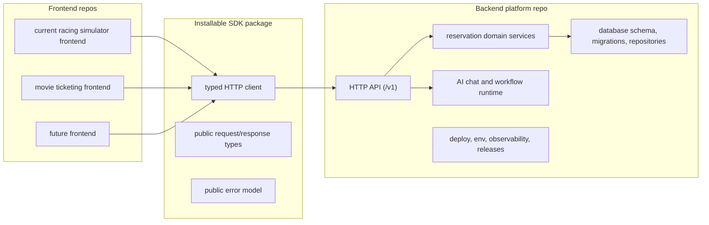

# Frontend Backend Separation Completion Plan

This folder plans the remaining work to make the current repository behave like
two separable products:

- a backend platform repository that owns APIs, database modules, workflows,
  operations, and deployable infrastructure;
- one or more frontend applications that install an SDK/client package and point
  it at the backend platform.

The intended outcome is not only "packages inside one monorepo." The intended
outcome is that a different frontend, in a different directory or repository,
can use the backend platform without copying backend code.

## Target Shape

## Phase Files

- [Phase 0: Separation Source of Truth](phase-0-separation-source-of-truth.md)
- [Phase 1: Backend Platform Repo Contract](phase-1-backend-platform-repo-contract.md)
- [Phase 2: SDK Client Product Surface](phase-2-sdk-client-product-surface.md)
- [Phase 3: Current Frontend Consumer Detachment](phase-3-current-frontend-consumer-detachment.md)
- [Phase 4: External Frontend Adoption Proof](phase-4-external-frontend-adoption-proof.md)
- [Phase 5: AI Chat Workflow Platformization](phase-5-ai-chat-workflow-platformization.md)
- [Phase 6: Cleanup, Release, and Ownership Gates](phase-6-cleanup-release-ownership-gates.md)
- [Subagent Execution Matrix](subagent-execution-matrix.md)

## Separation Rules

- Frontends must not import backend services, database repositories, route
  handlers, migrations, server-only auth helpers, provider SDKs, or service-role
  secrets.
- The SDK must be frontend-safe and HTTP-only. It can include public types,
  request builders, response parsing, header/auth plumbing, and stable error
  handling.
- Backend modules own persistence, tenant enforcement, availability rules,
  idempotency, LangChain/provider workflows, migrations, and operational
  concerns.
- Current-app compatibility routes are temporary adapters. They are not the
  long-term product API.
- A phase is not complete if it only works because the frontend and backend live
  in the same source tree.

## Downstream Update Rule

When a phase changes a shared assumption, update later phase files in this
folder before marking the phase done.

| Changed assumption | Later files to update |
| --- | --- |
| Backend API routes, auth, tenant model, data ownership, or deployment shape | Phases 1, 2, 3, 4, 5, and 6 |
| SDK exports, install method, environment variables, or error model | Phases 2, 3, 4, and 6 |
| Frontend consumer inventory or remaining direct backend dependencies | Phases 3, 4, and 6 |
| Chat workflow ownership, provider configuration, or runtime boundaries | Phases 5 and 6 |
| Compatibility route removal blockers or release gates | Phase 6 and `../remaining-modularity-gaps.md` |

## Subagent Rule

Each phase should be handled by one worker subagent, then checked by a spec
reviewer and a quality reviewer.

The worker must update the assigned phase file with implementation evidence.
The spec reviewer must reject overclaims. The quality reviewer must reject
fragile boundaries, noisy tests, and hidden coupling. The coordinator should not
advance to the next phase until the review loop passes.
