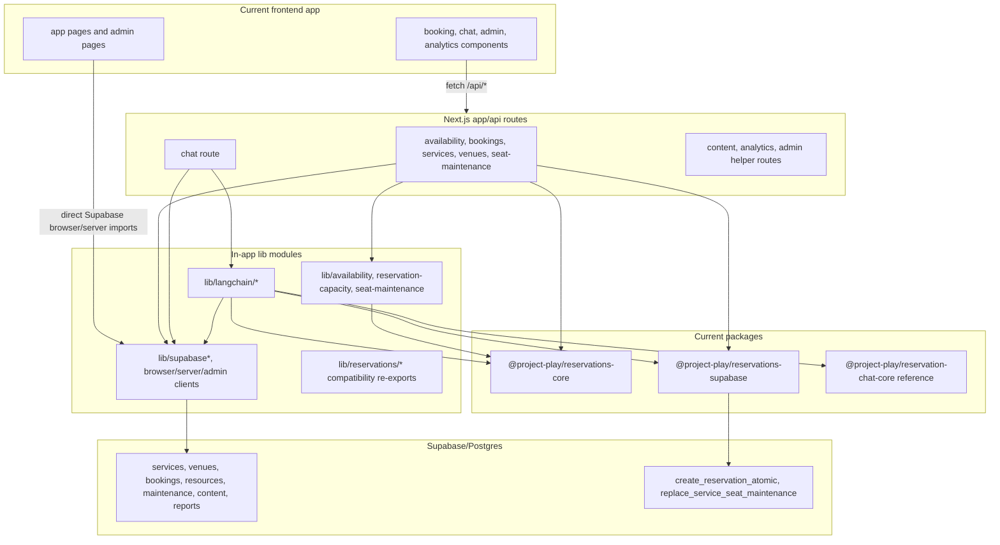

# Phase 0 Current Coupling Audit Results

This audit is documentation-only. It records current coupling between the
Next.js frontend, API route handlers, in-app backend modules, reservation
packages, Supabase clients, and AI workflow code so later phases can remove the
coupling without changing runtime behavior in Phase 0.

## Current Coupling Diagram

## Coupling Inventory

| Coupling | Current files | Current ownership | Target owner | Removal target phase |
| --- | --- | --- | --- | --- |
| Frontend/admin UI imports Supabase browser client directly | `app/admin/AdminDashboard.tsx`, `app/admin/login/page.tsx` | Frontend UI with direct auth/storage client | Frontend may keep host auth UX temporarily; reservation data access moves behind SDK/API | Phase 3 for reservation data reads/writes; Phase 4 for auth/session split |
| Server-rendered admin pages import Supabase server client directly | `app/admin/page.tsx`, `app/admin/content-pages.ts` | Frontend route code coupled to host Supabase session | Frontend host auth/session integration, platform validates API auth | Phase 4 |
| Reservation API routes query Supabase tables directly | `app/api/availability/route.ts`, `app/api/bookings/route.ts`, `app/api/bookings/[id]/route.ts`, `app/api/services/**`, `app/api/venues/**`, `app/api/seat-maintenance/route.ts` | Next.js routes act as backend platform | Backend platform `/v1` API and storage adapters | Phase 1 for module boundary, Phase 3 for frontend route migration |
| Reservation API routes use service-role client | `app/api/availability/route.ts`, `app/api/bookings/route.ts`, `lib/langchain/chat-agent.ts` | In-app backend code owns privileged persistence | Backend platform runtime config and service clients | Phase 4 |
| Reservation API routes import backend packages directly | `app/api/availability/route.ts`, `app/api/bookings/route.ts`, `app/api/reservation-api-adapters.test.ts` | Host routes compose domain and adapter packages | Backend platform API composes packages; frontend consumes HTTP/SDK | Phase 1 and Phase 3 |
| Legacy compatibility modules remain in `lib/**` | `lib/availability.ts`, `lib/reservation-capacity.ts`, `lib/seat-maintenance.ts`, `lib/reservations/**` | Shared in-app compatibility layer | Backend platform compatibility adapter or retired aliases | Phase 1 for ownership, Phase 3 for route/frontend usage removal |
| Chat API imports LangChain orchestration directly | `app/api/chat/route.ts`, `lib/langchain/chat-agent.ts` | Next.js route owns AI booking workflow | Optional backend chat module and `/v1/chat/*` APIs | Phase 5 |
| LangChain booking agent imports Supabase and reservation adapter directly | `lib/langchain/chat-agent.ts`, `lib/langchain/vector-store.ts` | AI workflow owns persistence and retrieval | Backend chat module with injected repository, model, retriever, clock, tenant copy | Phase 5 |
| LangChain prompt module imports route config | `lib/langchain/prompts.ts` imports `app/api/chat/chat-config.ts` | Backend-style lib depends on Next.js route folder | Backend prompt builder accepts tenant config; host route owns current Project Play copy | Phase 5 |
| Browser components call app-local API routes directly | `components/form/MultiStepForm.tsx`, `components/chat/useChat.ts`, `components/admin/SeatMaintenanceManager.tsx`, `app/admin/AdminDashboard.tsx`, analytics/content components | Current frontend consumes host API paths | Frontend consumes SDK methods or `/v1` endpoints | Phase 3 for reservation APIs, Phase 5 for chat, non-platform app routes remain frontend-owned |
| Analytics/report routes and agents share backend utilities with reservation app | `app/api/analytics-*`, `lib/langchain/analytics-agent.ts`, `lib/langchain/sales-report-pipeline.ts` | App-owned backend feature beside platform candidates | Frontend/admin app or separate analytics backend, not reservation platform core | Phase 6 removal gate documents as non-platform or separate module |
| Content routes share Supabase helpers and API route helpers | `app/api/content-posts.ts`, `app/api/blogs/**`, `app/api/updates/**`, `lib/content-posts.ts` | Project Play content backend inside frontend repo | Frontend/CMS ownership, outside reservation platform | Phase 6 removal gate documents exclusion |

## Frontend-Forbidden Import List

These imports are forbidden for browser-facing frontend code in the target
architecture. Some may remain temporarily in host-only server route glue until
the listed target phase removes them.

| Forbidden import or dependency | Current examples | Why forbidden for frontend/SDK | Target phase |
| --- | --- | --- | --- |
| `@/lib/supabase` | `app/api/services/**`, `app/api/venues/**`, `app/api/availability/route.ts`, `lib/langchain/vector-store.ts` | Direct database client and table access | Phase 3 for frontend/API consumers; Phase 5 for chat retrieval |
| `@/lib/supabase-admin` | `app/api/availability/route.ts`, `app/api/bookings/route.ts`, `lib/langchain/chat-agent.ts` | Service-role secret and privileged persistence | Phase 4 |
| `@/lib/supabase-server` | `app/api/api-utils.ts`, `app/admin/page.tsx`, `app/admin/content-pages.ts`, analytics report routes | Host session client; should not be SDK or backend-platform public surface | Phase 4 |
| `@/lib/supabase-browser` | `app/admin/AdminDashboard.tsx`, `app/admin/login/page.tsx` | Frontend may own auth UX, but reservation data access must not query tables directly | Phase 3 for reservation reads/writes, Phase 4 for auth cleanup |
| `@/lib/langchain/*` | `app/api/chat/route.ts`, analytics/chat/report routes | AI provider/workflow code is backend-only | Phase 5 for booking chat; Phase 6 for non-platform analytics exclusion |
| `@/lib/knowledge` | `app/api/chat/route.ts` | Structured retrieval and vector-store access are backend-only | Phase 5 |
| `@/lib/reservations/*` | `lib/reservations/**` re-exports | Compatibility bridge to backend domain packages, not a frontend contract | Phase 2 for contract types, Phase 3 for frontend migration |
| `@/lib/availability`, `@/lib/reservation-capacity`, `@/lib/seat-maintenance` | `lib/langchain/chat-agent.ts`, `app/api/seat-maintenance/route.ts` | Backend rules and legacy resource normalization | Phase 1 for backend module home, Phase 3 or 5 for callers |
| `@project-play/reservations-supabase` | `app/api/availability/route.ts`, `app/api/bookings/route.ts`, `lib/langchain/chat-agent.ts` | Storage adapter and SQL/RPC assumptions | Phase 1 |
| `@project-play/reservations-core` in frontend/browser code | Currently used by API/chat tests and backend routes, not observed in client components | Domain rules should run in backend; frontend should receive generated SDK/contract types | Phase 2 for public contract types, Phase 3 for frontend consumers |
| `@project-play/reservation-chat-core` in frontend/browser code | Currently used by chat route/tool-loop and LangChain tests, not observed in client components | Chat tool schemas/actions are backend module contracts unless exported through SDK chat namespace | Phase 5 |
| `@supabase/*`, `@langchain/*`, `@google/generative-ai`, direct OpenRouter fetch | `lib/supabase*`, `lib/langchain/*`, `lib/gemini-embeddings.ts`, `lib/sales-report-extraction.ts` | Provider, database, and model SDKs must stay out of frontend SDK | Phase 4 for Supabase config; Phase 5 for chat; Phase 6 for analytics/report exclusions |

## API Routes Acting As Backend Platform Routes

| Current route | Backend-platform behavior currently owned here | Target `/v1` resource | Target phase |
| --- | --- | --- | --- |
| `app/api/services/route.ts` | Lists Supabase `services` table directly | `GET /v1/services` | Phase 3 |
| `app/api/services/[id]/route.ts` | Reads one service from Supabase | `GET /v1/services/{service_id}` | Phase 3 |
| `app/api/venues/route.ts` | Lists Supabase `venues` table | `GET /v1/venues` | Phase 3, if venue catalog remains platform-owned |
| `app/api/venues/[id]/route.ts` | Reads venue plus `equipment(*)` | `GET /v1/venues/{venue_id}` or tenant config API | Phase 3, with Project Play copy split from platform config |
| `app/api/availability/route.ts` | Loads service, bookings, maintenance, resources, layout; adapts rows; generates slots | `GET /v1/availability` | Phase 1 then Phase 3 |
| `app/api/bookings/route.ts` | Admin booking search and atomic reservation creation through Supabase adapter | `GET /v1/reservations`, `POST /v1/reservations` | Phase 1 then Phase 3 |
| `app/api/bookings/[id]/route.ts` | Admin read/update/cancel direct `bookings` mutations | `GET /v1/reservations/{id}`, `PATCH /v1/reservations/{id}`, `POST /v1/reservations/{id}/cancel` | Phase 3 |
| `app/api/seat-maintenance/route.ts` | Reads and replaces `service_seat_maintenance`, validates resource labels | `GET /v1/resource-maintenance`, `POST /v1/resource-maintenance`, `POST /v1/resource-maintenance/{id}/end` | Phase 1 then Phase 3 |
| `app/api/chat/route.ts` | Booking chat orchestration, confirmation parsing, knowledge lookup, agent invocation | `/v1/chat/reservation-sessions/*` optional module | Phase 5 |

## Server-Only Modules Currently In `lib/**`

| Module | Server-only reason | Target location | Target phase |
| --- | --- | --- | --- |
| `lib/supabase-admin.ts` | Reads `SUPABASE_SERVICE_ROLE_KEY`; creates privileged client | Backend platform runtime config/client factory | Phase 4 |
| `lib/supabase-server.ts` | Creates cookie/session-aware Supabase SSR client | Frontend host auth adapter; backend validates incoming auth claims | Phase 4 |
| `lib/supabase.ts` | Creates Supabase client from env and enables direct table access | Split: backend storage client in platform, host content client only where app-owned | Phase 3 and Phase 4 |
| `lib/langchain/chat-agent.ts` | LangChain agent, service-role booking creation, Supabase table reads | Optional backend chat module with injected dependencies | Phase 5 |
| `lib/langchain/models.ts` | OpenRouter/Gemini model factories and API keys | Backend chat/analytics provider adapters | Phase 5 for booking chat; Phase 6 for analytics |
| `lib/langchain/vector-store.ts` and `lib/knowledge.ts` | Supabase vector store and retriever | Optional structured retrieval backend module | Phase 5 |
| `lib/langchain/analytics-agent.ts` and `lib/langchain/sales-report-pipeline.ts` | OpenRouter/Gemini calls, Supabase reports/storage | Non-platform analytics backend or frontend app backend | Phase 6 |
| `lib/gemini-embeddings.ts`, `lib/sales-report-extraction.ts` | Provider API calls and server buffers | Non-platform AI/reporting backend | Phase 6 |
| `lib/reservations/**` | Compatibility re-exports of backend packages | Remove bridge; import contracts from package/API/SDK locations | Phase 2 and Phase 3 |
| `lib/availability.ts`, `lib/reservation-capacity.ts`, `lib/seat-maintenance.ts` | Reservation rules and legacy seat/resource normalization | Backend platform compatibility/domain adapter | Phase 1 |

## Backend Module Candidates

| Candidate | Current location | Target backend-platform role | Target phase |
| --- | --- | --- | --- |
| Reservation domain contracts and rules | `packages/reservations-core/src/**` | Core backend domain package; may also feed generated public contract types | Phase 1 |
| Supabase repository adapter and SQL | `packages/reservations-supabase/src/**`, `packages/reservations-supabase/sql/**` | Backend storage adapter and migrations/RPC assets | Phase 1 |
| Reservation route implementations | `app/api/availability/route.ts`, `app/api/bookings/**`, `app/api/services/**`, `app/api/seat-maintenance/route.ts` | Reimplemented as backend `/v1` API handlers, not moved verbatim | Phase 3 |
| Venue catalog route behavior | `app/api/venues/**` | Backend tenant/venue catalog only where config-driven; copy remains frontend/tenant data | Phase 3 |
| Compatibility resource naming helpers | `lib/availability.ts`, `lib/reservation-capacity.ts`, `lib/seat-maintenance.ts` | Backend compatibility adapter for legacy `seat_*` fields | Phase 1 |
| Chat compatibility contracts and tool descriptors | `packages/reservation-chat-core/src/**` | Reference-only migration context for the backend-owned optional `packages/ai-chat` package and possible SDK chat namespace contracts | Phase 5 |
| LangChain booking adapter | `lib/langchain/chat-agent.ts`, `lib/langchain/prompts.ts`, `lib/langchain/vector-store.ts` | Optional backend chat adapter with injected repository/model/retriever/config | Phase 5 |
| Auth/API utility concepts | `app/api/api-utils.ts` | Backend API error/auth boundary concepts, with Next.js-specific wrapper left as host glue | Phase 4 |

## SDK Candidate Versus Non-Candidate List

| Current export or surface | SDK candidate? | Reason | Target phase |
| --- | --- | --- | --- |
| Public DTO concepts from `packages/reservations-core/src/types.ts` | Yes, through a contract package or generated API types | Serializable service/resource/reservation/availability shapes are consumer-safe after database/legacy fields are normalized | Phase 2 |
| Error codes from reservation validation and atomic create | Yes, as stable API error shapes | Frontends need machine-readable error mapping; SDK must preserve backend errors | Phase 2 and Phase 4 |
| SDK methods matching `contracts/sdk-method-list.md` | Yes, new package only | SDK should call `/v1` with fetch and context headers | Phase 2 and Phase 3 |
| `packages/reservation-chat-core` action/message DTOs | Conditional | Safe only as optional `chat` namespace contracts, not provider/tool execution code in frontend | Phase 5 |
| `packages/reservations-core` rule functions such as `generateAvailabilityTimeSlots` and `validateReservationRequest` | No for SDK runtime | These are backend rules; SDK must not duplicate backend decision-making | Phase 2 |
| `packages/reservations-supabase` exports | No | Contains storage adapter, table names, row adapters, SQL/RPC assumptions, and `@supabase/supabase-js` dependency | Phase 1 |
| `lib/supabase*` exports | No | Direct database clients and secrets/session implementation | Phase 4 |
| `lib/langchain/*` exports | No | Provider-specific AI workflows and server secrets | Phase 5 |
| `lib/reservations/**` re-exports | No | Temporary in-app bridge; not a stable public contract | Phase 2 |
| Next.js `app/api/**` route handlers | No | Server implementation detail; SDK should call HTTP resources | Phase 3 |
| UI components/pages | No | Frontend-owned app behavior, not installable SDK | Phase 3 removal gate |

## Migration Table

| Current coupling/work item | Owner after separation | Target location | Blocker | Target phase |
| --- | --- | --- | --- | --- |
| Define backend module boundaries for core, adapter, compatibility helpers | Backend platform | Backend packages for domain, adapters, compatibility | Need canonical split of generic resource naming versus legacy seat aliases | Phase 1 |
| Move direct Supabase adapter composition out of Next.js reservation routes | Backend platform | `/v1` backend route/service layer | Backend module boundary and stable API resource contracts | Phase 1 then Phase 3 |
| Create public contract/SDK type source | Backend platform plus SDK | Contract package or generated API types consumed by SDK | Need decide which `reservations-core` types are public DTOs versus internal rules | Phase 2 |
| Scaffold SDK client methods | SDK | `@reservation-platform/sdk` | Requires `/v1` endpoint names, error shape, tenant/auth/idempotency rules | Phase 2 |
| Replace frontend `/api/bookings`, `/api/availability`, `/api/services`, `/api/seat-maintenance` calls | Frontend consumer app | SDK calls or direct `/v1` HTTP calls | SDK/API compatibility adapters must preserve current payloads and legacy aliases | Phase 3 |
| Replace admin direct Supabase `bookings` reads/writes | Frontend consumer app | SDK/admin API calls | Backend admin authorization and list/update/cancel contracts | Phase 3 and Phase 4 |
| Split Supabase anon/server/service-role config | Backend platform and frontend host | Backend runtime config plus frontend host auth adapter | Need auth/tenant model and secret ownership rules | Phase 4 |
| Convert `app/api/api-utils.ts` auth/error helpers | Backend platform and host glue | Platform error/auth helpers plus Next.js adapter | Depends on auth/tenant/runtime config split | Phase 4 |
| Extract booking chat workflow | Optional backend chat module | `/v1/chat/reservation-sessions/*`, chat service package, LangChain adapter | Need injected model/repository/retriever/clock/tenant copy and Project Play copy split | Phase 5 |
| Remove `lib/langchain/prompts.ts` dependency on `app/api/chat/chat-config.ts` | Optional backend chat module and frontend host config | Prompt builders accept tenant config; route owns Project Play defaults | Requires chat module split | Phase 5 |
| Classify analytics/report AI code | Frontend/admin app or separate analytics backend | Outside reservation platform core unless separately scoped | Need explicit decision whether analytics is platform module | Phase 6 |
| Classify content/blog/update APIs | Frontend/CMS | Current frontend app or CMS integration | Need confirm content is excluded from reservation platform | Phase 6 |
| External frontend proof and removal gate | Frontend, backend platform, SDK | External consumer smoke test against `/v1` and SDK | Requires phases 1-5 complete | Phase 6 |

## What Remains Frontend-Owned

The current frontend keeps ownership of pages, layouts, styling, booking form
journey, chat rendering, admin screens, analytics UI, content pages, visual seat
map/resource selection UX, Project Play brand copy, and user-facing error copy.
Those surfaces should call backend APIs/SDK methods rather than import database,
storage adapter, domain service, LangChain, or route-handler modules.

## What Must Move To Backend Platform Ownership

The backend platform must own reservation domain rules, availability generation,
atomic reservation creation, reservation lifecycle rules, resource maintenance,
generic service/resource/venue configuration contracts where applicable,
storage adapters, migrations/RPC assets, auth/tenant enforcement at API
boundaries, stable API error contracts, and optional booking chat orchestration.

## Downstream Notes

No phase file was changed in Phase 0. Later phases should treat the current
`app/api/**` reservation routes as migration shims, not as the final backend
platform implementation. Every coupling identified above has a target removal
phase in the tables.
