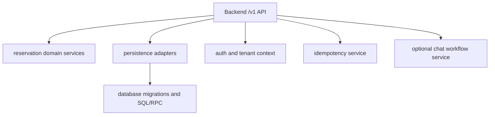

# Phase 1: Backend Module Boundary

## Purpose

Define which current modules become backend platform modules and which current
packages are only temporary stepping stones.

## Inputs To Read

- Phase 0 coupling audit.
- `docs/package-refactor/backend-platform-extraction/frontend-backend-sdk-separation/phase-0-current-coupling-audit-results.md`
- `packages/reservations-core/src/**`
- `packages/reservations-supabase/src/**`
- `app/api/bookings/**`
- `app/api/availability/**`
- `app/api/seat-maintenance/**`
- `app/api/chat/**`
- `lib/supabase-admin.ts`
- `docs/package-refactor/backend-platform-extraction/contracts/api-resource-list.md`

## Write Scope

- Backend module boundary docs in this folder.
- Later implementation belongs in the future backend platform repo or backend
  package area.

## Non-Goals

- Do not expose backend modules directly to external frontends.
- Do not make `packages/reservations-supabase` part of the public SDK.
- Do not move UI/admin/analytics components into backend modules.

## Target Backend Modules

## Phase 0 Findings To Carry Forward

Phase 1 owns the backend side of these Phase 0 couplings:

| Coupling | Phase 1 decision required |
| --- | --- |
| Reservation API routes query Supabase tables directly. | Define backend application service boundaries for availability, reservation lifecycle, catalog, and maintenance before any route migration. |
| Reservation API routes import `@project-play/reservations-core` and `@project-play/reservations-supabase`. | Decide which packages become backend-only domain/storage modules and which names are temporary. |
| Legacy compatibility modules remain in `lib/**`. | Decide whether compatibility helpers become backend adapters or are retired after frontend migration. |
| `packages/reservations-supabase` exposes storage adapter and SQL/RPC assumptions. | Keep adapter backend-only and exclude it from SDK/public frontend dependency lists. |
| `app/api/api-utils.ts` contains auth/error concepts. | Split reusable backend error/auth ideas from Next.js-specific route glue in Phase 4. |

## Implementation Steps

1. Define backend-only module names and ownership.
2. Move domain orchestration behind API/application-service interfaces.
3. Keep storage adapters behind repositories used only by backend code.
4. Move Supabase admin/client usage out of frontend-accessible modules.
5. Define backend module tests that do not depend on Next.js pages/components.
6. Add import checks preventing frontend and SDK packages from importing
   backend modules.

## Deliverables

- Backend module ownership table.
- Backend-only import policy.
- Package rename/migration decision list.
- Backend module test strategy.
- Compatibility helper disposition table: keep as backend adapter, replace with
  contract DTO, or remove after migration.
- Import-check proposal for frontend and SDK packages.

## Acceptance Criteria

- Backend modules can be reasoned about without frontend UI.
- Frontend code cannot import storage adapters or server-only modules.
- SDK does not import backend modules.
- Every backend module candidate from Phase 0 has a target backend owner or an
  explicit non-platform exclusion.

## Downstream Update Notes

If backend module names or locations change, update Phase 2, Phase 3, SDK
readiness Phase 3, and SDK readiness Phase 4.
