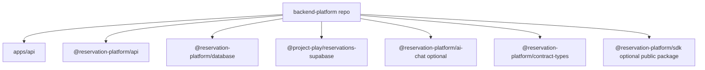

# Phase 16: Physical Backend Repository Split

## Purpose

Create the actual backend platform repository boundary instead of only proving
that the current monorepo could be separated.

This phase answers: if a new GitHub repository becomes the backend product,
which files move there, which files stay behind as frontend consumer code, and
which checks prove the backend repo can stand on its own?

## Inputs To Read

- `docs/package-refactor/backend-platform-extraction/frontend-backend-sdk-separation/phase-11-backend-repo-extraction.md`
- `docs/package-refactor/backend-platform-extraction/frontend-backend-sdk-separation/phase-13-backend-platform-product-repo.md`
- `docs/package-refactor/backend-platform-extraction/backend-repo-bootstrap.md`
- `docs/package-refactor/backend-platform-extraction/backend-package-ownership.md`
- `docs/package-refactor/backend-platform-extraction/standalone-backend-extraction-manifest.json`
- `apps/api/**`
- backend-owned `packages/**`
- backend platform scripts under `scripts/**`
- root package, workspace, TypeScript, lint, and test configuration

## Write Scope

- backend repo extraction manifest
- backend repo bootstrap docs
- backend package ownership docs
- backend-only CI plan docs
- extraction dry-run or package graph verification scripts
- this phase result doc, if created
- downstream phase docs in this folder
- `remaining-modularity-gaps.md`

## Non-Goals

- Do not move frontend pages, components, app-owned routes, or analytics UI into
  the backend product repository.
- Do not treat `app/api/**` compatibility routes as canonical backend source.
- Do not publish packages or deploy production infrastructure in this phase.
- Do not include real secrets in extracted repo examples.

## Target Repository Shape

The backend repository owns the `/v1` API, backend domain services, storage
adapters, database migrations, backend runtime configuration, optional chat
workflow module, and release gates for the backend platform.

## Implementation Steps

1. Convert the current extraction manifest into a file list that can create a
   backend-only repository without frontend app code.
2. Add or update a dry-run script that copies only backend-owned files into a
   temporary directory and validates package/workspace references there.
3. Make the extracted repo installable and testable with backend-only package
   scripts.
4. Prove the extracted repo does not import current frontend code, Next.js app
   route compatibility glue, browser Supabase helpers, or UI components.
5. Document the backend repo bootstrap flow for a clean clone: install, test,
   build, configure environment, run database proof, and start the API.
6. Update Phase 17 when the backend split changes what the frontend consumes.
7. Update Phase 18 when package visibility or SDK ownership changes.
8. Update Phase 19 when backend CI or release proof commands change.

## Deliverables

- Backend-only extraction manifest.
- Backend repo dry-run command.
- Backend-only package graph verification.
- Clean clone bootstrap instructions.
- Backend repo CI command list.
- Updated downstream phase docs.

## Acceptance Criteria

- A subagent can generate a backend-only repository from the manifest.
- The generated backend repo can install, build, and test without frontend
  source files.
- Backend package manifests do not depend on React, Next.js frontend app code,
  browser-only helpers, or app-owned compatibility routes.
- Database and optional chat packages are classified as backend-owned.
- SDK ownership is explicit: either released from the backend repo or from a
  separate package repo.

## Subagent Handoff Notes

Give the worker this file plus Phase 11, Phase 13, the extraction manifest,
and the package ownership doc. The worker should produce proof commands before
claiming separation. If the worker changes any package ownership, it must update
Phases 17, 18, and 19 before finishing.
