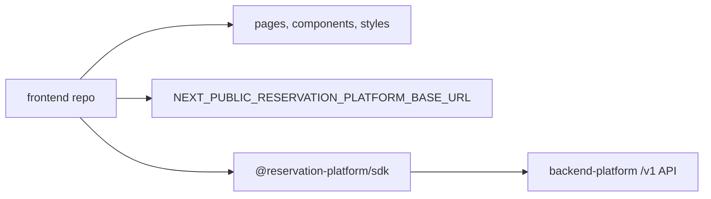

# Phase 17: Physical Frontend Repository Split

## Purpose

Create the actual frontend consumer repository boundary after the backend
platform is treated as a separate product.

This phase answers: can the current reservation frontend live in its own repo
with only UI code, browser-safe configuration, and the SDK or `/v1` HTTP
contract?

## Inputs To Read

- `docs/package-refactor/backend-platform-extraction/frontend-backend-sdk-separation/phase-8-current-frontend-consumer-cutover.md`
- `docs/package-refactor/backend-platform-extraction/frontend-backend-sdk-separation/phase-9-compatibility-route-removal.md`
- `docs/package-refactor/backend-platform-extraction/frontend-backend-sdk-separation/phase-12-frontend-repo-consumer-proof.md`
- `docs/package-refactor/backend-platform-extraction/frontend-backend-sdk-separation/phase-16-physical-backend-repo-split.md`
- `docs/package-refactor/backend-platform-extraction/frontend-backend-sdk-separation/frontend-consumer-repo-inventory.json`
- `lib/reservation-platform-client.ts`
- frontend app and component source
- root package, workspace, TypeScript, lint, and test configuration

## Write Scope

- frontend consumer inventory
- frontend repo bootstrap docs
- frontend-only package/dependency plan
- frontend boundary verification scripts
- compatibility route removal notes
- this phase result doc, if created
- downstream phase docs in this folder
- `remaining-modularity-gaps.md`

## Non-Goals

- Do not copy backend platform packages into the frontend repo.
- Do not keep local reservation-platform API routes as the normal frontend
  runtime path.
- Do not require Supabase service-role keys, database migrations, LangChain
  provider configuration, or backend server env in the frontend repo.
- Do not publish the SDK in this phase unless Phase 18 explicitly owns that
  release work.

## Target Repository Shape

The frontend repository owns presentation, navigation, browser/session UX, and
frontend deployment configuration. It consumes the backend platform through the
SDK or direct `/v1` HTTP only.

## Implementation Steps

1. Expand the frontend consumer inventory from proof slice to runnable app
   slice, classifying each source area as `include`, `reference-only`, or
   `exclude`.
2. Add a frontend repo dry-run command that copies the included source into a
   temporary directory.
3. Generate frontend-only package metadata that excludes backend packages,
   database tools, backend scripts, provider SDKs, and service-role helpers.
4. Prove the copied frontend can install, lint, build, and run its smoke tests
   against a configured platform base URL.
5. Replace remaining local compatibility route assumptions with SDK or `/v1`
   calls, or record them as Phase 9 blockers.
6. Document the clean frontend clone setup flow.
7. Update Phase 18 if the frontend needs SDK exports, package publishing, or
   contract changes.
8. Update Phase 19 if frontend release/deployment proof changes the final
   operational checklist.

## Deliverables

- Runnable frontend repo inventory.
- Frontend repo dry-run command.
- Frontend-only package metadata plan.
- Clean clone setup instructions.
- Frontend build/smoke proof against `/v1`.
- Updated compatibility route blockers.

## Acceptance Criteria

- The frontend repo can build without backend platform source files.
- Frontend code imports only frontend-safe packages and public contract types.
- Runtime configuration points to an external backend platform URL.
- No frontend proof depends on service-role keys, migrations, provider secrets,
  or backend-only workspace packages.
- Any remaining compatibility route dependency is tied to a Phase 9 removal
  blocker.

## Subagent Handoff Notes

Give the worker this file plus Phases 8, 9, 12, and 16. The worker should keep
backend logic out of the frontend, even if that means opening a downstream SDK
or backend requirement. If the frontend cannot build without a backend file,
the worker must classify that as a separation gap rather than copy the backend
file into the frontend repo.
