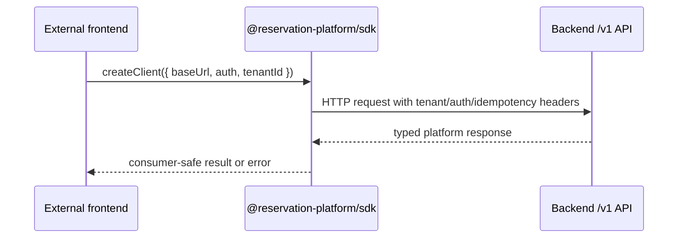

# Phase 18: SDK Distribution and Contract

## Purpose

Make the SDK the plug-and-play integration layer for unrelated frontend apps.

This phase answers: if another team has only their own frontend repository,
what do they install, what do they configure, and how do they call the backend
platform without importing backend internals?

## Inputs To Read

- `docs/package-refactor/backend-platform-extraction/frontend-backend-sdk-separation/phase-14-sdk-release-consumer-contract.md`
- `docs/package-refactor/backend-platform-extraction/frontend-backend-sdk-separation/phase-16-physical-backend-repo-split.md`
- `docs/package-refactor/backend-platform-extraction/frontend-backend-sdk-separation/phase-17-physical-frontend-repo-split.md`
- `docs/package-refactor/backend-platform-extraction/sdk-readiness/README.md`
- SDK package source and package metadata
- SDK registry/install proof scripts
- direct `/v1` API contract docs

## Write Scope

- SDK package metadata
- SDK public contract docs
- SDK pack/install proof fixtures
- SDK dependency and export boundary scans
- consumer quickstart docs
- this phase result doc, if created
- downstream Phase 19 docs
- `remaining-modularity-gaps.md`

## Non-Goals

- Do not publish to a registry without explicit release approval.
- Do not place backend route handlers, storage adapters, migrations, service
  clients, or provider workflows inside the SDK.
- Do not make the SDK require a specific frontend framework.
- Do not hide direct `/v1` behavior that differs from SDK behavior.

## Consumer Flow

An external frontend should need only package installation, a backend base URL,
tenant/auth context, and the SDK method calls it uses.

## Implementation Steps

1. Define the SDK public API contract by namespace and method.
2. Add package export checks so only public SDK files and contract types are
   shipped.
3. Add dependency checks so the SDK cannot depend on backend runtime packages.
4. Add a pack inspection proof that verifies tarball contents before publish.
5. Add a clean consumer fixture that installs the packed SDK into an unrelated
   frontend-like project.
6. Prove SDK behavior matches direct `/v1` HTTP for required read and mutation
   endpoints, including auth, tenant, correlation, and idempotency headers.
7. Document install flows for local tarball, private registry, and public
   registry without implying a package is already published.
8. Update Phase 19 with release gates and rollback steps for SDK versions.

## Deliverables

- SDK public method contract.
- SDK dependency/export boundary scan.
- Package tarball inspection guard.
- Clean external install fixture.
- SDK/direct HTTP parity proof.
- Consumer quickstart for unrelated frontend repos.

## Acceptance Criteria

- An unrelated frontend can install the SDK without this monorepo.
- SDK package contents are consumer-safe.
- SDK runtime uses HTTP only to reach the backend platform.
- Direct `/v1` calls and SDK calls have documented parity.
- Publishing remains a manual, approved release action.

## Subagent Handoff Notes

Give the worker this file plus Phase 14 and the SDK readiness docs. The worker
should focus on package proof and consumer ergonomics. If a required backend
endpoint is missing, update Phase 16. If a frontend adoption issue appears,
update Phase 17. Do not add backend behavior into the SDK to make a proof pass.
