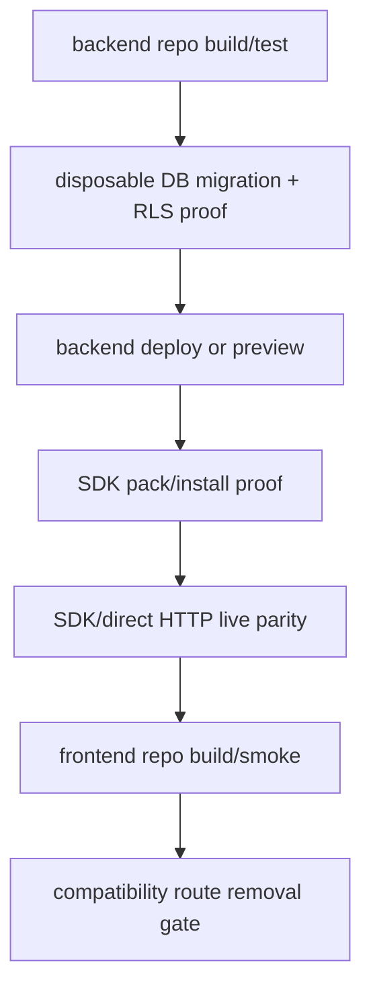

# Phase 19: Cross-Repo Release Proof

## Purpose

Prove the separated backend repo, frontend repo, and SDK release model work
together as independent products.

This phase answers: after the split, what exact checks must pass before the
backend platform can be treated as reusable infrastructure for multiple
frontends?

## Inputs To Read

- `docs/package-refactor/backend-platform-extraction/frontend-backend-sdk-separation/phase-10-live-platform-proof.md`
- `docs/package-refactor/backend-platform-extraction/frontend-backend-sdk-separation/phase-15-operations-deprecation-release.md`
- `docs/package-refactor/backend-platform-extraction/frontend-backend-sdk-separation/phase-16-physical-backend-repo-split.md`
- `docs/package-refactor/backend-platform-extraction/frontend-backend-sdk-separation/phase-17-physical-frontend-repo-split.md`
- `docs/package-refactor/backend-platform-extraction/frontend-backend-sdk-separation/phase-18-sdk-distribution-and-contract.md`
- backend deployment scripts and docs
- database proof scripts
- SDK install/parity proof scripts
- compatibility route inventory

## Write Scope

- cross-repo release checklist
- live proof runbook
- compatibility removal checklist
- rollback and support matrix docs
- CI/release orchestration docs
- this phase result doc, if created
- `remaining-modularity-gaps.md`

## Non-Goals

- Do not deploy production infrastructure without explicit approval.
- Do not publish packages without explicit approval.
- Do not mark skipped readiness checks as proof.
- Do not remove compatibility routes unless Phase 9 marks every affected route
  removable.

## Release Proof Chain

The platform is not truly plug-and-play until this proof chain passes against
separated repository boundaries and disposable live infrastructure.

## Implementation Steps

1. Write the backend repo release checklist, including install, build, unit
   tests, boundary scans, database proof, and deployment proof.
2. Write the SDK release checklist, including pack inspection, clean install,
   dependency scan, export scan, and SDK/direct HTTP parity.
3. Write the frontend consumer release checklist, including clean install,
   frontend-only build, platform URL configuration, and smoke tests.
4. Define the disposable live environment requirements for database, tenant,
   auth, idempotency, and optional chat proof.
5. Define compatibility route removal conditions and rollback steps.
6. Add support matrix entries for backend API versions, SDK versions, frontend
   consumer modes, and optional chat availability.
7. Update earlier phases if any proof requires undocumented backend, SDK, or
   frontend behavior.

## Deliverables

- Cross-repo release checklist.
- Disposable live proof runbook.
- SDK version and backend API compatibility matrix.
- Compatibility route removal and rollback checklist.
- Frontend consumer smoke proof instructions.
- Remaining-gap closeout criteria.

## Acceptance Criteria

- Backend, SDK, and frontend checks can run without depending on one monorepo.
- Live proof covers database migrations, tenant isolation, auth, idempotency,
  SDK/direct parity, and optional chat status.
- Compatibility routes are removed only after replacement behavior is proven.
- Rollback is documented for backend deployment, database migration, SDK
  version, and frontend consumer configuration.
- Remaining gaps are explicit deferred work, not hidden separation blockers.

## Subagent Handoff Notes

Give the worker this file plus Phases 10, 15, 16, 17, and 18. The worker must
prefer strict proof over optimistic docs. If a command only checks readiness or
skips when unconfigured, it should be listed as readiness, not release proof.
