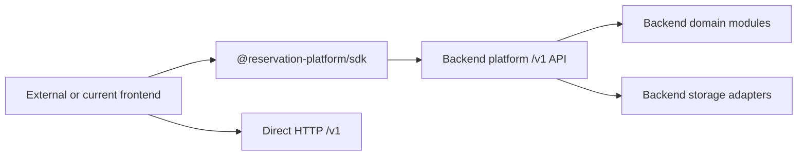

# Phase 2 SDK Boundary and Public Client Results

This document executes Phase 2 as planning/boundary work. It defines the SDK as
a frontend-safe HTTP client, not a backend module.

## SDK Boundary Decision

`@reservation-platform/sdk` must be a new package that calls the backend `/v1`
API. It must not import the current `@project-play/*` backend foundations.



## Public Export Plan

| Export | Purpose | Notes |
| --- | --- | --- |
| `createReservationPlatformClient(options)` | Main SDK factory | Uses `baseUrl`, auth callback, tenant/venue context, fetch, timeout, retry, hooks. |
| `ReservationPlatformClient` | Client interface | Methods mirror `contracts/sdk-method-list.md`. |
| `PlatformError` | Error wrapper | Preserves backend error object exactly. |
| `isPlatformError(error)` | Type guard | Does not rewrite backend error codes/messages. |
| Selected DTO re-exports | Consumer convenience | Re-export from `@reservation-platform/contract-types`, do not own contracts. |
| Optional `chat` namespace or subpath | Optional backend chat client | HTTP-only; no LangChain/provider imports. |

## Dependency Allow And Deny List

| Dependency class | SDK status |
| --- | --- |
| `@reservation-platform/contract-types` | Allowed. Public DTO/schema source. |
| Standard `fetch` or caller-provided `fetch` | Allowed. |
| Tiny SDK-local URL/query/error helpers | Allowed if browser-safe. |
| `@project-play/reservations-core` | Forbidden. Backend domain foundation. |
| `@project-play/reservations-supabase` | Forbidden. Backend storage adapter. |
| `@project-play/reservation-chat-core` | Forbidden by default; selected DTOs must move through contract types first. |
| `@supabase/*` | Forbidden. Database/session implementation. |
| `next`, React, route handlers, server actions | Forbidden. SDK must be framework-neutral. |
| `lib/**`, `app/**`, `components/**` from this repo | Forbidden. Current app internals. |
| LangChain, provider SDKs, vector stores | Forbidden. Backend chat owns these. |

## Method-To-Endpoint Checklist

| SDK method group | Endpoint source | SDK behavior |
| --- | --- | --- |
| Metadata/tenant/catalog | `GET /v1/metadata`, `/tenants/current`, `/venues`, `/services`, `/resources` | Serialize query/context headers; return public DTOs. |
| Availability | `GET /v1/availability` | Query serialization only; no local availability generation. |
| Reservations | `POST/GET/PATCH /v1/reservations*` | Forward DTOs/idempotency; no validation decisions beyond documented opt-in preflight. |
| Resource maintenance | `/v1/resource-maintenance*` | HTTP wrapper only; no table/RPC knowledge. |
| Optional chat | `/v1/chat/reservation-sessions*` | JSON/streaming wrapper only; no provider workflow. |

## Direct HTTP Parity Matrix

| Case | SDK proof | Direct HTTP proof |
| --- | --- | --- |
| Success payload | SDK response equals raw fetch JSON. | Raw fetch to same endpoint. |
| Platform error | `PlatformError.body` equals raw error body. | Raw fetch non-2xx body. |
| Missing idempotency key | SDK preserves API `missing_idempotency_key` default. | Raw mutation without key. |
| Replay | SDK sends same key and receives same replay semantics. | Raw fetch with same key/body. |
| Key misuse | SDK preserves misuse error. | Raw fetch same key/different body. |
| Streaming chat | SDK stream events equal backend-defined stream events after parsing. | Raw stream from `messages:stream`. |

## Enforcement Checklist

- Add static import checks for SDK source.
- Add package manifest checks for forbidden dependencies.
- Inspect packed tarball for route handlers, SQL, migrations, `lib/**`,
  `app/**`, React/Next, Supabase, and provider SDKs.
- Add fixture install tests from a clean external app.
- Add parity tests against raw fetch.

## Implementation Progress

Current branch now includes the first frontend-safe SDK slice:

| Artifact | Status | Evidence |
| --- | --- | --- |
| `packages/contract-types` | Added | Public DTO/error contracts plus initial Zod runtime schemas; no app, database, framework, or AI provider imports. The package now owns generated OpenAPI/JSON Schema artifacts under `packages/contract-types/contracts/`, checked by `contracts:check`; live publication/final standalone backend extraction remain separate follow-up work. |
| `packages/sdk` | Added | `createReservationPlatformClient`, `PlatformError`, `isPlatformError`, DTO re-exports, core reservation methods including `getResourceLayout`, resource maintenance methods, and optional HTTP-only `chat` namespace. |
| Root package scripts | Updated | `packages:build`, `packages:test`, and `packages:pack` include `@reservation-platform/contract-types` and `@reservation-platform/sdk`. |
| SDK request behavior | Partially proven | Unit tests cover reservation POST mapping, platform tenant/venue headers, idempotency/correlation headers, platform error preservation, resource layout mapping, safe-read retry, abort non-retry, mutation non-retry, and chat stream endpoint mapping. |
| Contract runtime schemas | Partially proven | Zod schema tests cover minimal reservation input, public platform errors, JSON-only error details, metadata constraints, and typed resource layouts. |
| Static forbidden dependency scan | Passing for the new packages | Fixed-string scans found no `next`, `react`, `@supabase`, `@langchain`, `@project-play`, `app/`, or `lib/` references in SDK/contract source and package manifests. |
| Package build and pack | Passing | `packages:build` covers the current workspace package set. `packages:pack` now covers release-candidate tarballs for `@reservation-platform/contract-types`, `@reservation-platform/sdk`, `@reservation-platform/api`, `@reservation-platform/ai-chat`, and `@reservation-platform/database` alongside legacy package candidates. The SDK remains frontend-safe and HTTP-only; backend-owned `api`, `ai-chat`, and `database` artifacts are included in local package-boundary proof, not treated as browser SDK runtime dependencies. |

Verification run:

```powershell
corepack pnpm run packages:test
corepack pnpm run packages:build
corepack pnpm run packages:pack
```

Result: all package tests passed, all configured package builds completed, and
release-candidate package tarballs were produced. The new SDK tarball contains
only `dist/*`, `package.json`, and `README.md`.

This is still only an SDK/client boundary implementation. Full runtime contract
schema coverage, live publication of generated contract artifacts, current
frontend migration, external clean-consumer proof, and live direct HTTP parity
remain required before this phase can be treated as release-ready. Local packed
tarball boundary scans now include the frontend SDK/contract packages and the
backend-owned API, chat, and database package candidates.

## Reviewer Follow-Up

A subagent spec review found four gaps in the first implementation pass:

| Finding | Follow-up |
| --- | --- |
| Missing `getResourceLayout(layoutId)` | Fixed in `packages/sdk` and covered by an SDK endpoint mapping test. |
| Tenant/venue header names used short aliases | Fixed to `X-Reservation-Tenant-Id` and `X-Reservation-Venue-Id`, matching Phase 5. |
| Contract package is type-only | Fixed for the local package boundary with Zod runtime schemas, generated OpenAPI/JSON Schema artifacts in `packages/contract-types/contracts/`, and `contracts:check` drift protection. Remaining work is publication/final standalone backend extraction, not artifact generation itself. |
| Retry option was exposed but unused | Fixed with bounded safe-read retry support and mutation non-retry tests. |

A follow-up code-quality review found retry abort handling, loose JSON error
schemas, and underspecified resource layout data. These were addressed with
abort non-retry behavior, recursive JSON value validation for error
details/causes, typed layout resources, and matching tests.

## Downstream Updates Required

Phase 3 must migrate the current frontend to use this SDK or direct HTTP
through a frontend-owned client wrapper. Phase 4 must define auth/context
headers used by SDK options. Phase 5 must keep optional chat HTTP-only. Phase 6
must fail release if SDK imports backend foundations or packed tarball contents
include backend internals.

Runtime code has started in this phase through the new contract and SDK
packages. Backend API implementation and frontend migration have not moved yet.
