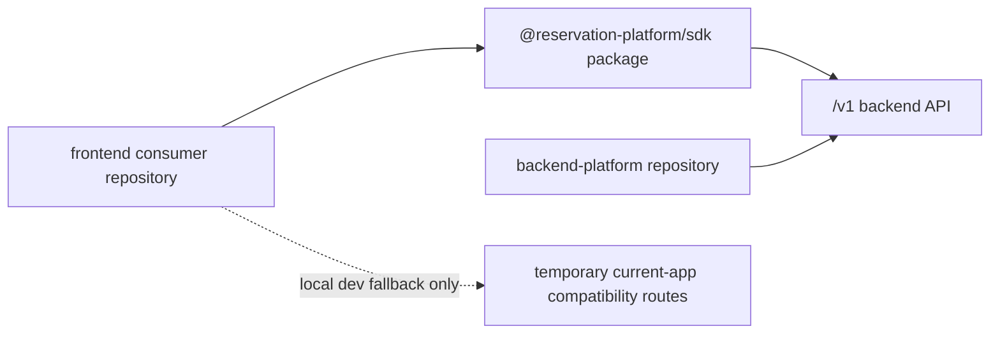

# Phase 20: Separation Source of Truth

## Purpose

Create one authoritative map for what belongs to the backend platform repo, the
frontend consumer repo, and the SDK package before doing more physical split
work.

This phase answers: which source files are canonical product code, which files
are temporary compatibility glue, and which files must never cross repository
boundaries?

## Inputs To Read

- `docs/package-refactor/backend-platform-extraction/frontend-backend-sdk-separation/README.md`
- `docs/package-refactor/backend-platform-extraction/frontend-backend-sdk-separation/remaining-modularity-gaps.md`
- `docs/package-refactor/backend-platform-extraction/frontend-backend-sdk-separation/frontend-consumer-repo-inventory.json`
- `docs/package-refactor/backend-platform-extraction/standalone-backend-extraction-manifest.json`
- `docs/package-refactor/backend-platform-extraction/backend-package-ownership.md`
- `apps/api/**`
- `app/**`
- `lib/**`
- `packages/**`
- `scripts/**`
- root `package.json` and `pnpm-workspace.yaml`

## Write Scope

- backend extraction manifest
- frontend consumer inventory
- backend package ownership docs
- frontend/backend/SDK separation docs in this folder
- verification scripts that only scan local files
- `remaining-modularity-gaps.md`

## Non-Goals

- Do not move files between repositories in this phase.
- Do not delete compatibility routes.
- Do not publish SDK packages.
- Do not deploy a backend.
- Do not mark skipped live checks as completed proof.

## Boundary Model

The backend repo owns product infrastructure. The frontend repo owns UI. The
SDK owns the installable HTTP contract. Current `app/api/**` compatibility
routes are temporary migration support, not the backend product.

## Implementation Steps

1. Create or update a source ownership matrix that classifies every relevant
   top-level source area as one of: `backend-owned`, `frontend-owned`,
   `sdk-owned`, `shared-contract`, `compatibility-only`, or `reference-only`.
2. Reconcile the backend extraction manifest and frontend consumer inventory
   against that matrix.
3. Add a local verifier that fails when a file appears in conflicting ownership
   categories.
4. Add explicit rules for generated artifacts, package tarballs, fixtures, and
   examples so subagents know whether to include or ignore them.
5. Update downstream phases when ownership changes their work.

## Deliverables

- Source ownership matrix.
- Manifest/inventory consistency verifier.
- Updated backend package ownership docs.
- Updated frontend consumer inventory.
- Updated remaining gap statuses.

## Acceptance Criteria

- A subagent can tell whether a file belongs in the backend repo, frontend repo,
  SDK package, or no extracted repo without reading conversation history.
- No source path is simultaneously marked backend-owned and frontend-owned.
- Compatibility routes are identified as temporary current-app code.
- Backend product docs do not treat frontend files as backend dependencies.
- Frontend consumer docs do not copy backend modules to make builds pass.

## Subagent Handoff Notes

Give the worker this file plus the backend extraction manifest, frontend
consumer inventory, backend package ownership doc, and remaining gaps index.
The worker must update later phases if it changes ownership. If a file cannot
be classified, it should be recorded as a blocker rather than silently assigned
to both repos.
