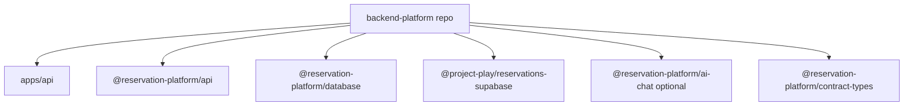

# Phase 21: Backend Repo Materialization

## Purpose

Turn the backend platform from a monorepo workspace slice into a generated,
installable backend repository candidate.

This phase answers: can the backend product repo exist without the current
frontend app, compatibility routes, browser helpers, or UI dependencies?

## Inputs To Read

- `phase-16-physical-backend-repo-split.md`
- `phase-20-separation-source-of-truth.md`
- `docs/package-refactor/backend-platform-extraction/backend-repo-bootstrap.md`
- `docs/package-refactor/backend-platform-extraction/backend-package-ownership.md`
- `docs/package-refactor/backend-platform-extraction/standalone-backend-extraction-manifest.json`
- `apps/api/**`
- backend-owned `packages/**`
- backend platform verification scripts
- root package/workspace/TypeScript config

## Write Scope

- backend extraction manifest
- backend dry-run generation scripts
- backend-only package metadata
- backend bootstrap docs
- backend CI/release checklist docs
- downstream frontend, SDK, and cross-repo phase docs
- `remaining-modularity-gaps.md`

## Non-Goals

- Do not include `app/**`, `components/**`, current frontend `lib/**`, or
  current-app compatibility route files in the backend repo.
- Do not rely on Next.js app routes as the canonical backend.
- Do not require frontend env such as `NEXT_PUBLIC_*` in backend runtime.
- Do not push to a separate GitHub repo unless the user explicitly asks.

## Target Backend Repo

## Implementation Steps

1. Generate a backend-only temporary workspace from the extraction manifest.
2. Write generated root package/workspace/TypeScript config for the backend
   repo candidate.
3. Install from the generated workspace without requiring the current frontend
   root package.
4. Run backend package builds, backend tests, backend boundary scans, database
   migration bundle checks, and standalone API skeleton tests in the generated
   workspace.
5. Prove the backend candidate does not import frontend, React, Next app route
   glue, browser Supabase helpers, or compatibility routes.
6. Document the backend repo clean-clone commands and which commands are safe
   local checks versus live/deploy checks.
7. Update Phase 22 if the frontend must change how it targets the backend.
8. Update Phase 23 if SDK package ownership or versioning changes.
9. Update Phase 24 with the exact generated-backend proof commands.

## Deliverables

- Backend repo generation or dry-run command.
- Backend-only package/workspace metadata.
- Backend source boundary verifier.
- Backend clean-clone bootstrap doc.
- Backend CI command list.

## Acceptance Criteria

- The generated backend repo can install, build, and test without current
  frontend source.
- `apps/api` is the canonical `/v1` API target.
- Backend packages own migrations, storage adapters, auth/tenant enforcement,
  idempotency, and optional chat workflow services.
- Compatibility routes are excluded from the backend product repo.
- Any skipped live proof is labeled readiness, not separation proof.

## Subagent Handoff Notes

Give the worker this file plus Phases 16 and 20, the extraction manifest, and
the package ownership doc. The worker should produce a local command that can
be rerun by CI. If the generated backend workspace fails because it needs a
frontend file, the correct fix is to extract or replace that dependency, not to
copy the frontend file into the backend repo.
