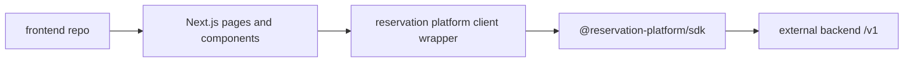

# Phase 22: Frontend Repo Materialization

## Purpose

Turn the current Next.js app into a frontend consumer repository candidate that
uses the backend platform as an external service.

This phase answers: can the frontend build and run with only UI code,
browser-safe configuration, public contract types, and the SDK or `/v1` HTTP
contract?

## Inputs To Read

- `phase-8-current-frontend-consumer-cutover.md`
- `phase-9-compatibility-route-removal.md`
- `phase-12-frontend-repo-consumer-proof.md`
- `phase-20-separation-source-of-truth.md`
- `phase-21-backend-repo-materialization.md`
- `frontend-consumer-repo-inventory.json`
- `app/**`
- `components/**`
- frontend-owned `lib/**`
- SDK package exports
- root package/workspace/TypeScript config

## Write Scope

- frontend consumer inventory
- frontend dry-run generation scripts
- frontend-only package metadata
- frontend platform boundary verifiers
- frontend bootstrap docs
- compatibility route blocker updates
- downstream SDK and cross-repo phase docs
- `remaining-modularity-gaps.md`

## Non-Goals

- Do not copy backend packages into the frontend repo to satisfy imports.
- Do not require Supabase service-role keys, migration files, provider secrets,
  or backend runtime env in the frontend repo.
- Do not keep local reservation-platform compatibility routes as the normal
  production data path.
- Do not publish the SDK from this phase.

## Target Frontend Repo

## Implementation Steps

1. Expand the frontend inventory from proof slices to a runnable app slice.
2. Mark each route/page/component/helper as `include`, `reference-only`, or
   `exclude` with a reason.
3. Generate a frontend-only temporary workspace from the inventory.
4. Create frontend package metadata that depends on published/packed SDK and
   public contract packages, not workspace backend internals.
5. Run frontend lint/build/smoke checks against
   `NEXT_PUBLIC_RESERVATION_PLATFORM_BASE_URL`.
6. Remove or isolate any frontend import of backend services, database adapters,
   route handlers, LangChain/provider workflow code, or service-role helpers.
7. Record every remaining local `/api` dependency as a Phase 9 compatibility
   blocker with the backend route or SDK method it needs.
8. Update Phase 23 if the frontend needs additional SDK exports.
9. Update Phase 24 with the frontend clean-clone proof commands.

## Deliverables

- Runnable frontend repo inventory.
- Frontend repo dry-run command.
- Frontend-only package metadata.
- Browser-safe env documentation.
- Frontend boundary verifier.
- Compatibility route blocker list.

## Acceptance Criteria

- The generated frontend repo can build without backend platform source.
- Frontend runtime uses an external backend URL in platform mode.
- Frontend imports only UI code, frontend-owned helpers, public contract types,
  and the SDK.
- No frontend command requires service-role keys, database migrations, backend
  provider secrets, or backend workspace packages.
- Remaining compatibility usage is explicit and tied to route removal gates.

## Subagent Handoff Notes

Give the worker this file plus Phases 8, 9, 12, 20, and 21. The worker should
keep the frontend honest as a consumer. If a build needs backend behavior, the
worker must open a backend or SDK requirement instead of moving backend code
into the frontend repo.
