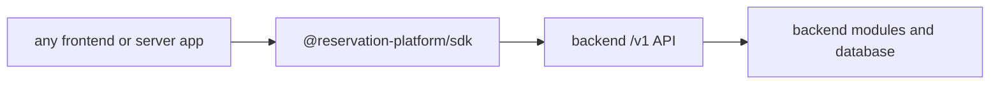

# Phase 23: SDK Package Materialization

## Purpose

Make the SDK the actual installable integration contract between any frontend
and the backend platform.

This phase answers: can a separate app install the SDK package and call the
backend `/v1` API without copying backend source or depending on this monorepo?

## Inputs To Read

- `phase-2-sdk-boundary-public-client.md`
- `phase-6-external-frontend-proof-removal-gate.md`
- `phase-14-sdk-release-consumer-contract.md`
- `phase-18-sdk-distribution-and-contract.md`
- `phase-20-separation-source-of-truth.md`
- `phase-21-backend-repo-materialization.md`
- `phase-22-frontend-repo-materialization.md`
- `packages/sdk/**`
- `packages/contract-types/**`
- SDK smoke examples under `examples/**`
- SDK release artifact scripts

## Write Scope

- SDK package manifest and export metadata
- SDK public contract docs
- SDK pack/install proof scripts
- SDK smoke fixtures
- SDK/direct HTTP parity docs and scripts
- downstream cross-repo proof docs
- `remaining-modularity-gaps.md`

## Non-Goals

- Do not publish to npm or a private registry without explicit approval.
- Do not add database, storage adapter, provider, LangChain, React UI, or
  backend runtime dependencies to the SDK.
- Do not make the SDK depend on workspace-only paths.
- Do not hide backend requirements inside frontend helper code.

## SDK Contract

The SDK is a typed HTTP client. It must not contain backend business rules,
database queries, auth provider secrets, LangChain workflows, or UI components.

## Implementation Steps

1. Inspect SDK exports and package metadata for a clean public surface.
2. Pack the SDK and public contract package into local tarballs.
3. Install those tarballs into clean external fixture apps without workspace
   links.
4. Run plain TypeScript, server-to-server, Vite/React, Next.js, and chat
   disabled/enabled smoke checks from installed packages.
5. Prove SDK requests and direct HTTP requests have matching behavior for the
   supported `/v1` contract.
6. Add package artifact inspection for unwanted files, private paths, backend
   dependencies, and workspace-only references.
7. Document version compatibility between SDK versions and backend API
   versions.
8. Update Phase 24 with exact package install and parity proof commands.

## Deliverables

- SDK public API documentation.
- Package tarball inspection guard.
- Clean install fixture proof.
- SDK/direct HTTP parity proof.
- Version compatibility matrix.
- Consumer quickstart for apps that start with no repo code installed.

## Acceptance Criteria

- A clean app can install the SDK from a packed or registry package.
- SDK package artifacts do not include backend source, database migrations,
  provider workflow code, or frontend UI.
- SDK has no backend-only runtime dependencies.
- SDK behavior matches direct `/v1` HTTP behavior for covered endpoints.
- Publication remains a separate explicit approval step.

## Subagent Handoff Notes

Give the worker this file plus Phases 2, 14, 18, 20, 21, and 22. The worker
must prove installability from package artifacts, not workspace links. If a
consumer needs behavior that only exists in the current frontend wrapper, the
worker should move it into the SDK contract or document it as a missing SDK
feature.
