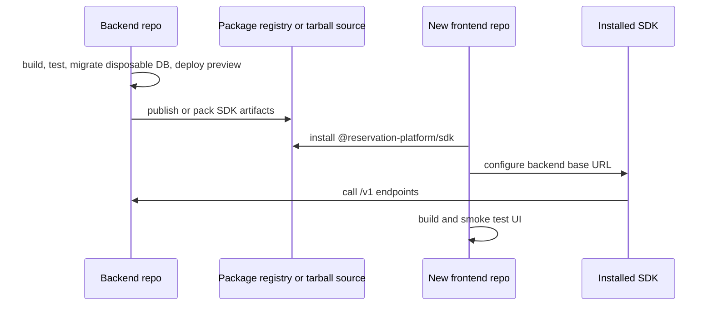

# Phase 24: Cross-Repo Adoption Proof

## Purpose

Prove the intended product model end to end: backend platform in its own repo,
SDK as the installable contract, and one or more frontends consuming it from
separate repositories.

This phase answers: can a new frontend team start in another directory, install
the SDK, point at the backend platform, and build a product without this
monorepo?

## Inputs To Read

- `phase-10-live-platform-proof.md`
- `phase-19-cross-repo-release-proof.md`
- `phase-20-separation-source-of-truth.md`
- `phase-21-backend-repo-materialization.md`
- `phase-22-frontend-repo-materialization.md`
- `phase-23-sdk-package-materialization.md`
- compatibility route inventory
- backend live proof scripts
- database live proof scripts
- SDK registry/install proof scripts
- frontend smoke proof scripts

## Write Scope

- cross-repo proof runbook
- strict release checklist
- compatibility route removal checklist
- rollback docs
- support matrix
- proof command orchestration scripts
- `remaining-modularity-gaps.md`

## Non-Goals

- Do not treat local monorepo workspace links as cross-repo proof.
- Do not count readiness checks that skip when env is absent as live proof.
- Do not publish packages or deploy production infrastructure without explicit
  approval.
- Do not remove compatibility routes until the removal gate says every affected
  route is removable.

## Adoption Flow

## Implementation Steps

1. Generate or clone a backend repo candidate and run backend-only build/test.
2. Apply backend database migrations to disposable infrastructure and prove
   tenant/RLS/idempotency behavior with strict checks.
3. Start or deploy the standalone backend and prove health, metadata, catalog,
   availability, reservations, resource maintenance, and optional chat behavior.
4. Pack or install SDK artifacts without workspace links.
5. Create a new external frontend fixture in a separate directory that starts
   with only its own frontend code and SDK dependency.
6. Build and smoke test the external frontend against the standalone backend.
7. Run SDK/direct HTTP live parity against the same backend.
8. Run the compatibility route removal gate and remove/deprecate only routes
   that pass every gate.
9. Document rollback for backend deployment, database migration, SDK version,
   frontend configuration, and route removal.

## Deliverables

- Cross-repo adoption runbook.
- Strict proof command list.
- External frontend fixture or generated proof workspace.
- Live backend parity evidence.
- Compatibility route removal decision log.
- Rollback/support matrix.

## Acceptance Criteria

- Backend, SDK, and frontend checks run from separated repository candidates or
  clean external fixture directories.
- A new frontend can install the SDK and target the backend without this repo's
  source code.
- Live proof covers database migration, RLS/tenant isolation, auth,
  idempotency, SDK/direct parity, and optional chat status.
- Compatibility routes are removed only after equivalent standalone behavior is
  proven.
- Remaining gaps are explicit deferred product work, not hidden separation
  blockers.

## Subagent Handoff Notes

Give the worker this file plus Phases 19 through 23 and the remaining gaps
index. The worker must separate readiness, local proof, live proof, and release
proof in its result notes. If network, database, registry, or deployment access
is unavailable, it should improve local strict-readiness gates and leave live
proof marked incomplete.
