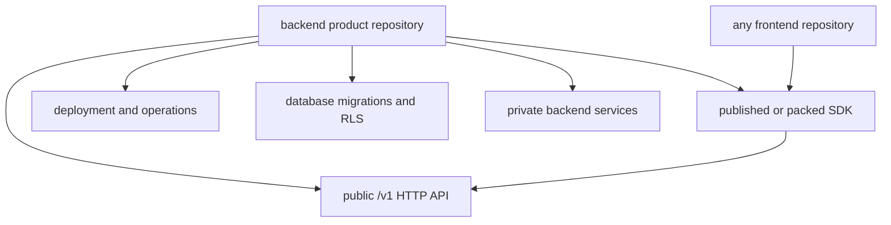

# Phase 25: Backend Product Repository Contract

## Purpose

Define the backend repository as the product boundary: the thing another
frontend team can depend on without copying this app.

This phase answers: if the backend lives in its own GitHub repository, what is
the public contract, what is private infrastructure, and what must never be
owned by the frontend?

## Inputs To Read

- `phase-20-separation-source-of-truth.md`
- `phase-21-backend-repo-materialization.md`
- `phase-24-cross-repo-adoption-proof.md`
- `docs/package-refactor/backend-platform-extraction/backend-package-ownership.md`
- `docs/package-refactor/backend-platform-extraction/backend-repo-bootstrap.md`
- `docs/package-refactor/backend-platform-extraction/standalone-backend-extraction-manifest.json`
- `apps/api/**`
- backend-owned `packages/**`
- backend verification scripts under `scripts/**`

## Write Scope

- backend product repository contract docs
- backend extraction manifest
- backend package ownership docs
- backend bootstrap and CI docs
- local-only backend boundary verifiers
- later phase docs in this folder
- `remaining-modularity-gaps.md`

## Non-Goals

- Do not move files into a real external GitHub repository in this phase.
- Do not publish packages.
- Do not deploy infrastructure.
- Do not include frontend app routes, React components, browser helpers, or
  current-app compatibility routes in the backend product contract.

## Target Contract

The product repository owns the backend API, database, auth/tenant enforcement,
idempotency, optional AI chat workflow, SDK release policy, and operational
runbooks. The frontend owns only presentation and product-specific UI.

## Implementation Steps

1. Write a backend product contract that separates public surfaces from private
   implementation:
   - public: `/v1` API, SDK package, OpenAPI or equivalent route contract,
     version compatibility matrix, deployment runbooks
   - private: storage adapters, migrations, provider integrations, auth
     verification, idempotency persistence, service-role credentials
2. Update backend package ownership so every backend-owned package states
   whether it is public, private, or deploy-only.
3. Update the extraction manifest so backend product files can be generated
   without frontend source or current-app route glue.
4. Add or update a local verifier that fails when backend product docs or
   manifests include frontend-owned paths.
5. Document which backend commands are safe local checks and which commands
   need live infrastructure.
6. Update Phase 26 when this contract changes what the frontend may import.
7. Update Phase 27 when this contract changes what the SDK must expose.
8. Update Phase 28 when this contract changes live proof requirements.
9. Update Phase 29 with subagent task boundaries and review gates.

## Deliverables

- Backend product repository contract.
- Backend public/private package visibility table.
- Updated extraction manifest.
- Backend product boundary verifier.
- Backend local/live command matrix.

## Acceptance Criteria

- A subagent can explain what the backend product repo provides without reading
  frontend code.
- Backend product materials exclude frontend routes, UI components, browser
  helpers, and compatibility-only files.
- Public backend surfaces are limited to `/v1`, SDK artifacts, contract docs,
  and operational docs.
- Private backend internals are not required by any frontend build.
- Later phases are updated if the backend contract changes.

## Subagent Handoff Notes

Give the worker this file plus Phases 20, 21, and 24. The worker should make
the backend repo contract explicit before adding proof scripts. If it discovers
frontend code is still needed by the backend, it must record that as a blocker
or extract backend behavior into backend-owned modules, not copy UI code into
the backend plan.
